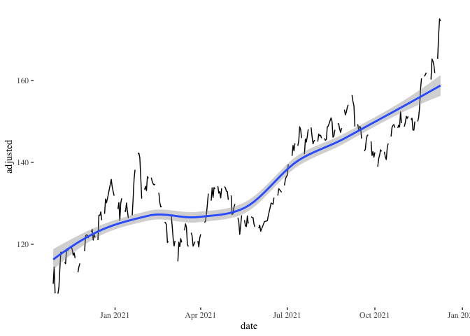
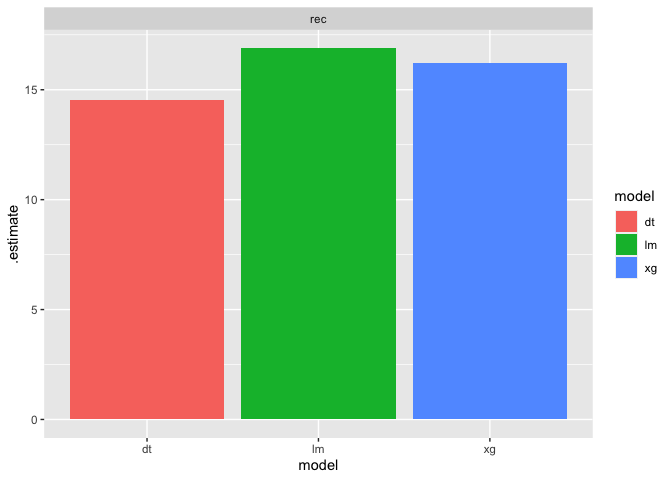
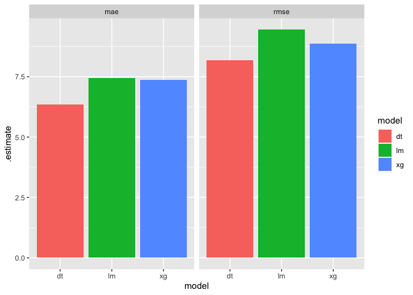
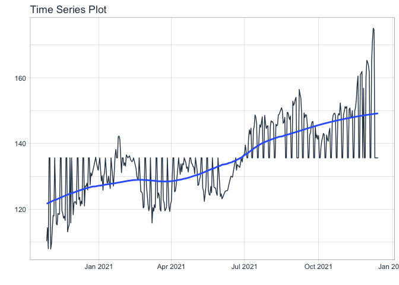
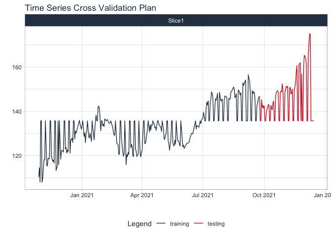

stock-predictor-model
================

``` r
library(rtweet)
library(tidyquant)
```

    ## Loading required package: lubridate

    ## 
    ## Attaching package: 'lubridate'

    ## The following objects are masked from 'package:base':
    ## 
    ##     date, intersect, setdiff, union

    ## Loading required package: PerformanceAnalytics

    ## Loading required package: xts

    ## Loading required package: zoo

    ## 
    ## Attaching package: 'zoo'

    ## The following objects are masked from 'package:base':
    ## 
    ##     as.Date, as.Date.numeric

    ## 
    ## Attaching package: 'PerformanceAnalytics'

    ## The following object is masked from 'package:graphics':
    ## 
    ##     legend

    ## Loading required package: quantmod

    ## Loading required package: TTR

    ## Registered S3 method overwritten by 'quantmod':
    ##   method            from
    ##   as.zoo.data.frame zoo

    ## ══ Need to Learn tidyquant? ════════════════════════════════════════════════════
    ## Business Science offers a 1-hour course - Learning Lab #9: Performance Analysis & Portfolio Optimization with tidyquant!
    ## </> Learn more at: https://university.business-science.io/p/learning-labs-pro </>

``` r
library(lubridate)
library(tidyverse)
```

    ## ── Attaching packages ─────────────────────────────────────── tidyverse 1.3.1 ──

    ## ✓ ggplot2 3.3.5     ✓ purrr   0.3.4
    ## ✓ tibble  3.1.6     ✓ dplyr   1.0.7
    ## ✓ tidyr   1.1.4     ✓ stringr 1.4.0
    ## ✓ readr   2.0.1     ✓ forcats 0.5.1

    ## ── Conflicts ────────────────────────────────────────── tidyverse_conflicts() ──
    ## x lubridate::as.difftime() masks base::as.difftime()
    ## x lubridate::date()        masks base::date()
    ## x dplyr::filter()          masks stats::filter()
    ## x dplyr::first()           masks xts::first()
    ## x purrr::flatten()         masks rtweet::flatten()
    ## x lubridate::intersect()   masks base::intersect()
    ## x dplyr::lag()             masks stats::lag()
    ## x dplyr::last()            masks xts::last()
    ## x lubridate::setdiff()     masks base::setdiff()
    ## x lubridate::union()       masks base::union()

``` r
library(tidytext)
library(dplyr)
library(hablar)
```

    ## 
    ## Attaching package: 'hablar'

    ## The following object is masked from 'package:dplyr':
    ## 
    ##     na_if

    ## The following object is masked from 'package:tibble':
    ## 
    ##     num

``` r
library(ggthemes)
library(tidymodels)
```

    ## Registered S3 method overwritten by 'tune':
    ##   method                   from   
    ##   required_pkgs.model_spec parsnip

    ## ── Attaching packages ────────────────────────────────────── tidymodels 0.1.4 ──

    ## ✓ broom        0.7.9      ✓ rsample      0.1.0 
    ## ✓ dials        0.0.10     ✓ tune         0.1.6 
    ## ✓ infer        1.0.0      ✓ workflows    0.2.4 
    ## ✓ modeldata    0.1.1      ✓ workflowsets 0.1.0 
    ## ✓ parsnip      0.1.7      ✓ yardstick    0.0.8 
    ## ✓ recipes      0.1.17

    ## ── Conflicts ───────────────────────────────────────── tidymodels_conflicts() ──
    ## x scales::discard() masks purrr::discard()
    ## x dplyr::filter()   masks stats::filter()
    ## x dplyr::first()    masks xts::first()
    ## x recipes::fixed()  masks stringr::fixed()
    ## x purrr::flatten()  masks rtweet::flatten()
    ## x dplyr::lag()      masks stats::lag()
    ## x dplyr::last()     masks xts::last()
    ## x dials::momentum() masks TTR::momentum()
    ## x hablar::na_if()   masks dplyr::na_if()
    ## x hablar::num()     masks tibble::num()
    ## x yardstick::spec() masks readr::spec()
    ## x recipes::step()   masks stats::step()
    ## • Learn how to get started at https://www.tidymodels.org/start/

``` r
library(tidyr)
library(dplyr)
set.seed(7)
```

``` r
myToken = create_token(app = app_name,
             consumer_key = key, 
             consumer_secret = secret,
             access_token = access,
             access_secret = access_secret)
```

``` r
timeline_1 = get_timeline("stocktwits", n=10000, token=myToken, include_rts = T)
timeline_2 = get_timeline("marketwatch", n=10000, token=myToken, include_rts = T)
timeline_3 = get_timeline("yahoofinance", n=10000, token=myToken, include_rts = T)
timeline_4 = get_timeline("wsjmarkets", n=10000, token=myToken, include_rts = T)
```

``` r
stocks = bind_rows(timeline_1, timeline_2, timeline_3, timeline_4)
tail(stocks)
```

    ## # A tibble: 6 × 90
    ##   user_id  status_id           created_at          screen_name text       source
    ##   <chr>    <chr>               <dttm>              <chr>       <chr>      <chr> 
    ## 1 28164923 1415358691591823365 2021-07-14 17:13:02 WSJmarkets  A federal… Socia…
    ## 2 28164923 1415356792570146816 2021-07-14 17:05:30 WSJmarkets  Stymied i… Twitt…
    ## 3 28164923 1415351150136766469 2021-07-14 16:43:04 WSJmarkets  Heard on … Socia…
    ## 4 28164923 1415342853304225792 2021-07-14 16:10:06 WSJmarkets  The jam i… Socia…
    ## 5 28164923 1415338306796142593 2021-07-14 15:52:02 WSJmarkets  Federal R… Socia…
    ## 6 28164923 1415334589783060485 2021-07-14 15:37:16 WSJmarkets  Lumber pr… Twitt…
    ## # … with 84 more variables: display_text_width <dbl>, reply_to_status_id <chr>,
    ## #   reply_to_user_id <chr>, reply_to_screen_name <chr>, is_quote <lgl>,
    ## #   is_retweet <lgl>, favorite_count <int>, retweet_count <int>,
    ## #   quote_count <int>, reply_count <int>, hashtags <list>, symbols <list>,
    ## #   urls_url <list>, urls_t.co <list>, urls_expanded_url <list>,
    ## #   media_url <list>, media_t.co <list>, media_expanded_url <list>,
    ## #   media_type <list>, ext_media_url <list>, ext_media_t.co <list>, …

``` r
stocks = stocks %>% select(user_id, created_at, status_id, text, screen_name)
stocks
```

    ## # A tibble: 13,000 × 5
    ##    user_id  created_at          status_id           text             screen_name
    ##    <chr>    <dttm>              <chr>               <chr>            <chr>      
    ##  1 14886375 2021-12-14 18:51:59 1470828936305254405 "What’s a stock… Stocktwits 
    ##  2 14886375 2021-12-14 17:21:43 1470806218449072128 "That's some ob… Stocktwits 
    ##  3 14886375 2021-12-14 15:36:11 1470779662607527937 "“There’s no su… Stocktwits 
    ##  4 14886375 2021-12-14 15:31:22 1470778448650067974 "👀 https://t.c… Stocktwits 
    ##  5 14886375 2021-12-14 15:20:54 1470775815810035722 "Why is Dogecoi… Stocktwits 
    ##  6 14886375 2021-12-14 13:21:04 1470745659083010049 "What’s on your… Stocktwits 
    ##  7 14886375 2021-12-14 13:20:43 1470745570880991236 "Trending on St… Stocktwits 
    ##  8 14886375 2021-12-13 23:27:54 1470535985385586703 "🚀 $ARNA ascen… Stocktwits 
    ##  9 14886375 2021-12-13 20:41:09 1470494018610118668 "Here are the s… Stocktwits 
    ## 10 14886375 2021-12-13 20:41:07 1470494013765693448 "$LLY will pay … Stocktwits 
    ## # … with 12,990 more rows

``` r
write_csv(stocks, "../data/project-first-deliverable.csv")
```

``` r
stocks = stocks %>% mutate(text = str_to_lower(text))
stocks %>% head
```

    ## # A tibble: 6 × 5
    ##   user_id  created_at          status_id           text              screen_name
    ##   <chr>    <dttm>              <chr>               <chr>             <chr>      
    ## 1 14886375 2021-12-14 18:51:59 1470828936305254405 "what’s a stock … Stocktwits 
    ## 2 14886375 2021-12-14 17:21:43 1470806218449072128 "that's some obs… Stocktwits 
    ## 3 14886375 2021-12-14 15:36:11 1470779662607527937 "“there’s no suc… Stocktwits 
    ## 4 14886375 2021-12-14 15:31:22 1470778448650067974 "👀 https://t.co… Stocktwits 
    ## 5 14886375 2021-12-14 15:20:54 1470775815810035722 "why is dogecoin… Stocktwits 
    ## 6 14886375 2021-12-14 13:21:04 1470745659083010049 "what’s on your … Stocktwits

``` r
stocks = stocks %>% mutate(AAPL = str_detect(text, "aapl|apple"))
stocks %>% head
```

    ## # A tibble: 6 × 6
    ##   user_id  created_at          status_id           text        screen_name AAPL 
    ##   <chr>    <dttm>              <chr>               <chr>       <chr>       <lgl>
    ## 1 14886375 2021-12-14 18:51:59 1470828936305254405 "what’s a … Stocktwits  FALSE
    ## 2 14886375 2021-12-14 17:21:43 1470806218449072128 "that's so… Stocktwits  FALSE
    ## 3 14886375 2021-12-14 15:36:11 1470779662607527937 "“there’s … Stocktwits  FALSE
    ## 4 14886375 2021-12-14 15:31:22 1470778448650067974 "👀 https:… Stocktwits  FALSE
    ## 5 14886375 2021-12-14 15:20:54 1470775815810035722 "why is do… Stocktwits  FALSE
    ## 6 14886375 2021-12-14 13:21:04 1470745659083010049 "what’s on… Stocktwits  FALSE

``` r
stocks %>% head
```

    ## # A tibble: 6 × 6
    ##   user_id  created_at          status_id           text        screen_name AAPL 
    ##   <chr>    <dttm>              <chr>               <chr>       <chr>       <lgl>
    ## 1 14886375 2021-12-14 18:51:59 1470828936305254405 "what’s a … Stocktwits  FALSE
    ## 2 14886375 2021-12-14 17:21:43 1470806218449072128 "that's so… Stocktwits  FALSE
    ## 3 14886375 2021-12-14 15:36:11 1470779662607527937 "“there’s … Stocktwits  FALSE
    ## 4 14886375 2021-12-14 15:31:22 1470778448650067974 "👀 https:… Stocktwits  FALSE
    ## 5 14886375 2021-12-14 15:20:54 1470775815810035722 "why is do… Stocktwits  FALSE
    ## 6 14886375 2021-12-14 13:21:04 1470745659083010049 "what’s on… Stocktwits  FALSE

``` r
nrc_lexicon = get_sentiments("nrc")
nrc_lexicon %>% head
```

    ## # A tibble: 6 × 2
    ##   word      sentiment
    ##   <chr>     <chr>    
    ## 1 abacus    trust    
    ## 2 abandon   fear     
    ## 3 abandon   negative 
    ## 4 abandon   sadness  
    ## 5 abandoned anger    
    ## 6 abandoned fear

``` r
stocks1 = stocks %>% unnest_tokens(word, text)  %>% anti_join(stop_words, by="word") %>% filter(str_detect(word,"^[a-z]+$"))
stocks1
```

    ## # A tibble: 142,159 × 6
    ##    user_id  created_at          status_id           screen_name AAPL  word      
    ##    <chr>    <dttm>              <chr>               <chr>       <lgl> <chr>     
    ##  1 14886375 2021-12-14 18:51:59 1470828936305254405 Stocktwits  FALSE stock     
    ##  2 14886375 2021-12-14 18:51:59 1470828936305254405 Stocktwits  FALSE crypto    
    ##  3 14886375 2021-12-14 18:51:59 1470828936305254405 Stocktwits  FALSE regret    
    ##  4 14886375 2021-12-14 18:51:59 1470828936305254405 Stocktwits  FALSE selling   
    ##  5 14886375 2021-12-14 17:21:43 1470806218449072128 Stocktwits  FALSE observati…
    ##  6 14886375 2021-12-14 17:21:43 1470806218449072128 Stocktwits  FALSE https     
    ##  7 14886375 2021-12-14 15:36:11 1470779662607527937 Stocktwits  FALSE coinciden…
    ##  8 14886375 2021-12-14 15:36:11 1470779662607527937 Stocktwits  FALSE op        
    ##  9 14886375 2021-12-14 15:36:11 1470779662607527937 Stocktwits  FALSE https     
    ## 10 14886375 2021-12-14 15:36:11 1470779662607527937 Stocktwits  FALSE uueokwdiry
    ## # … with 142,149 more rows

``` r
stocks1 %>% filter(!word %in% stop_words$word)
```

    ## # A tibble: 142,159 × 6
    ##    user_id  created_at          status_id           screen_name AAPL  word      
    ##    <chr>    <dttm>              <chr>               <chr>       <lgl> <chr>     
    ##  1 14886375 2021-12-14 18:51:59 1470828936305254405 Stocktwits  FALSE stock     
    ##  2 14886375 2021-12-14 18:51:59 1470828936305254405 Stocktwits  FALSE crypto    
    ##  3 14886375 2021-12-14 18:51:59 1470828936305254405 Stocktwits  FALSE regret    
    ##  4 14886375 2021-12-14 18:51:59 1470828936305254405 Stocktwits  FALSE selling   
    ##  5 14886375 2021-12-14 17:21:43 1470806218449072128 Stocktwits  FALSE observati…
    ##  6 14886375 2021-12-14 17:21:43 1470806218449072128 Stocktwits  FALSE https     
    ##  7 14886375 2021-12-14 15:36:11 1470779662607527937 Stocktwits  FALSE coinciden…
    ##  8 14886375 2021-12-14 15:36:11 1470779662607527937 Stocktwits  FALSE op        
    ##  9 14886375 2021-12-14 15:36:11 1470779662607527937 Stocktwits  FALSE https     
    ## 10 14886375 2021-12-14 15:36:11 1470779662607527937 Stocktwits  FALSE uueokwdiry
    ## # … with 142,149 more rows

``` r
stocks1 %>% anti_join(stop_words, by="word") %>% 
  count(word,user_id, AAPL, created_at) %>% bind_tf_idf(word,user_id,n) %>% 
  select(word,user_id, tf_idf, AAPL, created_at) 
```

    ## Warning: A value for tf_idf is negative:
    ##  Input should have exactly one row per document-term combination.

    ## # A tibble: 136,131 × 5
    ##    word        user_id       tf_idf AAPL  created_at         
    ##    <chr>       <chr>          <dbl> <lgl> <dttm>             
    ##  1 aaa         19546277 -0.00000960 FALSE 2021-11-19 17:01:29
    ##  2 aaa         624413   -0.0000112  FALSE 2021-11-16 03:16:56
    ##  3 aaa         624413   -0.0000112  FALSE 2021-11-23 08:34:29
    ##  4 aaa         624413   -0.0000112  FALSE 2021-11-23 09:26:51
    ##  5 aaa         624413   -0.0000112  FALSE 2021-11-25 10:39:24
    ##  6 aaa         624413   -0.0000112  FALSE 2021-11-25 18:36:16
    ##  7 aaacktqzif  19546277  0.0000328  FALSE 2021-11-03 16:16:15
    ##  8 aaand       14886375  0.0000620  FALSE 2021-01-25 15:44:39
    ##  9 aaasinclair 19546277  0.0000328  FALSE 2021-11-19 17:01:29
    ## 10 aadilhzaman 19546277  0.0000328  FALSE 2021-11-04 14:15:17
    ## # … with 136,121 more rows

``` r
stocks2 = stocks1 %>% anti_join(stop_words, by="word") %>% 
  inner_join(nrc_lexicon, by="word") %>% 
  count(user_id,sentiment, created_at, AAPL) %>% 
  pivot_wider(names_from = sentiment, values_from=n,
                values_fill=0)
```

``` r
stocks2 = stocks2 %>% mutate(created_at = as_date(created_at, tz = NULL))
stocks2 = stocks2 %>% convert(int(AAPL))
stocks2
```

    ## # A tibble: 9,856 × 13
    ##    user_id  created_at  AAPL anger anticipation disgust  fear   joy negative
    ##    <chr>    <date>     <int> <int>        <int>   <int> <int> <int>    <int>
    ##  1 14886375 2020-10-27     0     1            0       3     1     0        4
    ##  2 14886375 2020-10-28     0     1            0       0     1     0        2
    ##  3 14886375 2020-10-28     0     1            1       0     0     1        0
    ##  4 14886375 2020-10-29     0     1            0       1     1     0        1
    ##  5 14886375 2020-10-29     1     1            0       1     1     0        1
    ##  6 14886375 2020-10-29     1     1            0       0     0     0        1
    ##  7 14886375 2020-10-29     1     1            0       1     1     0        1
    ##  8 14886375 2020-10-31     0     1            1       0     1     1        0
    ##  9 14886375 2020-11-02     0     1            0       0     0     0        1
    ## 10 14886375 2020-11-02     0     1            0       0     0     0        3
    ## # … with 9,846 more rows, and 4 more variables: positive <int>, sadness <int>,
    ## #   surprise <int>, trust <int>

``` r
stocks3 = stocks2 %>% group_by(created_at) %>% summarise(anger =sum(anger), anticipation=sum(anger), disgust = sum(disgust), fear = sum(fear), joy = sum(joy), negative = sum(negative), positive = sum(positive), sadness = sum(sadness), surprise = sum(surprise), trust = sum(trust), AAPL = mean(AAPL))
stocks3
```

    ## # A tibble: 376 × 12
    ##    created_at anger anticipation disgust  fear   joy negative positive sadness
    ##    <date>     <int>        <int>   <int> <int> <int>    <int>    <int>   <int>
    ##  1 2020-10-27     1            1       3     1     0        4        2       1
    ##  2 2020-10-28     2            2       0     2     3        3       10       3
    ##  3 2020-10-29     4            4       3     5     2        7        8       3
    ##  4 2020-10-30     0            0       0     1     2        1        5       0
    ##  5 2020-10-31     1            1       0     1     2        1        8       0
    ##  6 2020-11-01     0            0       0     0     0        2        0       2
    ##  7 2020-11-02     5            5       1     2     6       10       11       3
    ##  8 2020-11-03     4            4       2     4     0        7        4       1
    ##  9 2020-11-04     2            2       2     1     3        5        9       2
    ## 10 2020-11-05     4            4       2     4     8        9       12       5
    ## # … with 366 more rows, and 3 more variables: surprise <int>, trust <int>,
    ## #   AAPL <dbl>

``` r
r = c("AAPL") %>% tq_get(get = "stock.prices",
                                 from = "2020-10-26",
                                 to = "2021-12-10")
```

    ## Warning: `type_convert()` only converts columns of type 'character'.
    ## - `df` has no columns of type 'character'

``` r
stocks3 = stocks3 %>% mutate(date = created_at)
stocks3 %>% head
```

    ## # A tibble: 6 × 13
    ##   created_at anger anticipation disgust  fear   joy negative positive sadness
    ##   <date>     <int>        <int>   <int> <int> <int>    <int>    <int>   <int>
    ## 1 2020-10-27     1            1       3     1     0        4        2       1
    ## 2 2020-10-28     2            2       0     2     3        3       10       3
    ## 3 2020-10-29     4            4       3     5     2        7        8       3
    ## 4 2020-10-30     0            0       0     1     2        1        5       0
    ## 5 2020-10-31     1            1       0     1     2        1        8       0
    ## 6 2020-11-01     0            0       0     0     0        2        0       2
    ## # … with 4 more variables: surprise <int>, trust <int>, AAPL <dbl>, date <date>

``` r
final = stocks3 %>% left_join(r,by="date")
final %>% head
```

    ## # A tibble: 6 × 20
    ##   created_at anger anticipation disgust  fear   joy negative positive sadness
    ##   <date>     <int>        <int>   <int> <int> <int>    <int>    <int>   <int>
    ## 1 2020-10-27     1            1       3     1     0        4        2       1
    ## 2 2020-10-28     2            2       0     2     3        3       10       3
    ## 3 2020-10-29     4            4       3     5     2        7        8       3
    ## 4 2020-10-30     0            0       0     1     2        1        5       0
    ## 5 2020-10-31     1            1       0     1     2        1        8       0
    ## 6 2020-11-01     0            0       0     0     0        2        0       2
    ## # … with 11 more variables: surprise <int>, trust <int>, AAPL <dbl>,
    ## #   date <date>, symbol <chr>, open <dbl>, high <dbl>, low <dbl>, close <dbl>,
    ## #   volume <dbl>, adjusted <dbl>

``` r
final2 = final %>% mutate(anger = lag(anger), anticipation = lag(anticipation, na.rm=TRUE), disgust = lag(disgust, na.rm=TRUE), fear = lag(fear, na.rm=TRUE), negative = lag(negative, na.rm=TRUE), positive = lag(positive, na.rm=TRUE), sadness = lag(sadness, na.rm=TRUE), surprise = lag(surprise, na.rm=TRUE), trust = lag(trust, na.rm=TRUE), joy = lag(joy, na.rm=TRUE))
final2 %>% head
```

    ## # A tibble: 6 × 20
    ##   created_at anger anticipation disgust  fear   joy negative positive sadness
    ##   <date>     <int>        <int>   <int> <int> <int>    <int>    <int>   <int>
    ## 1 2020-10-27    NA           NA      NA    NA    NA       NA       NA      NA
    ## 2 2020-10-28     1            1       3     1     0        4        2       1
    ## 3 2020-10-29     2            2       0     2     3        3       10       3
    ## 4 2020-10-30     4            4       3     5     2        7        8       3
    ## 5 2020-10-31     0            0       0     1     2        1        5       0
    ## 6 2020-11-01     1            1       0     1     2        1        8       0
    ## # … with 11 more variables: surprise <int>, trust <int>, AAPL <dbl>,
    ## #   date <date>, symbol <chr>, open <dbl>, high <dbl>, low <dbl>, close <dbl>,
    ## #   volume <dbl>, adjusted <dbl>

``` r
final2 = final2 %>% drop_na(anger)
final2
```

    ## # A tibble: 375 × 20
    ##    created_at anger anticipation disgust  fear   joy negative positive sadness
    ##    <date>     <int>        <int>   <int> <int> <int>    <int>    <int>   <int>
    ##  1 2020-10-28     1            1       3     1     0        4        2       1
    ##  2 2020-10-29     2            2       0     2     3        3       10       3
    ##  3 2020-10-30     4            4       3     5     2        7        8       3
    ##  4 2020-10-31     0            0       0     1     2        1        5       0
    ##  5 2020-11-01     1            1       0     1     2        1        8       0
    ##  6 2020-11-02     0            0       0     0     0        2        0       2
    ##  7 2020-11-03     5            5       1     2     6       10       11       3
    ##  8 2020-11-04     4            4       2     4     0        7        4       1
    ##  9 2020-11-05     2            2       2     1     3        5        9       2
    ## 10 2020-11-06     4            4       2     4     8        9       12       5
    ## # … with 365 more rows, and 11 more variables: surprise <int>, trust <int>,
    ## #   AAPL <dbl>, date <date>, symbol <chr>, open <dbl>, high <dbl>, low <dbl>,
    ## #   close <dbl>, volume <dbl>, adjusted <dbl>

``` r
final2 %>%  ggplot(aes(x=date, y=adjusted))+geom_line()+geom_smooth()+theme_tufte()
```

    ## `geom_smooth()` using method = 'loess' and formula 'y ~ x'

    ## Warning: Removed 99 rows containing non-finite values (stat_smooth).

    ## Warning: Removed 5 row(s) containing missing values (geom_path).

<!-- -->

``` r
write_csv(final2, "../data/final2stocks.csv")
```

``` r
stonks = read_csv("../data/final2stocks.csv")
```

    ## Rows: 375 Columns: 20

    ## ── Column specification ────────────────────────────────────────────────────────
    ## Delimiter: ","
    ## chr   (1): symbol
    ## dbl  (17): anger, anticipation, disgust, fear, joy, negative, positive, sadn...
    ## date  (2): created_at, date

    ## 
    ## ℹ Use `spec()` to retrieve the full column specification for this data.
    ## ℹ Specify the column types or set `show_col_types = FALSE` to quiet this message.

``` r
stonks
```

    ## # A tibble: 375 × 20
    ##    created_at anger anticipation disgust  fear   joy negative positive sadness
    ##    <date>     <dbl>        <dbl>   <dbl> <dbl> <dbl>    <dbl>    <dbl>   <dbl>
    ##  1 2020-10-28     1            1       3     1     0        4        2       1
    ##  2 2020-10-29     2            2       0     2     3        3       10       3
    ##  3 2020-10-30     4            4       3     5     2        7        8       3
    ##  4 2020-10-31     0            0       0     1     2        1        5       0
    ##  5 2020-11-01     1            1       0     1     2        1        8       0
    ##  6 2020-11-02     0            0       0     0     0        2        0       2
    ##  7 2020-11-03     5            5       1     2     6       10       11       3
    ##  8 2020-11-04     4            4       2     4     0        7        4       1
    ##  9 2020-11-05     2            2       2     1     3        5        9       2
    ## 10 2020-11-06     4            4       2     4     8        9       12       5
    ## # … with 365 more rows, and 11 more variables: surprise <dbl>, trust <dbl>,
    ## #   AAPL <dbl>, date <date>, symbol <chr>, open <dbl>, high <dbl>, low <dbl>,
    ## #   close <dbl>, volume <dbl>, adjusted <dbl>

``` r
#d = stonks  %>%  mutate(across(AAPL, factor))
stonkstemp = stonks %>% filter(!is.na(adjusted))
mean(stonkstemp$adjusted)
```

    ## [1] 135.7202

``` r
stonks = stonks %>% mutate(adjusted = if_na(adjusted, 135.6478))
stonks
```

    ## # A tibble: 375 × 20
    ##    created_at anger anticipation disgust  fear   joy negative positive sadness
    ##    <date>     <dbl>        <dbl>   <dbl> <dbl> <dbl>    <dbl>    <dbl>   <dbl>
    ##  1 2020-10-28     1            1       3     1     0        4        2       1
    ##  2 2020-10-29     2            2       0     2     3        3       10       3
    ##  3 2020-10-30     4            4       3     5     2        7        8       3
    ##  4 2020-10-31     0            0       0     1     2        1        5       0
    ##  5 2020-11-01     1            1       0     1     2        1        8       0
    ##  6 2020-11-02     0            0       0     0     0        2        0       2
    ##  7 2020-11-03     5            5       1     2     6       10       11       3
    ##  8 2020-11-04     4            4       2     4     0        7        4       1
    ##  9 2020-11-05     2            2       2     1     3        5        9       2
    ## 10 2020-11-06     4            4       2     4     8        9       12       5
    ## # … with 365 more rows, and 11 more variables: surprise <dbl>, trust <dbl>,
    ## #   AAPL <dbl>, date <date>, symbol <chr>, open <dbl>, high <dbl>, low <dbl>,
    ## #   close <dbl>, volume <dbl>, adjusted <dbl>

``` r
split = initial_split(stonks, prop=5/6)
trs_ = training(split)
ts_ = testing(split)
trs_
```

    ## # A tibble: 312 × 20
    ##    created_at anger anticipation disgust  fear   joy negative positive sadness
    ##    <date>     <dbl>        <dbl>   <dbl> <dbl> <dbl>    <dbl>    <dbl>   <dbl>
    ##  1 2021-11-03    31           31      13    46    24       77      115      25
    ##  2 2021-11-21    38           38      17    49    56       84      117      45
    ##  3 2021-03-20     0            0       0     2     0        1        5       0
    ##  4 2021-10-30    26           26      10    46    35       70       97      28
    ##  5 2021-04-12     0            0       0     0     0        0        1       0
    ##  6 2020-11-02     0            0       0     0     0        2        0       2
    ##  7 2021-05-08     0            0       0     0     0        0        0       0
    ##  8 2020-12-28     0            0       0     0     1        0        1       0
    ##  9 2021-09-14     7            7       3    11    11       20       41       7
    ## 10 2021-09-12     0            0       0     0     0        3        2       1
    ## # … with 302 more rows, and 11 more variables: surprise <dbl>, trust <dbl>,
    ## #   AAPL <dbl>, date <date>, symbol <chr>, open <dbl>, high <dbl>, low <dbl>,
    ## #   close <dbl>, volume <dbl>, adjusted <dbl>

``` r
rec = recipe(adjusted ~ anger + anticipation + disgust + fear + joy + positive + negative + sadness + surprise + trust + AAPL, trs_)
rec
```

    ## Recipe
    ## 
    ## Inputs:
    ## 
    ##       role #variables
    ##    outcome          1
    ##  predictor         11

``` r
rec %>% prep %>% juice %>% summary
```

    ##      anger         anticipation       disgust            fear       
    ##  Min.   : 0.000   Min.   : 0.000   Min.   : 0.000   Min.   :  0.00  
    ##  1st Qu.: 0.000   1st Qu.: 0.000   1st Qu.: 0.000   1st Qu.:  0.00  
    ##  Median : 1.000   Median : 1.000   Median : 0.000   Median :  2.00  
    ##  Mean   : 7.439   Mean   : 7.439   Mean   : 3.035   Mean   : 12.15  
    ##  3rd Qu.: 7.000   3rd Qu.: 7.000   3rd Qu.: 3.000   3rd Qu.: 11.00  
    ##  Max.   :75.000   Max.   :75.000   Max.   :35.000   Max.   :130.00  
    ##       joy           positive         negative         sadness     
    ##  Min.   : 0.00   Min.   :  0.00   Min.   :  0.00   Min.   : 0.00  
    ##  1st Qu.: 0.00   1st Qu.:  2.00   1st Qu.:  1.00   1st Qu.: 0.00  
    ##  Median : 2.00   Median :  5.00   Median :  3.00   Median : 1.00  
    ##  Mean   :10.98   Mean   : 34.27   Mean   : 21.46   Mean   : 8.67  
    ##  3rd Qu.: 9.00   3rd Qu.: 30.25   3rd Qu.: 20.00   3rd Qu.: 8.00  
    ##  Max.   :97.00   Max.   :299.00   Max.   :200.00   Max.   :86.00  
    ##     surprise          trust             AAPL            adjusted    
    ##  Min.   : 0.000   Min.   :  0.00   Min.   :0.00000   Min.   :107.9  
    ##  1st Qu.: 0.000   1st Qu.:  1.00   1st Qu.:0.00000   1st Qu.:127.5  
    ##  Median : 1.000   Median :  3.00   Median :0.00000   Median :135.6  
    ##  Mean   : 6.407   Mean   : 20.41   Mean   :0.01356   Mean   :135.7  
    ##  3rd Qu.: 6.000   3rd Qu.: 18.00   3rd Qu.:0.00000   3rd Qu.:143.7  
    ##  Max.   :61.000   Max.   :175.00   Max.   :0.50000   Max.   :175.1

``` r
lm_reg = linear_reg() %>% 
  set_engine("lm") %>% 
  set_mode("regression") 

xgboost_reg = boost_tree() %>% 
  set_engine("xgboost") %>% 
  set_mode("regression")

dt_reg = decision_tree() %>% 
  set_engine("rpart") %>% 
  set_mode("regression")
```

``` r
basicwork = workflow() %>% add_model(lm_reg) %>% 
  add_recipe(rec)
```

``` r
logit_fit = basicwork %>% fit(trs_)
p = predict(logit_fit, ts_) %>%  bind_cols(ts_ %>% select(adjusted))
```

    ## Warning in predict.lm(object = object$fit, newdata = new_data, type =
    ## "response"): prediction from a rank-deficient fit may be misleading

``` r
p
```

    ## # A tibble: 63 × 2
    ##    .pred adjusted
    ##    <dbl>    <dbl>
    ##  1  132.     114.
    ##  2  133.     136.
    ##  3  137.     119.
    ##  4  133.     120.
    ##  5  134.     117.
    ##  6  134.     117.
    ##  7  133.     116.
    ##  8  133.     136.
    ##  9  133.     122.
    ## 10  134.     122.
    ## # … with 53 more rows

``` r
evalRegression = function(curWorkflow){
  c = curWorkflow %>% fit(data=trs_)
  p1 = predict(c, ts_) %>% 
  bind_cols(ts_ %>% select(adjusted))
  t1 = p1 %>% mae(.pred, adjusted)
  t2 = p1 %>% rmse(.pred, adjusted)
  return(bind_rows(t1,t2))
}
```

``` r
lg_model = basicwork %>% evalRegression() %>% mutate(model = "lm",recipe="rec")
```

    ## Warning in predict.lm(object = object$fit, newdata = new_data, type =
    ## "response"): prediction from a rank-deficient fit may be misleading

``` r
xbg_model = basicwork %>% update_model(xgboost_reg) %>% evalRegression %>% mutate(model = "xg",recipe="rec")
dt_model = basicwork %>% update_model(dt_reg) %>% evalRegression %>% mutate(model = "dt",recipe="rec")
```

``` r
models = bind_rows(lg_model,xbg_model,dt_model)
models
```

    ## # A tibble: 6 × 5
    ##   .metric .estimator .estimate model recipe
    ##   <chr>   <chr>          <dbl> <chr> <chr> 
    ## 1 mae     standard        7.44 lm    rec   
    ## 2 rmse    standard        9.44 lm    rec   
    ## 3 mae     standard        7.35 xg    rec   
    ## 4 rmse    standard        8.87 xg    rec   
    ## 5 mae     standard        6.35 dt    rec   
    ## 6 rmse    standard        8.17 dt    rec

``` r
models %>%  ggplot(aes(x=model, y = .estimate, fill = model) )+
  geom_col() + facet_wrap(~recipe)
```

<!-- -->

``` r
models %>% ggplot(aes(x = model,y = .estimate, fill =model))+
  geom_col()+facet_wrap(~.metric)
```

<!-- -->

``` r
library(timetk)
library(modeltime)
```

    ## 
    ## Attaching package: 'modeltime'

    ## The following object is masked from 'package:TTR':
    ## 
    ##     growth

``` r
stonks
```

    ## # A tibble: 375 × 20
    ##    created_at anger anticipation disgust  fear   joy negative positive sadness
    ##    <date>     <dbl>        <dbl>   <dbl> <dbl> <dbl>    <dbl>    <dbl>   <dbl>
    ##  1 2020-10-28     1            1       3     1     0        4        2       1
    ##  2 2020-10-29     2            2       0     2     3        3       10       3
    ##  3 2020-10-30     4            4       3     5     2        7        8       3
    ##  4 2020-10-31     0            0       0     1     2        1        5       0
    ##  5 2020-11-01     1            1       0     1     2        1        8       0
    ##  6 2020-11-02     0            0       0     0     0        2        0       2
    ##  7 2020-11-03     5            5       1     2     6       10       11       3
    ##  8 2020-11-04     4            4       2     4     0        7        4       1
    ##  9 2020-11-05     2            2       2     1     3        5        9       2
    ## 10 2020-11-06     4            4       2     4     8        9       12       5
    ## # … with 365 more rows, and 11 more variables: surprise <dbl>, trust <dbl>,
    ## #   AAPL <dbl>, date <date>, symbol <chr>, open <dbl>, high <dbl>, low <dbl>,
    ## #   close <dbl>, volume <dbl>, adjusted <dbl>

``` r
stonks %>% plot_time_series(date, adjusted, .interactive = F)
```

<!-- -->

``` r
split_time = stonks %>% time_series_split(date_var = date, 
                                 assess = "3 months",
                        cumulative = T)
trs_time = training(split_time)
ts_time = testing(split_time)
```

``` r
split_time %>% tk_time_series_cv_plan() %>% 
  plot_time_series_cv_plan(date, adjusted, 
                           .interactive = F)
```

<!-- -->

``` r
br_time = recipe(adjusted ~ date + anger + anticipation + disgust + fear + joy + positive + negative + sadness + surprise + trust + AAPL, trs_time) %>% 
  step_dummy(all_nominal())
br_time %>%  prep %>% juice %>%  head
```

    ## # A tibble: 6 × 13
    ##   date       anger anticipation disgust  fear   joy positive negative sadness
    ##   <date>     <dbl>        <dbl>   <dbl> <dbl> <dbl>    <dbl>    <dbl>   <dbl>
    ## 1 2020-10-28     1            1       3     1     0        2        4       1
    ## 2 2020-10-29     2            2       0     2     3       10        3       3
    ## 3 2020-10-30     4            4       3     5     2        8        7       3
    ## 4 2020-10-31     0            0       0     1     2        5        1       0
    ## 5 2020-11-01     1            1       0     1     2        8        1       0
    ## 6 2020-11-02     0            0       0     0     0        0        2       2
    ## # … with 4 more variables: surprise <dbl>, trust <dbl>, AAPL <dbl>,
    ## #   adjusted <dbl>

``` r
arima_reg_b = arima_boost() %>% 
  set_engine("arima_xgboost")
prophet_reg_b = prophet_boost() %>%
    set_engine("prophet_xgboost") 
```

``` r
bw_time = workflow() %>%  add_model(arima_reg_b) %>% add_recipe(br_time)
bw_time
```

    ## ══ Workflow ════════════════════════════════════════════════════════════════════
    ## Preprocessor: Recipe
    ## Model: arima_boost()
    ## 
    ## ── Preprocessor ────────────────────────────────────────────────────────────────
    ## 1 Recipe Step
    ## 
    ## • step_dummy()
    ## 
    ## ── Model ───────────────────────────────────────────────────────────────────────
    ## Time Series Model w/ XGBoost Error Specification (regression)
    ## 
    ## Computational engine: arima_xgboost

``` r
m1 =  bw_time %>% fit(trs_time) 
```

    ## frequency = 6 observations per 1 week

``` r
m2 = bw_time %>% update_model(prophet_reg_b) %>%  fit(trs_time) 
```

    ## Disabling yearly seasonality. Run prophet with yearly.seasonality=TRUE to override this.

    ## Disabling daily seasonality. Run prophet with daily.seasonality=TRUE to override this.

``` r
mt = modeltime_table(m1, m2)
ct = mt %>% modeltime_calibrate(ts_time)
```

``` r
ct %>% modeltime_accuracy() %>% select(#.model_id, 
  .model_desc , mae, rmse) 
```

    ## # A tibble: 2 × 3
    ##   .model_desc                                         mae  rmse
    ##   <chr>                                             <dbl> <dbl>
    ## 1 ARIMA(0,0,0) WITH NON-ZERO MEAN W/ XGBOOST ERRORS  9.80  11.9
    ## 2 PROPHET W/ XGBOOST ERRORS                         10.8   13.5

``` r
ct %>% modeltime_forecast(new_data = ts_time, actual_data = trs_time) %>% 
  plot_modeltime_forecast(.interactive = T)
```

<div id="htmlwidget-60cf0735f8a9c08f7190" style="width:672px;height:480px;" class="plotly html-widget"></div>
<script type="application/json" data-for="htmlwidget-60cf0735f8a9c08f7190">{"x":{"data":[{"x":["2020-10-28","2020-10-29","2020-10-30","2020-10-31","2020-11-01","2020-11-02","2020-11-03","2020-11-04","2020-11-05","2020-11-06","2020-11-07","2020-11-09","2020-11-10","2020-11-11","2020-11-12","2020-11-13","2020-11-14","2020-11-15","2020-11-16","2020-11-17","2020-11-18","2020-11-19","2020-11-20","2020-11-21","2020-11-22","2020-11-23","2020-11-24","2020-11-25","2020-11-26","2020-11-27","2020-11-28","2020-11-30","2020-12-01","2020-12-02","2020-12-03","2020-12-04","2020-12-05","2020-12-06","2020-12-07","2020-12-08","2020-12-09","2020-12-10","2020-12-11","2020-12-12","2020-12-13","2020-12-14","2020-12-15","2020-12-16","2020-12-17","2020-12-18","2020-12-19","2020-12-20","2020-12-21","2020-12-22","2020-12-23","2020-12-24","2020-12-28","2020-12-29","2020-12-30","2020-12-31","2021-01-02","2021-01-04","2021-01-05","2021-01-06","2021-01-07","2021-01-08","2021-01-09","2021-01-11","2021-01-12","2021-01-13","2021-01-14","2021-01-15","2021-01-16","2021-01-19","2021-01-20","2021-01-21","2021-01-22","2021-01-23","2021-01-24","2021-01-25","2021-01-26","2021-01-27","2021-01-28","2021-01-29","2021-01-30","2021-01-31","2021-02-01","2021-02-02","2021-02-03","2021-02-04","2021-02-05","2021-02-06","2021-02-08","2021-02-09","2021-02-10","2021-02-11","2021-02-12","2021-02-13","2021-02-16","2021-02-17","2021-02-18","2021-02-19","2021-02-20","2021-02-22","2021-02-23","2021-02-24","2021-02-25","2021-02-26","2021-02-27","2021-02-28","2021-03-01","2021-03-02","2021-03-03","2021-03-04","2021-03-05","2021-03-06","2021-03-08","2021-03-09","2021-03-10","2021-03-11","2021-03-12","2021-03-13","2021-03-14","2021-03-15","2021-03-16","2021-03-17","2021-03-18","2021-03-19","2021-03-20","2021-03-21","2021-03-22","2021-03-23","2021-03-24","2021-03-25","2021-03-26","2021-03-27","2021-03-29","2021-03-30","2021-03-31","2021-04-01","2021-04-03","2021-04-04","2021-04-05","2021-04-06","2021-04-07","2021-04-08","2021-04-09","2021-04-10","2021-04-12","2021-04-13","2021-04-14","2021-04-15","2021-04-16","2021-04-17","2021-04-19","2021-04-20","2021-04-21","2021-04-22","2021-04-23","2021-04-24","2021-04-25","2021-04-26","2021-04-27","2021-04-28","2021-04-29","2021-04-30","2021-05-01","2021-05-03","2021-05-04","2021-05-05","2021-05-06","2021-05-07","2021-05-08","2021-05-09","2021-05-10","2021-05-11","2021-05-12","2021-05-13","2021-05-14","2021-05-15","2021-05-16","2021-05-17","2021-05-18","2021-05-19","2021-05-20","2021-05-21","2021-05-22","2021-05-24","2021-05-25","2021-05-26","2021-05-27","2021-05-28","2021-05-29","2021-06-01","2021-06-02","2021-06-03","2021-06-07","2021-06-10","2021-06-11","2021-06-14","2021-06-16","2021-06-17","2021-06-20","2021-06-21","2021-06-22","2021-06-24","2021-06-25","2021-06-27","2021-06-28","2021-06-29","2021-06-30","2021-07-01","2021-07-02","2021-07-04","2021-07-05","2021-07-06","2021-07-07","2021-07-08","2021-07-09","2021-07-10","2021-07-11","2021-07-12","2021-07-13","2021-07-14","2021-07-15","2021-07-16","2021-07-17","2021-07-18","2021-07-19","2021-07-20","2021-07-21","2021-07-22","2021-07-23","2021-07-24","2021-07-25","2021-07-26","2021-07-27","2021-07-28","2021-07-29","2021-07-30","2021-07-31","2021-08-01","2021-08-02","2021-08-03","2021-08-04","2021-08-05","2021-08-06","2021-08-07","2021-08-08","2021-08-09","2021-08-10","2021-08-11","2021-08-12","2021-08-13","2021-08-16","2021-08-17","2021-08-18","2021-08-19","2021-08-20","2021-08-21","2021-08-22","2021-08-23","2021-08-24","2021-08-25","2021-08-26","2021-08-27","2021-08-28","2021-08-29","2021-08-30","2021-08-31","2021-09-01","2021-09-02","2021-09-03","2021-09-04","2021-09-05","2021-09-06","2021-09-07","2021-09-08","2021-09-09","2021-09-10","2021-09-11","2021-09-12","2021-09-13","2021-09-14","2021-09-15","2021-09-16","2021-09-17","2021-09-18","2021-09-19","2021-09-20","2021-09-21","2021-09-22","2021-09-23","2021-09-23","2021-09-22","2021-09-21","2021-09-20","2021-09-19","2021-09-18","2021-09-17","2021-09-16","2021-09-15","2021-09-14","2021-09-13","2021-09-12","2021-09-11","2021-09-10","2021-09-09","2021-09-08","2021-09-07","2021-09-06","2021-09-05","2021-09-04","2021-09-03","2021-09-02","2021-09-01","2021-08-31","2021-08-30","2021-08-29","2021-08-28","2021-08-27","2021-08-26","2021-08-25","2021-08-24","2021-08-23","2021-08-22","2021-08-21","2021-08-20","2021-08-19","2021-08-18","2021-08-17","2021-08-16","2021-08-13","2021-08-12","2021-08-11","2021-08-10","2021-08-09","2021-08-08","2021-08-07","2021-08-06","2021-08-05","2021-08-04","2021-08-03","2021-08-02","2021-08-01","2021-07-31","2021-07-30","2021-07-29","2021-07-28","2021-07-27","2021-07-26","2021-07-25","2021-07-24","2021-07-23","2021-07-22","2021-07-21","2021-07-20","2021-07-19","2021-07-18","2021-07-17","2021-07-16","2021-07-15","2021-07-14","2021-07-13","2021-07-12","2021-07-11","2021-07-10","2021-07-09","2021-07-08","2021-07-07","2021-07-06","2021-07-05","2021-07-04","2021-07-02","2021-07-01","2021-06-30","2021-06-29","2021-06-28","2021-06-27","2021-06-25","2021-06-24","2021-06-22","2021-06-21","2021-06-20","2021-06-17","2021-06-16","2021-06-14","2021-06-11","2021-06-10","2021-06-07","2021-06-03","2021-06-02","2021-06-01","2021-05-29","2021-05-28","2021-05-27","2021-05-26","2021-05-25","2021-05-24","2021-05-22","2021-05-21","2021-05-20","2021-05-19","2021-05-18","2021-05-17","2021-05-16","2021-05-15","2021-05-14","2021-05-13","2021-05-12","2021-05-11","2021-05-10","2021-05-09","2021-05-08","2021-05-07","2021-05-06","2021-05-05","2021-05-04","2021-05-03","2021-05-01","2021-04-30","2021-04-29","2021-04-28","2021-04-27","2021-04-26","2021-04-25","2021-04-24","2021-04-23","2021-04-22","2021-04-21","2021-04-20","2021-04-19","2021-04-17","2021-04-16","2021-04-15","2021-04-14","2021-04-13","2021-04-12","2021-04-10","2021-04-09","2021-04-08","2021-04-07","2021-04-06","2021-04-05","2021-04-04","2021-04-03","2021-04-01","2021-03-31","2021-03-30","2021-03-29","2021-03-27","2021-03-26","2021-03-25","2021-03-24","2021-03-23","2021-03-22","2021-03-21","2021-03-20","2021-03-19","2021-03-18","2021-03-17","2021-03-16","2021-03-15","2021-03-14","2021-03-13","2021-03-12","2021-03-11","2021-03-10","2021-03-09","2021-03-08","2021-03-06","2021-03-05","2021-03-04","2021-03-03","2021-03-02","2021-03-01","2021-02-28","2021-02-27","2021-02-26","2021-02-25","2021-02-24","2021-02-23","2021-02-22","2021-02-20","2021-02-19","2021-02-18","2021-02-17","2021-02-16","2021-02-13","2021-02-12","2021-02-11","2021-02-10","2021-02-09","2021-02-08","2021-02-06","2021-02-05","2021-02-04","2021-02-03","2021-02-02","2021-02-01","2021-01-31","2021-01-30","2021-01-29","2021-01-28","2021-01-27","2021-01-26","2021-01-25","2021-01-24","2021-01-23","2021-01-22","2021-01-21","2021-01-20","2021-01-19","2021-01-16","2021-01-15","2021-01-14","2021-01-13","2021-01-12","2021-01-11","2021-01-09","2021-01-08","2021-01-07","2021-01-06","2021-01-05","2021-01-04","2021-01-02","2020-12-31","2020-12-30","2020-12-29","2020-12-28","2020-12-24","2020-12-23","2020-12-22","2020-12-21","2020-12-20","2020-12-19","2020-12-18","2020-12-17","2020-12-16","2020-12-15","2020-12-14","2020-12-13","2020-12-12","2020-12-11","2020-12-10","2020-12-09","2020-12-08","2020-12-07","2020-12-06","2020-12-05","2020-12-04","2020-12-03","2020-12-02","2020-12-01","2020-11-30","2020-11-28","2020-11-27","2020-11-26","2020-11-25","2020-11-24","2020-11-23","2020-11-22","2020-11-21","2020-11-20","2020-11-19","2020-11-18","2020-11-17","2020-11-16","2020-11-15","2020-11-14","2020-11-13","2020-11-12","2020-11-11","2020-11-10","2020-11-09","2020-11-07","2020-11-06","2020-11-05","2020-11-04","2020-11-03","2020-11-02","2020-11-01","2020-10-31","2020-10-30","2020-10-29","2020-10-28","2020-10-28"],"y":[null,null,null,null,null,null,null,null,null,null,null,null,null,null,null,null,null,null,null,null,null,null,null,null,null,null,null,null,null,null,null,null,null,null,null,null,null,null,null,null,null,null,null,null,null,null,null,null,null,null,null,null,null,null,null,null,null,null,null,null,null,null,null,null,null,null,null,null,null,null,null,null,null,null,null,null,null,null,null,null,null,null,null,null,null,null,null,null,null,null,null,null,null,null,null,null,null,null,null,null,null,null,null,null,null,null,null,null,null,null,null,null,null,null,null,null,null,null,null,null,null,null,null,null,null,null,null,null,null,null,null,null,null,null,null,null,null,null,null,null,null,null,null,null,null,null,null,null,null,null,null,null,null,null,null,null,null,null,null,null,null,null,null,null,null,null,null,null,null,null,null,null,null,null,null,null,null,null,null,null,null,null,null,null,null,null,null,null,null,null,null,null,null,null,null,null,null,null,null,null,null,null,null,null,null,null,null,null,null,null,null,null,null,null,null,null,null,null,null,null,null,null,null,null,null,null,null,null,null,null,null,null,null,null,null,null,null,null,null,null,null,null,null,null,null,null,null,null,null,null,null,null,null,null,null,null,null,null,null,null,null,null,null,null,null,null,null,null,null,null,null,null,null,null,null,null,null,null,null,null,null,null,null,null,null,null,null,null,null,null,null,null,null,null,null,null,null,null,null,null,null,null,null,null,null,null,null,null,null,null,null,null,null,null,null,null,null,null,null,null,null,null,null,null,null,null,null,null,null,null,null,null,null,null,null,null,null,null,null,null,null,null,null,null,null,null,null,null,null,null,null,null,null,null,null,null,null,null,null,null,null,null,null,null,null,null,null,null,null,null,null,null,null,null,null,null,null,null,null,null,null,null,null,null,null,null,null,null,null,null,null,null,null,null,null,null,null,null,null,null,null,null,null,null,null,null,null,null,null,null,null,null,null,null,null,null,null,null,null,null,null,null,null,null,null,null,null,null,null,null,null,null,null,null,null,null,null,null,null,null,null,null,null,null,null,null,null,null,null,null,null,null,null,null,null,null,null,null,null,null,null,null,null,null,null,null,null,null,null,null,null,null,null,null,null,null,null,null,null,null,null,null,null,null,null,null,null,null,null,null,null,null,null,null,null,null,null,null,null,null,null,null,null,null,null,null,null,null,null,null,null,null,null,null,null,null,null,null,null,null,null,null,null,null,null,null,null,null,null,null,null,null,null,null,null,null,null,null,null,null,null,null,null,null,null,null,null,null,null,null,null,null,null,null,null,null,null,null,null,null,null,null,null,null,null,null,null,null,null,null,null,null,null,null,null,null,null,null,null,null,null,null,null,null,null,null,null],"text":[".index: 2020-10-28<br />.value: 110.3283<br />.conf_lo:        NA<br />.conf_hi:       NA<br />.model_desc: ACTUAL",".index: 2020-10-29<br />.value: 114.4160<br />.conf_lo:        NA<br />.conf_hi:       NA<br />.model_desc: ACTUAL",".index: 2020-10-30<br />.value: 108.0067<br />.conf_lo:        NA<br />.conf_hi:       NA<br />.model_desc: ACTUAL",".index: 2020-10-31<br />.value: 135.6478<br />.conf_lo:        NA<br />.conf_hi:       NA<br />.model_desc: ACTUAL",".index: 2020-11-01<br />.value: 135.6478<br />.conf_lo:        NA<br />.conf_hi:       NA<br />.model_desc: ACTUAL",".index: 2020-11-02<br />.value: 107.9174<br />.conf_lo:        NA<br />.conf_hi:       NA<br />.model_desc: ACTUAL",".index: 2020-11-03<br />.value: 109.5743<br />.conf_lo:        NA<br />.conf_hi:       NA<br />.model_desc: ACTUAL",".index: 2020-11-04<br />.value: 114.0489<br />.conf_lo:        NA<br />.conf_hi:       NA<br />.model_desc: ACTUAL",".index: 2020-11-05<br />.value: 118.0970<br />.conf_lo:        NA<br />.conf_hi:       NA<br />.model_desc: ACTUAL",".index: 2020-11-06<br />.value: 117.9628<br />.conf_lo:        NA<br />.conf_hi:       NA<br />.model_desc: ACTUAL",".index: 2020-11-07<br />.value: 135.6478<br />.conf_lo:        NA<br />.conf_hi:       NA<br />.model_desc: ACTUAL",".index: 2020-11-09<br />.value: 115.6073<br />.conf_lo:        NA<br />.conf_hi:       NA<br />.model_desc: ACTUAL",".index: 2020-11-10<br />.value: 115.2595<br />.conf_lo:        NA<br />.conf_hi:       NA<br />.model_desc: ACTUAL",".index: 2020-11-11<br />.value: 118.7579<br />.conf_lo:        NA<br />.conf_hi:       NA<br />.model_desc: ACTUAL",".index: 2020-11-12<br />.value: 118.4796<br />.conf_lo:        NA<br />.conf_hi:       NA<br />.model_desc: ACTUAL",".index: 2020-11-13<br />.value: 118.5293<br />.conf_lo:        NA<br />.conf_hi:       NA<br />.model_desc: ACTUAL",".index: 2020-11-14<br />.value: 135.6478<br />.conf_lo:        NA<br />.conf_hi:       NA<br />.model_desc: ACTUAL",".index: 2020-11-15<br />.value: 135.6478<br />.conf_lo:        NA<br />.conf_hi:       NA<br />.model_desc: ACTUAL",".index: 2020-11-16<br />.value: 119.5629<br />.conf_lo:        NA<br />.conf_hi:       NA<br />.model_desc: ACTUAL",".index: 2020-11-17<br />.value: 118.6585<br />.conf_lo:        NA<br />.conf_hi:       NA<br />.model_desc: ACTUAL",".index: 2020-11-18<br />.value: 117.3068<br />.conf_lo:        NA<br />.conf_hi:       NA<br />.model_desc: ACTUAL",".index: 2020-11-19<br />.value: 117.9131<br />.conf_lo:        NA<br />.conf_hi:       NA<br />.model_desc: ACTUAL",".index: 2020-11-20<br />.value: 116.6210<br />.conf_lo:        NA<br />.conf_hi:       NA<br />.model_desc: ACTUAL",".index: 2020-11-21<br />.value: 135.6478<br />.conf_lo:        NA<br />.conf_hi:       NA<br />.model_desc: ACTUAL",".index: 2020-11-22<br />.value: 135.6478<br />.conf_lo:        NA<br />.conf_hi:       NA<br />.model_desc: ACTUAL",".index: 2020-11-23<br />.value: 113.1524<br />.conf_lo:        NA<br />.conf_hi:       NA<br />.model_desc: ACTUAL",".index: 2020-11-24<br />.value: 114.4644<br />.conf_lo:        NA<br />.conf_hi:       NA<br />.model_desc: ACTUAL",".index: 2020-11-25<br />.value: 115.3191<br />.conf_lo:        NA<br />.conf_hi:       NA<br />.model_desc: ACTUAL",".index: 2020-11-26<br />.value: 135.6478<br />.conf_lo:        NA<br />.conf_hi:       NA<br />.model_desc: ACTUAL",".index: 2020-11-27<br />.value: 115.8756<br />.conf_lo:        NA<br />.conf_hi:       NA<br />.model_desc: ACTUAL",".index: 2020-11-28<br />.value: 135.6478<br />.conf_lo:        NA<br />.conf_hi:       NA<br />.model_desc: ACTUAL",".index: 2020-11-30<br />.value: 118.3206<br />.conf_lo:        NA<br />.conf_hi:       NA<br />.model_desc: ACTUAL",".index: 2020-12-01<br />.value: 121.9681<br />.conf_lo:        NA<br />.conf_hi:       NA<br />.model_desc: ACTUAL",".index: 2020-12-02<br />.value: 122.3259<br />.conf_lo:        NA<br />.conf_hi:       NA<br />.model_desc: ACTUAL",".index: 2020-12-03<br />.value: 122.1867<br />.conf_lo:        NA<br />.conf_hi:       NA<br />.model_desc: ACTUAL",".index: 2020-12-04<br />.value: 121.5010<br />.conf_lo:        NA<br />.conf_hi:       NA<br />.model_desc: ACTUAL",".index: 2020-12-05<br />.value: 135.6478<br />.conf_lo:        NA<br />.conf_hi:       NA<br />.model_desc: ACTUAL",".index: 2020-12-06<br />.value: 135.6478<br />.conf_lo:        NA<br />.conf_hi:       NA<br />.model_desc: ACTUAL",".index: 2020-12-07<br />.value: 122.9918<br />.conf_lo:        NA<br />.conf_hi:       NA<br />.model_desc: ACTUAL",".index: 2020-12-08<br />.value: 123.6179<br />.conf_lo:        NA<br />.conf_hi:       NA<br />.model_desc: ACTUAL",".index: 2020-12-09<br />.value: 121.0339<br />.conf_lo:        NA<br />.conf_hi:       NA<br />.model_desc: ACTUAL",".index: 2020-12-10<br />.value: 122.4849<br />.conf_lo:        NA<br />.conf_hi:       NA<br />.model_desc: ACTUAL",".index: 2020-12-11<br />.value: 121.6600<br />.conf_lo:        NA<br />.conf_hi:       NA<br />.model_desc: ACTUAL",".index: 2020-12-12<br />.value: 135.6478<br />.conf_lo:        NA<br />.conf_hi:       NA<br />.model_desc: ACTUAL",".index: 2020-12-13<br />.value: 135.6478<br />.conf_lo:        NA<br />.conf_hi:       NA<br />.model_desc: ACTUAL",".index: 2020-12-14<br />.value: 121.0339<br />.conf_lo:        NA<br />.conf_hi:       NA<br />.model_desc: ACTUAL",".index: 2020-12-15<br />.value: 127.0965<br />.conf_lo:        NA<br />.conf_hi:       NA<br />.model_desc: ACTUAL",".index: 2020-12-16<br />.value: 127.0269<br />.conf_lo:        NA<br />.conf_hi:       NA<br />.model_desc: ACTUAL",".index: 2020-12-17<br />.value: 127.9114<br />.conf_lo:        NA<br />.conf_hi:       NA<br />.model_desc: ACTUAL",".index: 2020-12-18<br />.value: 125.8840<br />.conf_lo:        NA<br />.conf_hi:       NA<br />.model_desc: ACTUAL",".index: 2020-12-19<br />.value: 135.6478<br />.conf_lo:        NA<br />.conf_hi:       NA<br />.model_desc: ACTUAL",".index: 2020-12-20<br />.value: 135.6478<br />.conf_lo:        NA<br />.conf_hi:       NA<br />.model_desc: ACTUAL",".index: 2020-12-21<br />.value: 127.4443<br />.conf_lo:        NA<br />.conf_hi:       NA<br />.model_desc: ACTUAL",".index: 2020-12-22<br />.value: 131.0720<br />.conf_lo:        NA<br />.conf_hi:       NA<br />.model_desc: ACTUAL",".index: 2020-12-23<br />.value: 130.1576<br />.conf_lo:        NA<br />.conf_hi:       NA<br />.model_desc: ACTUAL",".index: 2020-12-24<br />.value: 131.1614<br />.conf_lo:        NA<br />.conf_hi:       NA<br />.model_desc: ACTUAL",".index: 2020-12-28<br />.value: 135.8525<br />.conf_lo:        NA<br />.conf_hi:       NA<br />.model_desc: ACTUAL",".index: 2020-12-29<br />.value: 134.0436<br />.conf_lo:        NA<br />.conf_hi:       NA<br />.model_desc: ACTUAL",".index: 2020-12-30<br />.value: 132.9007<br />.conf_lo:        NA<br />.conf_hi:       NA<br />.model_desc: ACTUAL",".index: 2020-12-31<br />.value: 131.8770<br />.conf_lo:        NA<br />.conf_hi:       NA<br />.model_desc: ACTUAL",".index: 2021-01-02<br />.value: 135.6478<br />.conf_lo:        NA<br />.conf_hi:       NA<br />.model_desc: ACTUAL",".index: 2021-01-04<br />.value: 128.6171<br />.conf_lo:        NA<br />.conf_hi:       NA<br />.model_desc: ACTUAL",".index: 2021-01-05<br />.value: 130.2073<br />.conf_lo:        NA<br />.conf_hi:       NA<br />.model_desc: ACTUAL",".index: 2021-01-06<br />.value: 125.8243<br />.conf_lo:        NA<br />.conf_hi:       NA<br />.model_desc: ACTUAL",".index: 2021-01-07<br />.value: 130.1178<br />.conf_lo:        NA<br />.conf_hi:       NA<br />.model_desc: ACTUAL",".index: 2021-01-08<br />.value: 131.2409<br />.conf_lo:        NA<br />.conf_hi:       NA<br />.model_desc: ACTUAL",".index: 2021-01-09<br />.value: 135.6478<br />.conf_lo:        NA<br />.conf_hi:       NA<br />.model_desc: ACTUAL",".index: 2021-01-11<br />.value: 128.1897<br />.conf_lo:        NA<br />.conf_hi:       NA<br />.model_desc: ACTUAL",".index: 2021-01-12<br />.value: 128.0108<br />.conf_lo:        NA<br />.conf_hi:       NA<br />.model_desc: ACTUAL",".index: 2021-01-13<br />.value: 130.0880<br />.conf_lo:        NA<br />.conf_hi:       NA<br />.model_desc: ACTUAL",".index: 2021-01-14<br />.value: 128.1202<br />.conf_lo:        NA<br />.conf_hi:       NA<br />.model_desc: ACTUAL",".index: 2021-01-15<br />.value: 126.3610<br />.conf_lo:        NA<br />.conf_hi:       NA<br />.model_desc: ACTUAL",".index: 2021-01-16<br />.value: 135.6478<br />.conf_lo:        NA<br />.conf_hi:       NA<br />.model_desc: ACTUAL",".index: 2021-01-19<br />.value: 127.0468<br />.conf_lo:        NA<br />.conf_hi:       NA<br />.model_desc: ACTUAL",".index: 2021-01-20<br />.value: 131.2210<br />.conf_lo:        NA<br />.conf_hi:       NA<br />.model_desc: ACTUAL",".index: 2021-01-21<br />.value: 136.0314<br />.conf_lo:        NA<br />.conf_hi:       NA<br />.model_desc: ACTUAL",".index: 2021-01-22<br />.value: 138.2179<br />.conf_lo:        NA<br />.conf_hi:       NA<br />.model_desc: ACTUAL",".index: 2021-01-23<br />.value: 135.6478<br />.conf_lo:        NA<br />.conf_hi:       NA<br />.model_desc: ACTUAL",".index: 2021-01-24<br />.value: 135.6478<br />.conf_lo:        NA<br />.conf_hi:       NA<br />.model_desc: ACTUAL",".index: 2021-01-25<br />.value: 142.0443<br />.conf_lo:        NA<br />.conf_hi:       NA<br />.model_desc: ACTUAL",".index: 2021-01-26<br />.value: 142.2829<br />.conf_lo:        NA<br />.conf_hi:       NA<br />.model_desc: ACTUAL",".index: 2021-01-27<br />.value: 141.1896<br />.conf_lo:        NA<br />.conf_hi:       NA<br />.model_desc: ACTUAL",".index: 2021-01-28<br />.value: 136.2500<br />.conf_lo:        NA<br />.conf_hi:       NA<br />.model_desc: ACTUAL",".index: 2021-01-29<br />.value: 131.1515<br />.conf_lo:        NA<br />.conf_hi:       NA<br />.model_desc: ACTUAL",".index: 2021-01-30<br />.value: 135.6478<br />.conf_lo:        NA<br />.conf_hi:       NA<br />.model_desc: ACTUAL",".index: 2021-01-31<br />.value: 135.6478<br />.conf_lo:        NA<br />.conf_hi:       NA<br />.model_desc: ACTUAL",".index: 2021-02-01<br />.value: 133.3181<br />.conf_lo:        NA<br />.conf_hi:       NA<br />.model_desc: ACTUAL",".index: 2021-02-02<br />.value: 134.1629<br />.conf_lo:        NA<br />.conf_hi:       NA<br />.model_desc: ACTUAL",".index: 2021-02-03<br />.value: 133.1193<br />.conf_lo:        NA<br />.conf_hi:       NA<br />.model_desc: ACTUAL",".index: 2021-02-04<br />.value: 136.5482<br />.conf_lo:        NA<br />.conf_hi:       NA<br />.model_desc: ACTUAL",".index: 2021-02-05<br />.value: 136.1252<br />.conf_lo:        NA<br />.conf_hi:       NA<br />.model_desc: ACTUAL",".index: 2021-02-06<br />.value: 135.6478<br />.conf_lo:        NA<br />.conf_hi:       NA<br />.model_desc: ACTUAL",".index: 2021-02-08<br />.value: 136.2745<br />.conf_lo:        NA<br />.conf_hi:       NA<br />.model_desc: ACTUAL",".index: 2021-02-09<br />.value: 135.3786<br />.conf_lo:        NA<br />.conf_hi:       NA<br />.model_desc: ACTUAL",".index: 2021-02-10<br />.value: 134.7615<br />.conf_lo:        NA<br />.conf_hi:       NA<br />.model_desc: ACTUAL",".index: 2021-02-11<br />.value: 134.5027<br />.conf_lo:        NA<br />.conf_hi:       NA<br />.model_desc: ACTUAL",".index: 2021-02-12<br />.value: 134.7416<br />.conf_lo:        NA<br />.conf_hi:       NA<br />.model_desc: ACTUAL",".index: 2021-02-13<br />.value: 135.6478<br />.conf_lo:        NA<br />.conf_hi:       NA<br />.model_desc: ACTUAL",".index: 2021-02-16<br />.value: 132.5718<br />.conf_lo:        NA<br />.conf_hi:       NA<br />.model_desc: ACTUAL",".index: 2021-02-17<br />.value: 130.2327<br />.conf_lo:        NA<br />.conf_hi:       NA<br />.model_desc: ACTUAL",".index: 2021-02-18<br />.value: 129.1079<br />.conf_lo:        NA<br />.conf_hi:       NA<br />.model_desc: ACTUAL",".index: 2021-02-19<br />.value: 129.2672<br />.conf_lo:        NA<br />.conf_hi:       NA<br />.model_desc: ACTUAL",".index: 2021-02-20<br />.value: 135.6478<br />.conf_lo:        NA<br />.conf_hi:       NA<br />.model_desc: ACTUAL",".index: 2021-02-22<br />.value: 125.4151<br />.conf_lo:        NA<br />.conf_hi:       NA<br />.model_desc: ACTUAL",".index: 2021-02-23<br />.value: 125.2758<br />.conf_lo:        NA<br />.conf_hi:       NA<br />.model_desc: ACTUAL",".index: 2021-02-24<br />.value: 124.7682<br />.conf_lo:        NA<br />.conf_hi:       NA<br />.model_desc: ACTUAL",".index: 2021-02-25<br />.value: 120.4284<br />.conf_lo:        NA<br />.conf_hi:       NA<br />.model_desc: ACTUAL",".index: 2021-02-26<br />.value: 120.6971<br />.conf_lo:        NA<br />.conf_hi:       NA<br />.model_desc: ACTUAL",".index: 2021-02-27<br />.value: 135.6478<br />.conf_lo:        NA<br />.conf_hi:       NA<br />.model_desc: ACTUAL",".index: 2021-02-28<br />.value: 135.6478<br />.conf_lo:        NA<br />.conf_hi:       NA<br />.model_desc: ACTUAL",".index: 2021-03-01<br />.value: 127.1968<br />.conf_lo:        NA<br />.conf_hi:       NA<br />.model_desc: ACTUAL",".index: 2021-03-02<br />.value: 124.5392<br />.conf_lo:        NA<br />.conf_hi:       NA<br />.model_desc: ACTUAL",".index: 2021-03-03<br />.value: 121.4934<br />.conf_lo:        NA<br />.conf_hi:       NA<br />.model_desc: ACTUAL",".index: 2021-03-04<br />.value: 119.5724<br />.conf_lo:        NA<br />.conf_hi:       NA<br />.model_desc: ACTUAL",".index: 2021-03-05<br />.value: 120.8564<br />.conf_lo:        NA<br />.conf_hi:       NA<br />.model_desc: ACTUAL",".index: 2021-03-06<br />.value: 135.6478<br />.conf_lo:        NA<br />.conf_hi:       NA<br />.model_desc: ACTUAL",".index: 2021-03-08<br />.value: 115.8199<br />.conf_lo:        NA<br />.conf_hi:       NA<br />.model_desc: ACTUAL",".index: 2021-03-09<br />.value: 120.5279<br />.conf_lo:        NA<br />.conf_hi:       NA<br />.model_desc: ACTUAL",".index: 2021-03-10<br />.value: 119.4231<br />.conf_lo:        NA<br />.conf_hi:       NA<br />.model_desc: ACTUAL",".index: 2021-03-11<br />.value: 121.3939<br />.conf_lo:        NA<br />.conf_hi:       NA<br />.model_desc: ACTUAL",".index: 2021-03-12<br />.value: 120.4682<br />.conf_lo:        NA<br />.conf_hi:       NA<br />.model_desc: ACTUAL",".index: 2021-03-13<br />.value: 135.6478<br />.conf_lo:        NA<br />.conf_hi:       NA<br />.model_desc: ACTUAL",".index: 2021-03-14<br />.value: 135.6478<br />.conf_lo:        NA<br />.conf_hi:       NA<br />.model_desc: ACTUAL",".index: 2021-03-15<br />.value: 123.4145<br />.conf_lo:        NA<br />.conf_hi:       NA<br />.model_desc: ACTUAL",".index: 2021-03-16<br />.value: 124.9871<br />.conf_lo:        NA<br />.conf_hi:       NA<br />.model_desc: ACTUAL",".index: 2021-03-17<br />.value: 124.1809<br />.conf_lo:        NA<br />.conf_hi:       NA<br />.model_desc: ACTUAL",".index: 2021-03-18<br />.value: 119.9705<br />.conf_lo:        NA<br />.conf_hi:       NA<br />.model_desc: ACTUAL",".index: 2021-03-19<br />.value: 119.4330<br />.conf_lo:        NA<br />.conf_hi:       NA<br />.model_desc: ACTUAL",".index: 2021-03-20<br />.value: 135.6478<br />.conf_lo:        NA<br />.conf_hi:       NA<br />.model_desc: ACTUAL",".index: 2021-03-21<br />.value: 135.6478<br />.conf_lo:        NA<br />.conf_hi:       NA<br />.model_desc: ACTUAL",".index: 2021-03-22<br />.value: 122.8172<br />.conf_lo:        NA<br />.conf_hi:       NA<br />.model_desc: ACTUAL",".index: 2021-03-23<br />.value: 121.9712<br />.conf_lo:        NA<br />.conf_hi:       NA<br />.model_desc: ACTUAL",".index: 2021-03-24<br />.value: 119.5326<br />.conf_lo:        NA<br />.conf_hi:       NA<br />.model_desc: ACTUAL",".index: 2021-03-25<br />.value: 120.0302<br />.conf_lo:        NA<br />.conf_hi:       NA<br />.model_desc: ACTUAL",".index: 2021-03-26<br />.value: 120.6474<br />.conf_lo:        NA<br />.conf_hi:       NA<br />.model_desc: ACTUAL",".index: 2021-03-27<br />.value: 135.6478<br />.conf_lo:        NA<br />.conf_hi:       NA<br />.model_desc: ACTUAL",".index: 2021-03-29<br />.value: 120.8265<br />.conf_lo:        NA<br />.conf_hi:       NA<br />.model_desc: ACTUAL",".index: 2021-03-30<br />.value: 119.3434<br />.conf_lo:        NA<br />.conf_hi:       NA<br />.model_desc: ACTUAL",".index: 2021-03-31<br />.value: 121.5830<br />.conf_lo:        NA<br />.conf_hi:       NA<br />.model_desc: ACTUAL",".index: 2021-04-01<br />.value: 122.4290<br />.conf_lo:        NA<br />.conf_hi:       NA<br />.model_desc: ACTUAL",".index: 2021-04-03<br />.value: 135.6478<br />.conf_lo:        NA<br />.conf_hi:       NA<br />.model_desc: ACTUAL",".index: 2021-04-04<br />.value: 135.6478<br />.conf_lo:        NA<br />.conf_hi:       NA<br />.model_desc: ACTUAL",".index: 2021-04-05<br />.value: 125.3156<br />.conf_lo:        NA<br />.conf_hi:       NA<br />.model_desc: ACTUAL",".index: 2021-04-06<br />.value: 125.6242<br />.conf_lo:        NA<br />.conf_hi:       NA<br />.model_desc: ACTUAL",".index: 2021-04-07<br />.value: 127.3063<br />.conf_lo:        NA<br />.conf_hi:       NA<br />.model_desc: ACTUAL",".index: 2021-04-08<br />.value: 129.7549<br />.conf_lo:        NA<br />.conf_hi:       NA<br />.model_desc: ACTUAL",".index: 2021-04-09<br />.value: 132.3826<br />.conf_lo:        NA<br />.conf_hi:       NA<br />.model_desc: ACTUAL",".index: 2021-04-10<br />.value: 135.6478<br />.conf_lo:        NA<br />.conf_hi:       NA<br />.model_desc: ACTUAL",".index: 2021-04-12<br />.value: 130.6308<br />.conf_lo:        NA<br />.conf_hi:       NA<br />.model_desc: ACTUAL",".index: 2021-04-13<br />.value: 133.8060<br />.conf_lo:        NA<br />.conf_hi:       NA<br />.model_desc: ACTUAL",".index: 2021-04-14<br />.value: 131.4171<br />.conf_lo:        NA<br />.conf_hi:       NA<br />.model_desc: ACTUAL",".index: 2021-04-15<br />.value: 133.8757<br />.conf_lo:        NA<br />.conf_hi:       NA<br />.model_desc: ACTUAL",".index: 2021-04-16<br />.value: 133.5373<br />.conf_lo:        NA<br />.conf_hi:       NA<br />.model_desc: ACTUAL",".index: 2021-04-17<br />.value: 135.6478<br />.conf_lo:        NA<br />.conf_hi:       NA<br />.model_desc: ACTUAL",".index: 2021-04-19<br />.value: 134.2141<br />.conf_lo:        NA<br />.conf_hi:       NA<br />.model_desc: ACTUAL",".index: 2021-04-20<br />.value: 132.4921<br />.conf_lo:        NA<br />.conf_hi:       NA<br />.model_desc: ACTUAL",".index: 2021-04-21<br />.value: 132.8803<br />.conf_lo:        NA<br />.conf_hi:       NA<br />.model_desc: ACTUAL",".index: 2021-04-22<br />.value: 131.3276<br />.conf_lo:        NA<br />.conf_hi:       NA<br />.model_desc: ACTUAL",".index: 2021-04-23<br />.value: 133.6965<br />.conf_lo:        NA<br />.conf_hi:       NA<br />.model_desc: ACTUAL",".index: 2021-04-24<br />.value: 135.6478<br />.conf_lo:        NA<br />.conf_hi:       NA<br />.model_desc: ACTUAL",".index: 2021-04-25<br />.value: 135.6478<br />.conf_lo:        NA<br />.conf_hi:       NA<br />.model_desc: ACTUAL",".index: 2021-04-26<br />.value: 134.0947<br />.conf_lo:        NA<br />.conf_hi:       NA<br />.model_desc: ACTUAL",".index: 2021-04-27<br />.value: 133.7662<br />.conf_lo:        NA<br />.conf_hi:       NA<br />.model_desc: ACTUAL",".index: 2021-04-28<br />.value: 132.9599<br />.conf_lo:        NA<br />.conf_hi:       NA<br />.model_desc: ACTUAL",".index: 2021-04-29<br />.value: 132.8604<br />.conf_lo:        NA<br />.conf_hi:       NA<br />.model_desc: ACTUAL",".index: 2021-04-30<br />.value: 130.8498<br />.conf_lo:        NA<br />.conf_hi:       NA<br />.model_desc: ACTUAL",".index: 2021-05-01<br />.value: 135.6478<br />.conf_lo:        NA<br />.conf_hi:       NA<br />.model_desc: ACTUAL",".index: 2021-05-03<br />.value: 131.9248<br />.conf_lo:        NA<br />.conf_hi:       NA<br />.model_desc: ACTUAL",".index: 2021-05-04<br />.value: 127.2565<br />.conf_lo:        NA<br />.conf_hi:       NA<br />.model_desc: ACTUAL",".index: 2021-05-05<br />.value: 127.5054<br />.conf_lo:        NA<br />.conf_hi:       NA<br />.model_desc: ACTUAL",".index: 2021-05-06<br />.value: 129.1378<br />.conf_lo:        NA<br />.conf_hi:       NA<br />.model_desc: ACTUAL",".index: 2021-05-07<br />.value: 129.8257<br />.conf_lo:        NA<br />.conf_hi:       NA<br />.model_desc: ACTUAL",".index: 2021-05-08<br />.value: 135.6478<br />.conf_lo:        NA<br />.conf_hi:       NA<br />.model_desc: ACTUAL",".index: 2021-05-09<br />.value: 135.6478<br />.conf_lo:        NA<br />.conf_hi:       NA<br />.model_desc: ACTUAL",".index: 2021-05-10<br />.value: 126.4756<br />.conf_lo:        NA<br />.conf_hi:       NA<br />.model_desc: ACTUAL",".index: 2021-05-11<br />.value: 125.5384<br />.conf_lo:        NA<br />.conf_hi:       NA<br />.model_desc: ACTUAL",".index: 2021-05-12<br />.value: 122.4077<br />.conf_lo:        NA<br />.conf_hi:       NA<br />.model_desc: ACTUAL",".index: 2021-05-13<br />.value: 124.6012<br />.conf_lo:        NA<br />.conf_hi:       NA<br />.model_desc: ACTUAL",".index: 2021-05-14<br />.value: 127.0739<br />.conf_lo:        NA<br />.conf_hi:       NA<br />.model_desc: ACTUAL",".index: 2021-05-15<br />.value: 135.6478<br />.conf_lo:        NA<br />.conf_hi:       NA<br />.model_desc: ACTUAL",".index: 2021-05-16<br />.value: 135.6478<br />.conf_lo:        NA<br />.conf_hi:       NA<br />.model_desc: ACTUAL",".index: 2021-05-17<br />.value: 125.8974<br />.conf_lo:        NA<br />.conf_hi:       NA<br />.model_desc: ACTUAL",".index: 2021-05-18<br />.value: 124.4815<br />.conf_lo:        NA<br />.conf_hi:       NA<br />.model_desc: ACTUAL",".index: 2021-05-19<br />.value: 124.3220<br />.conf_lo:        NA<br />.conf_hi:       NA<br />.model_desc: ACTUAL",".index: 2021-05-20<br />.value: 126.9343<br />.conf_lo:        NA<br />.conf_hi:       NA<br />.model_desc: ACTUAL",".index: 2021-05-21<br />.value: 125.0598<br />.conf_lo:        NA<br />.conf_hi:       NA<br />.model_desc: ACTUAL",".index: 2021-05-22<br />.value: 135.6478<br />.conf_lo:        NA<br />.conf_hi:       NA<br />.model_desc: ACTUAL",".index: 2021-05-24<br />.value: 126.7249<br />.conf_lo:        NA<br />.conf_hi:       NA<br />.model_desc: ACTUAL",".index: 2021-05-25<br />.value: 126.5255<br />.conf_lo:        NA<br />.conf_hi:       NA<br />.model_desc: ACTUAL",".index: 2021-05-26<br />.value: 126.4756<br />.conf_lo:        NA<br />.conf_hi:       NA<br />.model_desc: ACTUAL",".index: 2021-05-27<br />.value: 124.9103<br />.conf_lo:        NA<br />.conf_hi:       NA<br />.model_desc: ACTUAL",".index: 2021-05-28<br />.value: 124.2423<br />.conf_lo:        NA<br />.conf_hi:       NA<br />.model_desc: ACTUAL",".index: 2021-05-29<br />.value: 135.6478<br />.conf_lo:        NA<br />.conf_hi:       NA<br />.model_desc: ACTUAL",".index: 2021-06-01<br />.value: 123.9132<br />.conf_lo:        NA<br />.conf_hi:       NA<br />.model_desc: ACTUAL",".index: 2021-06-02<br />.value: 124.6909<br />.conf_lo:        NA<br />.conf_hi:       NA<br />.model_desc: ACTUAL",".index: 2021-06-03<br />.value: 123.1754<br />.conf_lo:        NA<br />.conf_hi:       NA<br />.model_desc: ACTUAL",".index: 2021-06-07<br />.value: 125.5285<br />.conf_lo:        NA<br />.conf_hi:       NA<br />.model_desc: ACTUAL",".index: 2021-06-10<br />.value: 125.7378<br />.conf_lo:        NA<br />.conf_hi:       NA<br />.model_desc: ACTUAL",".index: 2021-06-11<br />.value: 126.9742<br />.conf_lo:        NA<br />.conf_hi:       NA<br />.model_desc: ACTUAL",".index: 2021-06-14<br />.value: 130.0949<br />.conf_lo:        NA<br />.conf_hi:       NA<br />.model_desc: ACTUAL",".index: 2021-06-16<br />.value: 129.7659<br />.conf_lo:        NA<br />.conf_hi:       NA<br />.model_desc: ACTUAL",".index: 2021-06-17<br />.value: 131.4011<br />.conf_lo:        NA<br />.conf_hi:       NA<br />.model_desc: ACTUAL",".index: 2021-06-20<br />.value: 135.6478<br />.conf_lo:        NA<br />.conf_hi:       NA<br />.model_desc: ACTUAL",".index: 2021-06-21<br />.value: 131.9096<br />.conf_lo:        NA<br />.conf_hi:       NA<br />.model_desc: ACTUAL",".index: 2021-06-22<br />.value: 133.5846<br />.conf_lo:        NA<br />.conf_hi:       NA<br />.model_desc: ACTUAL",".index: 2021-06-24<br />.value: 133.0163<br />.conf_lo:        NA<br />.conf_hi:       NA<br />.model_desc: ACTUAL",".index: 2021-06-25<br />.value: 132.7172<br />.conf_lo:        NA<br />.conf_hi:       NA<br />.model_desc: ACTUAL",".index: 2021-06-27<br />.value: 135.6478<br />.conf_lo:        NA<br />.conf_hi:       NA<br />.model_desc: ACTUAL",".index: 2021-06-28<br />.value: 134.3822<br />.conf_lo:        NA<br />.conf_hi:       NA<br />.model_desc: ACTUAL",".index: 2021-06-29<br />.value: 135.9277<br />.conf_lo:        NA<br />.conf_hi:       NA<br />.model_desc: ACTUAL",".index: 2021-06-30<br />.value: 136.5558<br />.conf_lo:        NA<br />.conf_hi:       NA<br />.model_desc: ACTUAL",".index: 2021-07-01<br />.value: 136.8649<br />.conf_lo:        NA<br />.conf_hi:       NA<br />.model_desc: ACTUAL",".index: 2021-07-02<br />.value: 139.5470<br />.conf_lo:        NA<br />.conf_hi:       NA<br />.model_desc: ACTUAL",".index: 2021-07-04<br />.value: 135.6478<br />.conf_lo:        NA<br />.conf_hi:       NA<br />.model_desc: ACTUAL",".index: 2021-07-05<br />.value: 135.6478<br />.conf_lo:        NA<br />.conf_hi:       NA<br />.model_desc: ACTUAL",".index: 2021-07-06<br />.value: 141.6009<br />.conf_lo:        NA<br />.conf_hi:       NA<br />.model_desc: ACTUAL",".index: 2021-07-07<br />.value: 144.1434<br />.conf_lo:        NA<br />.conf_hi:       NA<br />.model_desc: ACTUAL",".index: 2021-07-08<br />.value: 142.8173<br />.conf_lo:        NA<br />.conf_hi:       NA<br />.model_desc: ACTUAL",".index: 2021-07-09<br />.value: 144.6818<br />.conf_lo:        NA<br />.conf_hi:       NA<br />.model_desc: ACTUAL",".index: 2021-07-10<br />.value: 135.6478<br />.conf_lo:        NA<br />.conf_hi:       NA<br />.model_desc: ACTUAL",".index: 2021-07-11<br />.value: 135.6478<br />.conf_lo:        NA<br />.conf_hi:       NA<br />.model_desc: ACTUAL",".index: 2021-07-12<br />.value: 144.0736<br />.conf_lo:        NA<br />.conf_hi:       NA<br />.model_desc: ACTUAL",".index: 2021-07-13<br />.value: 145.2102<br />.conf_lo:        NA<br />.conf_hi:       NA<br />.model_desc: ACTUAL",".index: 2021-07-14<br />.value: 148.7098<br />.conf_lo:        NA<br />.conf_hi:       NA<br />.model_desc: ACTUAL",".index: 2021-07-15<br />.value: 148.0418<br />.conf_lo:        NA<br />.conf_hi:       NA<br />.model_desc: ACTUAL",".index: 2021-07-16<br />.value: 145.9580<br />.conf_lo:        NA<br />.conf_hi:       NA<br />.model_desc: ACTUAL",".index: 2021-07-17<br />.value: 135.6478<br />.conf_lo:        NA<br />.conf_hi:       NA<br />.model_desc: ACTUAL",".index: 2021-07-18<br />.value: 135.6478<br />.conf_lo:        NA<br />.conf_hi:       NA<br />.model_desc: ACTUAL",".index: 2021-07-19<br />.value: 142.0296<br />.conf_lo:        NA<br />.conf_hi:       NA<br />.model_desc: ACTUAL",".index: 2021-07-20<br />.value: 145.7187<br />.conf_lo:        NA<br />.conf_hi:       NA<br />.model_desc: ACTUAL",".index: 2021-07-21<br />.value: 144.9709<br />.conf_lo:        NA<br />.conf_hi:       NA<br />.model_desc: ACTUAL",".index: 2021-07-22<br />.value: 146.3668<br />.conf_lo:        NA<br />.conf_hi:       NA<br />.model_desc: ACTUAL",".index: 2021-07-23<br />.value: 148.1216<br />.conf_lo:        NA<br />.conf_hi:       NA<br />.model_desc: ACTUAL",".index: 2021-07-24<br />.value: 135.6478<br />.conf_lo:        NA<br />.conf_hi:       NA<br />.model_desc: ACTUAL",".index: 2021-07-25<br />.value: 135.6478<br />.conf_lo:        NA<br />.conf_hi:       NA<br />.model_desc: ACTUAL",".index: 2021-07-26<br />.value: 148.5503<br />.conf_lo:        NA<br />.conf_hi:       NA<br />.model_desc: ACTUAL",".index: 2021-07-27<br />.value: 146.3369<br />.conf_lo:        NA<br />.conf_hi:       NA<br />.model_desc: ACTUAL",".index: 2021-07-28<br />.value: 144.5521<br />.conf_lo:        NA<br />.conf_hi:       NA<br />.model_desc: ACTUAL",".index: 2021-07-29<br />.value: 145.2102<br />.conf_lo:        NA<br />.conf_hi:       NA<br />.model_desc: ACTUAL",".index: 2021-07-30<br />.value: 145.4295<br />.conf_lo:        NA<br />.conf_hi:       NA<br />.model_desc: ACTUAL",".index: 2021-07-31<br />.value: 135.6478<br />.conf_lo:        NA<br />.conf_hi:       NA<br />.model_desc: ACTUAL",".index: 2021-08-01<br />.value: 135.6478<br />.conf_lo:        NA<br />.conf_hi:       NA<br />.model_desc: ACTUAL",".index: 2021-08-02<br />.value: 145.0905<br />.conf_lo:        NA<br />.conf_hi:       NA<br />.model_desc: ACTUAL",".index: 2021-08-03<br />.value: 146.9251<br />.conf_lo:        NA<br />.conf_hi:       NA<br />.model_desc: ACTUAL",".index: 2021-08-04<br />.value: 146.5163<br />.conf_lo:        NA<br />.conf_hi:       NA<br />.model_desc: ACTUAL",".index: 2021-08-05<br />.value: 146.6260<br />.conf_lo:        NA<br />.conf_hi:       NA<br />.model_desc: ACTUAL",".index: 2021-08-06<br />.value: 145.9270<br />.conf_lo:        NA<br />.conf_hi:       NA<br />.model_desc: ACTUAL",".index: 2021-08-07<br />.value: 135.6478<br />.conf_lo:        NA<br />.conf_hi:       NA<br />.model_desc: ACTUAL",".index: 2021-08-08<br />.value: 135.6478<br />.conf_lo:        NA<br />.conf_hi:       NA<br />.model_desc: ACTUAL",".index: 2021-08-09<br />.value: 145.8771<br />.conf_lo:        NA<br />.conf_hi:       NA<br />.model_desc: ACTUAL",".index: 2021-08-10<br />.value: 145.3878<br />.conf_lo:        NA<br />.conf_hi:       NA<br />.model_desc: ACTUAL",".index: 2021-08-11<br />.value: 145.6474<br />.conf_lo:        NA<br />.conf_hi:       NA<br />.model_desc: ACTUAL",".index: 2021-08-12<br />.value: 148.6730<br />.conf_lo:        NA<br />.conf_hi:       NA<br />.model_desc: ACTUAL",".index: 2021-08-13<br />.value: 148.8827<br />.conf_lo:        NA<br />.conf_hi:       NA<br />.model_desc: ACTUAL",".index: 2021-08-16<br />.value: 150.8998<br />.conf_lo:        NA<br />.conf_hi:       NA<br />.model_desc: ACTUAL",".index: 2021-08-17<br />.value: 149.9711<br />.conf_lo:        NA<br />.conf_hi:       NA<br />.model_desc: ACTUAL",".index: 2021-08-18<br />.value: 146.1467<br />.conf_lo:        NA<br />.conf_hi:       NA<br />.model_desc: ACTUAL",".index: 2021-08-19<br />.value: 146.4862<br />.conf_lo:        NA<br />.conf_hi:       NA<br />.model_desc: ACTUAL",".index: 2021-08-20<br />.value: 147.9740<br />.conf_lo:        NA<br />.conf_hi:       NA<br />.model_desc: ACTUAL",".index: 2021-08-21<br />.value: 135.6478<br />.conf_lo:        NA<br />.conf_hi:       NA<br />.model_desc: ACTUAL",".index: 2021-08-22<br />.value: 135.6478<br />.conf_lo:        NA<br />.conf_hi:       NA<br />.model_desc: ACTUAL",".index: 2021-08-23<br />.value: 149.4918<br />.conf_lo:        NA<br />.conf_hi:       NA<br />.model_desc: ACTUAL",".index: 2021-08-24<br />.value: 149.4019<br />.conf_lo:        NA<br />.conf_hi:       NA<br />.model_desc: ACTUAL",".index: 2021-08-25<br />.value: 148.1438<br />.conf_lo:        NA<br />.conf_hi:       NA<br />.model_desc: ACTUAL",".index: 2021-08-26<br />.value: 147.3250<br />.conf_lo:        NA<br />.conf_hi:       NA<br />.model_desc: ACTUAL",".index: 2021-08-27<br />.value: 148.3835<br />.conf_lo:        NA<br />.conf_hi:       NA<br />.model_desc: ACTUAL",".index: 2021-08-28<br />.value: 135.6478<br />.conf_lo:        NA<br />.conf_hi:       NA<br />.model_desc: ACTUAL",".index: 2021-08-29<br />.value: 135.6478<br />.conf_lo:        NA<br />.conf_hi:       NA<br />.model_desc: ACTUAL",".index: 2021-08-30<br />.value: 152.8969<br />.conf_lo:        NA<br />.conf_hi:       NA<br />.model_desc: ACTUAL",".index: 2021-08-31<br />.value: 151.6087<br />.conf_lo:        NA<br />.conf_hi:       NA<br />.model_desc: ACTUAL",".index: 2021-09-01<br />.value: 152.2877<br />.conf_lo:        NA<br />.conf_hi:       NA<br />.model_desc: ACTUAL",".index: 2021-09-02<br />.value: 153.4261<br />.conf_lo:        NA<br />.conf_hi:       NA<br />.model_desc: ACTUAL",".index: 2021-09-03<br />.value: 154.0751<br />.conf_lo:        NA<br />.conf_hi:       NA<br />.model_desc: ACTUAL",".index: 2021-09-04<br />.value: 135.6478<br />.conf_lo:        NA<br />.conf_hi:       NA<br />.model_desc: ACTUAL",".index: 2021-09-05<br />.value: 135.6478<br />.conf_lo:        NA<br />.conf_hi:       NA<br />.model_desc: ACTUAL",".index: 2021-09-06<br />.value: 135.6478<br />.conf_lo:        NA<br />.conf_hi:       NA<br />.model_desc: ACTUAL",".index: 2021-09-07<br />.value: 156.4617<br />.conf_lo:        NA<br />.conf_hi:       NA<br />.model_desc: ACTUAL",".index: 2021-09-08<br />.value: 154.8840<br />.conf_lo:        NA<br />.conf_hi:       NA<br />.model_desc: ACTUAL",".index: 2021-09-09<br />.value: 153.8455<br />.conf_lo:        NA<br />.conf_hi:       NA<br />.model_desc: ACTUAL",".index: 2021-09-10<br />.value: 148.7529<br />.conf_lo:        NA<br />.conf_hi:       NA<br />.model_desc: ACTUAL",".index: 2021-09-11<br />.value: 135.6478<br />.conf_lo:        NA<br />.conf_hi:       NA<br />.model_desc: ACTUAL",".index: 2021-09-12<br />.value: 135.6478<br />.conf_lo:        NA<br />.conf_hi:       NA<br />.model_desc: ACTUAL",".index: 2021-09-13<br />.value: 149.3321<br />.conf_lo:        NA<br />.conf_hi:       NA<br />.model_desc: ACTUAL",".index: 2021-09-14<br />.value: 147.9041<br />.conf_lo:        NA<br />.conf_hi:       NA<br />.model_desc: ACTUAL",".index: 2021-09-15<br />.value: 148.8128<br />.conf_lo:        NA<br />.conf_hi:       NA<br />.model_desc: ACTUAL",".index: 2021-09-16<br />.value: 148.5732<br />.conf_lo:        NA<br />.conf_hi:       NA<br />.model_desc: ACTUAL",".index: 2021-09-17<br />.value: 145.8471<br />.conf_lo:        NA<br />.conf_hi:       NA<br />.model_desc: ACTUAL",".index: 2021-09-18<br />.value: 135.6478<br />.conf_lo:        NA<br />.conf_hi:       NA<br />.model_desc: ACTUAL",".index: 2021-09-19<br />.value: 135.6478<br />.conf_lo:        NA<br />.conf_hi:       NA<br />.model_desc: ACTUAL",".index: 2021-09-20<br />.value: 142.7317<br />.conf_lo:        NA<br />.conf_hi:       NA<br />.model_desc: ACTUAL",".index: 2021-09-21<br />.value: 143.2210<br />.conf_lo:        NA<br />.conf_hi:       NA<br />.model_desc: ACTUAL",".index: 2021-09-22<br />.value: 145.6375<br />.conf_lo:        NA<br />.conf_hi:       NA<br />.model_desc: ACTUAL",".index: 2021-09-23<br />.value: 146.6160<br />.conf_lo:        NA<br />.conf_hi:       NA<br />.model_desc: ACTUAL",".index: 2021-09-23<br />.value: 146.6160<br />.conf_lo:        NA<br />.conf_hi:       NA<br />.model_desc: ACTUAL",".index: 2021-09-22<br />.value: 145.6375<br />.conf_lo:        NA<br />.conf_hi:       NA<br />.model_desc: ACTUAL",".index: 2021-09-21<br />.value: 143.2210<br />.conf_lo:        NA<br />.conf_hi:       NA<br />.model_desc: ACTUAL",".index: 2021-09-20<br />.value: 142.7317<br />.conf_lo:        NA<br />.conf_hi:       NA<br />.model_desc: ACTUAL",".index: 2021-09-19<br />.value: 135.6478<br />.conf_lo:        NA<br />.conf_hi:       NA<br />.model_desc: ACTUAL",".index: 2021-09-18<br />.value: 135.6478<br />.conf_lo:        NA<br />.conf_hi:       NA<br />.model_desc: ACTUAL",".index: 2021-09-17<br />.value: 145.8471<br />.conf_lo:        NA<br />.conf_hi:       NA<br />.model_desc: ACTUAL",".index: 2021-09-16<br />.value: 148.5732<br />.conf_lo:        NA<br />.conf_hi:       NA<br />.model_desc: ACTUAL",".index: 2021-09-15<br />.value: 148.8128<br />.conf_lo:        NA<br />.conf_hi:       NA<br />.model_desc: ACTUAL",".index: 2021-09-14<br />.value: 147.9041<br />.conf_lo:        NA<br />.conf_hi:       NA<br />.model_desc: ACTUAL",".index: 2021-09-13<br />.value: 149.3321<br />.conf_lo:        NA<br />.conf_hi:       NA<br />.model_desc: ACTUAL",".index: 2021-09-12<br />.value: 135.6478<br />.conf_lo:        NA<br />.conf_hi:       NA<br />.model_desc: ACTUAL",".index: 2021-09-11<br />.value: 135.6478<br />.conf_lo:        NA<br />.conf_hi:       NA<br />.model_desc: ACTUAL",".index: 2021-09-10<br />.value: 148.7529<br />.conf_lo:        NA<br />.conf_hi:       NA<br />.model_desc: ACTUAL",".index: 2021-09-09<br />.value: 153.8455<br />.conf_lo:        NA<br />.conf_hi:       NA<br />.model_desc: ACTUAL",".index: 2021-09-08<br />.value: 154.8840<br />.conf_lo:        NA<br />.conf_hi:       NA<br />.model_desc: ACTUAL",".index: 2021-09-07<br />.value: 156.4617<br />.conf_lo:        NA<br />.conf_hi:       NA<br />.model_desc: ACTUAL",".index: 2021-09-06<br />.value: 135.6478<br />.conf_lo:        NA<br />.conf_hi:       NA<br />.model_desc: ACTUAL",".index: 2021-09-05<br />.value: 135.6478<br />.conf_lo:        NA<br />.conf_hi:       NA<br />.model_desc: ACTUAL",".index: 2021-09-04<br />.value: 135.6478<br />.conf_lo:        NA<br />.conf_hi:       NA<br />.model_desc: ACTUAL",".index: 2021-09-03<br />.value: 154.0751<br />.conf_lo:        NA<br />.conf_hi:       NA<br />.model_desc: ACTUAL",".index: 2021-09-02<br />.value: 153.4261<br />.conf_lo:        NA<br />.conf_hi:       NA<br />.model_desc: ACTUAL",".index: 2021-09-01<br />.value: 152.2877<br />.conf_lo:        NA<br />.conf_hi:       NA<br />.model_desc: ACTUAL",".index: 2021-08-31<br />.value: 151.6087<br />.conf_lo:        NA<br />.conf_hi:       NA<br />.model_desc: ACTUAL",".index: 2021-08-30<br />.value: 152.8969<br />.conf_lo:        NA<br />.conf_hi:       NA<br />.model_desc: ACTUAL",".index: 2021-08-29<br />.value: 135.6478<br />.conf_lo:        NA<br />.conf_hi:       NA<br />.model_desc: ACTUAL",".index: 2021-08-28<br />.value: 135.6478<br />.conf_lo:        NA<br />.conf_hi:       NA<br />.model_desc: ACTUAL",".index: 2021-08-27<br />.value: 148.3835<br />.conf_lo:        NA<br />.conf_hi:       NA<br />.model_desc: ACTUAL",".index: 2021-08-26<br />.value: 147.3250<br />.conf_lo:        NA<br />.conf_hi:       NA<br />.model_desc: ACTUAL",".index: 2021-08-25<br />.value: 148.1438<br />.conf_lo:        NA<br />.conf_hi:       NA<br />.model_desc: ACTUAL",".index: 2021-08-24<br />.value: 149.4019<br />.conf_lo:        NA<br />.conf_hi:       NA<br />.model_desc: ACTUAL",".index: 2021-08-23<br />.value: 149.4918<br />.conf_lo:        NA<br />.conf_hi:       NA<br />.model_desc: ACTUAL",".index: 2021-08-22<br />.value: 135.6478<br />.conf_lo:        NA<br />.conf_hi:       NA<br />.model_desc: ACTUAL",".index: 2021-08-21<br />.value: 135.6478<br />.conf_lo:        NA<br />.conf_hi:       NA<br />.model_desc: ACTUAL",".index: 2021-08-20<br />.value: 147.9740<br />.conf_lo:        NA<br />.conf_hi:       NA<br />.model_desc: ACTUAL",".index: 2021-08-19<br />.value: 146.4862<br />.conf_lo:        NA<br />.conf_hi:       NA<br />.model_desc: ACTUAL",".index: 2021-08-18<br />.value: 146.1467<br />.conf_lo:        NA<br />.conf_hi:       NA<br />.model_desc: ACTUAL",".index: 2021-08-17<br />.value: 149.9711<br />.conf_lo:        NA<br />.conf_hi:       NA<br />.model_desc: ACTUAL",".index: 2021-08-16<br />.value: 150.8998<br />.conf_lo:        NA<br />.conf_hi:       NA<br />.model_desc: ACTUAL",".index: 2021-08-13<br />.value: 148.8827<br />.conf_lo:        NA<br />.conf_hi:       NA<br />.model_desc: ACTUAL",".index: 2021-08-12<br />.value: 148.6730<br />.conf_lo:        NA<br />.conf_hi:       NA<br />.model_desc: ACTUAL",".index: 2021-08-11<br />.value: 145.6474<br />.conf_lo:        NA<br />.conf_hi:       NA<br />.model_desc: ACTUAL",".index: 2021-08-10<br />.value: 145.3878<br />.conf_lo:        NA<br />.conf_hi:       NA<br />.model_desc: ACTUAL",".index: 2021-08-09<br />.value: 145.8771<br />.conf_lo:        NA<br />.conf_hi:       NA<br />.model_desc: ACTUAL",".index: 2021-08-08<br />.value: 135.6478<br />.conf_lo:        NA<br />.conf_hi:       NA<br />.model_desc: ACTUAL",".index: 2021-08-07<br />.value: 135.6478<br />.conf_lo:        NA<br />.conf_hi:       NA<br />.model_desc: ACTUAL",".index: 2021-08-06<br />.value: 145.9270<br />.conf_lo:        NA<br />.conf_hi:       NA<br />.model_desc: ACTUAL",".index: 2021-08-05<br />.value: 146.6260<br />.conf_lo:        NA<br />.conf_hi:       NA<br />.model_desc: ACTUAL",".index: 2021-08-04<br />.value: 146.5163<br />.conf_lo:        NA<br />.conf_hi:       NA<br />.model_desc: ACTUAL",".index: 2021-08-03<br />.value: 146.9251<br />.conf_lo:        NA<br />.conf_hi:       NA<br />.model_desc: ACTUAL",".index: 2021-08-02<br />.value: 145.0905<br />.conf_lo:        NA<br />.conf_hi:       NA<br />.model_desc: ACTUAL",".index: 2021-08-01<br />.value: 135.6478<br />.conf_lo:        NA<br />.conf_hi:       NA<br />.model_desc: ACTUAL",".index: 2021-07-31<br />.value: 135.6478<br />.conf_lo:        NA<br />.conf_hi:       NA<br />.model_desc: ACTUAL",".index: 2021-07-30<br />.value: 145.4295<br />.conf_lo:        NA<br />.conf_hi:       NA<br />.model_desc: ACTUAL",".index: 2021-07-29<br />.value: 145.2102<br />.conf_lo:        NA<br />.conf_hi:       NA<br />.model_desc: ACTUAL",".index: 2021-07-28<br />.value: 144.5521<br />.conf_lo:        NA<br />.conf_hi:       NA<br />.model_desc: ACTUAL",".index: 2021-07-27<br />.value: 146.3369<br />.conf_lo:        NA<br />.conf_hi:       NA<br />.model_desc: ACTUAL",".index: 2021-07-26<br />.value: 148.5503<br />.conf_lo:        NA<br />.conf_hi:       NA<br />.model_desc: ACTUAL",".index: 2021-07-25<br />.value: 135.6478<br />.conf_lo:        NA<br />.conf_hi:       NA<br />.model_desc: ACTUAL",".index: 2021-07-24<br />.value: 135.6478<br />.conf_lo:        NA<br />.conf_hi:       NA<br />.model_desc: ACTUAL",".index: 2021-07-23<br />.value: 148.1216<br />.conf_lo:        NA<br />.conf_hi:       NA<br />.model_desc: ACTUAL",".index: 2021-07-22<br />.value: 146.3668<br />.conf_lo:        NA<br />.conf_hi:       NA<br />.model_desc: ACTUAL",".index: 2021-07-21<br />.value: 144.9709<br />.conf_lo:        NA<br />.conf_hi:       NA<br />.model_desc: ACTUAL",".index: 2021-07-20<br />.value: 145.7187<br />.conf_lo:        NA<br />.conf_hi:       NA<br />.model_desc: ACTUAL",".index: 2021-07-19<br />.value: 142.0296<br />.conf_lo:        NA<br />.conf_hi:       NA<br />.model_desc: ACTUAL",".index: 2021-07-18<br />.value: 135.6478<br />.conf_lo:        NA<br />.conf_hi:       NA<br />.model_desc: ACTUAL",".index: 2021-07-17<br />.value: 135.6478<br />.conf_lo:        NA<br />.conf_hi:       NA<br />.model_desc: ACTUAL",".index: 2021-07-16<br />.value: 145.9580<br />.conf_lo:        NA<br />.conf_hi:       NA<br />.model_desc: ACTUAL",".index: 2021-07-15<br />.value: 148.0418<br />.conf_lo:        NA<br />.conf_hi:       NA<br />.model_desc: ACTUAL",".index: 2021-07-14<br />.value: 148.7098<br />.conf_lo:        NA<br />.conf_hi:       NA<br />.model_desc: ACTUAL",".index: 2021-07-13<br />.value: 145.2102<br />.conf_lo:        NA<br />.conf_hi:       NA<br />.model_desc: ACTUAL",".index: 2021-07-12<br />.value: 144.0736<br />.conf_lo:        NA<br />.conf_hi:       NA<br />.model_desc: ACTUAL",".index: 2021-07-11<br />.value: 135.6478<br />.conf_lo:        NA<br />.conf_hi:       NA<br />.model_desc: ACTUAL",".index: 2021-07-10<br />.value: 135.6478<br />.conf_lo:        NA<br />.conf_hi:       NA<br />.model_desc: ACTUAL",".index: 2021-07-09<br />.value: 144.6818<br />.conf_lo:        NA<br />.conf_hi:       NA<br />.model_desc: ACTUAL",".index: 2021-07-08<br />.value: 142.8173<br />.conf_lo:        NA<br />.conf_hi:       NA<br />.model_desc: ACTUAL",".index: 2021-07-07<br />.value: 144.1434<br />.conf_lo:        NA<br />.conf_hi:       NA<br />.model_desc: ACTUAL",".index: 2021-07-06<br />.value: 141.6009<br />.conf_lo:        NA<br />.conf_hi:       NA<br />.model_desc: ACTUAL",".index: 2021-07-05<br />.value: 135.6478<br />.conf_lo:        NA<br />.conf_hi:       NA<br />.model_desc: ACTUAL",".index: 2021-07-04<br />.value: 135.6478<br />.conf_lo:        NA<br />.conf_hi:       NA<br />.model_desc: ACTUAL",".index: 2021-07-02<br />.value: 139.5470<br />.conf_lo:        NA<br />.conf_hi:       NA<br />.model_desc: ACTUAL",".index: 2021-07-01<br />.value: 136.8649<br />.conf_lo:        NA<br />.conf_hi:       NA<br />.model_desc: ACTUAL",".index: 2021-06-30<br />.value: 136.5558<br />.conf_lo:        NA<br />.conf_hi:       NA<br />.model_desc: ACTUAL",".index: 2021-06-29<br />.value: 135.9277<br />.conf_lo:        NA<br />.conf_hi:       NA<br />.model_desc: ACTUAL",".index: 2021-06-28<br />.value: 134.3822<br />.conf_lo:        NA<br />.conf_hi:       NA<br />.model_desc: ACTUAL",".index: 2021-06-27<br />.value: 135.6478<br />.conf_lo:        NA<br />.conf_hi:       NA<br />.model_desc: ACTUAL",".index: 2021-06-25<br />.value: 132.7172<br />.conf_lo:        NA<br />.conf_hi:       NA<br />.model_desc: ACTUAL",".index: 2021-06-24<br />.value: 133.0163<br />.conf_lo:        NA<br />.conf_hi:       NA<br />.model_desc: ACTUAL",".index: 2021-06-22<br />.value: 133.5846<br />.conf_lo:        NA<br />.conf_hi:       NA<br />.model_desc: ACTUAL",".index: 2021-06-21<br />.value: 131.9096<br />.conf_lo:        NA<br />.conf_hi:       NA<br />.model_desc: ACTUAL",".index: 2021-06-20<br />.value: 135.6478<br />.conf_lo:        NA<br />.conf_hi:       NA<br />.model_desc: ACTUAL",".index: 2021-06-17<br />.value: 131.4011<br />.conf_lo:        NA<br />.conf_hi:       NA<br />.model_desc: ACTUAL",".index: 2021-06-16<br />.value: 129.7659<br />.conf_lo:        NA<br />.conf_hi:       NA<br />.model_desc: ACTUAL",".index: 2021-06-14<br />.value: 130.0949<br />.conf_lo:        NA<br />.conf_hi:       NA<br />.model_desc: ACTUAL",".index: 2021-06-11<br />.value: 126.9742<br />.conf_lo:        NA<br />.conf_hi:       NA<br />.model_desc: ACTUAL",".index: 2021-06-10<br />.value: 125.7378<br />.conf_lo:        NA<br />.conf_hi:       NA<br />.model_desc: ACTUAL",".index: 2021-06-07<br />.value: 125.5285<br />.conf_lo:        NA<br />.conf_hi:       NA<br />.model_desc: ACTUAL",".index: 2021-06-03<br />.value: 123.1754<br />.conf_lo:        NA<br />.conf_hi:       NA<br />.model_desc: ACTUAL",".index: 2021-06-02<br />.value: 124.6909<br />.conf_lo:        NA<br />.conf_hi:       NA<br />.model_desc: ACTUAL",".index: 2021-06-01<br />.value: 123.9132<br />.conf_lo:        NA<br />.conf_hi:       NA<br />.model_desc: ACTUAL",".index: 2021-05-29<br />.value: 135.6478<br />.conf_lo:        NA<br />.conf_hi:       NA<br />.model_desc: ACTUAL",".index: 2021-05-28<br />.value: 124.2423<br />.conf_lo:        NA<br />.conf_hi:       NA<br />.model_desc: ACTUAL",".index: 2021-05-27<br />.value: 124.9103<br />.conf_lo:        NA<br />.conf_hi:       NA<br />.model_desc: ACTUAL",".index: 2021-05-26<br />.value: 126.4756<br />.conf_lo:        NA<br />.conf_hi:       NA<br />.model_desc: ACTUAL",".index: 2021-05-25<br />.value: 126.5255<br />.conf_lo:        NA<br />.conf_hi:       NA<br />.model_desc: ACTUAL",".index: 2021-05-24<br />.value: 126.7249<br />.conf_lo:        NA<br />.conf_hi:       NA<br />.model_desc: ACTUAL",".index: 2021-05-22<br />.value: 135.6478<br />.conf_lo:        NA<br />.conf_hi:       NA<br />.model_desc: ACTUAL",".index: 2021-05-21<br />.value: 125.0598<br />.conf_lo:        NA<br />.conf_hi:       NA<br />.model_desc: ACTUAL",".index: 2021-05-20<br />.value: 126.9343<br />.conf_lo:        NA<br />.conf_hi:       NA<br />.model_desc: ACTUAL",".index: 2021-05-19<br />.value: 124.3220<br />.conf_lo:        NA<br />.conf_hi:       NA<br />.model_desc: ACTUAL",".index: 2021-05-18<br />.value: 124.4815<br />.conf_lo:        NA<br />.conf_hi:       NA<br />.model_desc: ACTUAL",".index: 2021-05-17<br />.value: 125.8974<br />.conf_lo:        NA<br />.conf_hi:       NA<br />.model_desc: ACTUAL",".index: 2021-05-16<br />.value: 135.6478<br />.conf_lo:        NA<br />.conf_hi:       NA<br />.model_desc: ACTUAL",".index: 2021-05-15<br />.value: 135.6478<br />.conf_lo:        NA<br />.conf_hi:       NA<br />.model_desc: ACTUAL",".index: 2021-05-14<br />.value: 127.0739<br />.conf_lo:        NA<br />.conf_hi:       NA<br />.model_desc: ACTUAL",".index: 2021-05-13<br />.value: 124.6012<br />.conf_lo:        NA<br />.conf_hi:       NA<br />.model_desc: ACTUAL",".index: 2021-05-12<br />.value: 122.4077<br />.conf_lo:        NA<br />.conf_hi:       NA<br />.model_desc: ACTUAL",".index: 2021-05-11<br />.value: 125.5384<br />.conf_lo:        NA<br />.conf_hi:       NA<br />.model_desc: ACTUAL",".index: 2021-05-10<br />.value: 126.4756<br />.conf_lo:        NA<br />.conf_hi:       NA<br />.model_desc: ACTUAL",".index: 2021-05-09<br />.value: 135.6478<br />.conf_lo:        NA<br />.conf_hi:       NA<br />.model_desc: ACTUAL",".index: 2021-05-08<br />.value: 135.6478<br />.conf_lo:        NA<br />.conf_hi:       NA<br />.model_desc: ACTUAL",".index: 2021-05-07<br />.value: 129.8257<br />.conf_lo:        NA<br />.conf_hi:       NA<br />.model_desc: ACTUAL",".index: 2021-05-06<br />.value: 129.1378<br />.conf_lo:        NA<br />.conf_hi:       NA<br />.model_desc: ACTUAL",".index: 2021-05-05<br />.value: 127.5054<br />.conf_lo:        NA<br />.conf_hi:       NA<br />.model_desc: ACTUAL",".index: 2021-05-04<br />.value: 127.2565<br />.conf_lo:        NA<br />.conf_hi:       NA<br />.model_desc: ACTUAL",".index: 2021-05-03<br />.value: 131.9248<br />.conf_lo:        NA<br />.conf_hi:       NA<br />.model_desc: ACTUAL",".index: 2021-05-01<br />.value: 135.6478<br />.conf_lo:        NA<br />.conf_hi:       NA<br />.model_desc: ACTUAL",".index: 2021-04-30<br />.value: 130.8498<br />.conf_lo:        NA<br />.conf_hi:       NA<br />.model_desc: ACTUAL",".index: 2021-04-29<br />.value: 132.8604<br />.conf_lo:        NA<br />.conf_hi:       NA<br />.model_desc: ACTUAL",".index: 2021-04-28<br />.value: 132.9599<br />.conf_lo:        NA<br />.conf_hi:       NA<br />.model_desc: ACTUAL",".index: 2021-04-27<br />.value: 133.7662<br />.conf_lo:        NA<br />.conf_hi:       NA<br />.model_desc: ACTUAL",".index: 2021-04-26<br />.value: 134.0947<br />.conf_lo:        NA<br />.conf_hi:       NA<br />.model_desc: ACTUAL",".index: 2021-04-25<br />.value: 135.6478<br />.conf_lo:        NA<br />.conf_hi:       NA<br />.model_desc: ACTUAL",".index: 2021-04-24<br />.value: 135.6478<br />.conf_lo:        NA<br />.conf_hi:       NA<br />.model_desc: ACTUAL",".index: 2021-04-23<br />.value: 133.6965<br />.conf_lo:        NA<br />.conf_hi:       NA<br />.model_desc: ACTUAL",".index: 2021-04-22<br />.value: 131.3276<br />.conf_lo:        NA<br />.conf_hi:       NA<br />.model_desc: ACTUAL",".index: 2021-04-21<br />.value: 132.8803<br />.conf_lo:        NA<br />.conf_hi:       NA<br />.model_desc: ACTUAL",".index: 2021-04-20<br />.value: 132.4921<br />.conf_lo:        NA<br />.conf_hi:       NA<br />.model_desc: ACTUAL",".index: 2021-04-19<br />.value: 134.2141<br />.conf_lo:        NA<br />.conf_hi:       NA<br />.model_desc: ACTUAL",".index: 2021-04-17<br />.value: 135.6478<br />.conf_lo:        NA<br />.conf_hi:       NA<br />.model_desc: ACTUAL",".index: 2021-04-16<br />.value: 133.5373<br />.conf_lo:        NA<br />.conf_hi:       NA<br />.model_desc: ACTUAL",".index: 2021-04-15<br />.value: 133.8757<br />.conf_lo:        NA<br />.conf_hi:       NA<br />.model_desc: ACTUAL",".index: 2021-04-14<br />.value: 131.4171<br />.conf_lo:        NA<br />.conf_hi:       NA<br />.model_desc: ACTUAL",".index: 2021-04-13<br />.value: 133.8060<br />.conf_lo:        NA<br />.conf_hi:       NA<br />.model_desc: ACTUAL",".index: 2021-04-12<br />.value: 130.6308<br />.conf_lo:        NA<br />.conf_hi:       NA<br />.model_desc: ACTUAL",".index: 2021-04-10<br />.value: 135.6478<br />.conf_lo:        NA<br />.conf_hi:       NA<br />.model_desc: ACTUAL",".index: 2021-04-09<br />.value: 132.3826<br />.conf_lo:        NA<br />.conf_hi:       NA<br />.model_desc: ACTUAL",".index: 2021-04-08<br />.value: 129.7549<br />.conf_lo:        NA<br />.conf_hi:       NA<br />.model_desc: ACTUAL",".index: 2021-04-07<br />.value: 127.3063<br />.conf_lo:        NA<br />.conf_hi:       NA<br />.model_desc: ACTUAL",".index: 2021-04-06<br />.value: 125.6242<br />.conf_lo:        NA<br />.conf_hi:       NA<br />.model_desc: ACTUAL",".index: 2021-04-05<br />.value: 125.3156<br />.conf_lo:        NA<br />.conf_hi:       NA<br />.model_desc: ACTUAL",".index: 2021-04-04<br />.value: 135.6478<br />.conf_lo:        NA<br />.conf_hi:       NA<br />.model_desc: ACTUAL",".index: 2021-04-03<br />.value: 135.6478<br />.conf_lo:        NA<br />.conf_hi:       NA<br />.model_desc: ACTUAL",".index: 2021-04-01<br />.value: 122.4290<br />.conf_lo:        NA<br />.conf_hi:       NA<br />.model_desc: ACTUAL",".index: 2021-03-31<br />.value: 121.5830<br />.conf_lo:        NA<br />.conf_hi:       NA<br />.model_desc: ACTUAL",".index: 2021-03-30<br />.value: 119.3434<br />.conf_lo:        NA<br />.conf_hi:       NA<br />.model_desc: ACTUAL",".index: 2021-03-29<br />.value: 120.8265<br />.conf_lo:        NA<br />.conf_hi:       NA<br />.model_desc: ACTUAL",".index: 2021-03-27<br />.value: 135.6478<br />.conf_lo:        NA<br />.conf_hi:       NA<br />.model_desc: ACTUAL",".index: 2021-03-26<br />.value: 120.6474<br />.conf_lo:        NA<br />.conf_hi:       NA<br />.model_desc: ACTUAL",".index: 2021-03-25<br />.value: 120.0302<br />.conf_lo:        NA<br />.conf_hi:       NA<br />.model_desc: ACTUAL",".index: 2021-03-24<br />.value: 119.5326<br />.conf_lo:        NA<br />.conf_hi:       NA<br />.model_desc: ACTUAL",".index: 2021-03-23<br />.value: 121.9712<br />.conf_lo:        NA<br />.conf_hi:       NA<br />.model_desc: ACTUAL",".index: 2021-03-22<br />.value: 122.8172<br />.conf_lo:        NA<br />.conf_hi:       NA<br />.model_desc: ACTUAL",".index: 2021-03-21<br />.value: 135.6478<br />.conf_lo:        NA<br />.conf_hi:       NA<br />.model_desc: ACTUAL",".index: 2021-03-20<br />.value: 135.6478<br />.conf_lo:        NA<br />.conf_hi:       NA<br />.model_desc: ACTUAL",".index: 2021-03-19<br />.value: 119.4330<br />.conf_lo:        NA<br />.conf_hi:       NA<br />.model_desc: ACTUAL",".index: 2021-03-18<br />.value: 119.9705<br />.conf_lo:        NA<br />.conf_hi:       NA<br />.model_desc: ACTUAL",".index: 2021-03-17<br />.value: 124.1809<br />.conf_lo:        NA<br />.conf_hi:       NA<br />.model_desc: ACTUAL",".index: 2021-03-16<br />.value: 124.9871<br />.conf_lo:        NA<br />.conf_hi:       NA<br />.model_desc: ACTUAL",".index: 2021-03-15<br />.value: 123.4145<br />.conf_lo:        NA<br />.conf_hi:       NA<br />.model_desc: ACTUAL",".index: 2021-03-14<br />.value: 135.6478<br />.conf_lo:        NA<br />.conf_hi:       NA<br />.model_desc: ACTUAL",".index: 2021-03-13<br />.value: 135.6478<br />.conf_lo:        NA<br />.conf_hi:       NA<br />.model_desc: ACTUAL",".index: 2021-03-12<br />.value: 120.4682<br />.conf_lo:        NA<br />.conf_hi:       NA<br />.model_desc: ACTUAL",".index: 2021-03-11<br />.value: 121.3939<br />.conf_lo:        NA<br />.conf_hi:       NA<br />.model_desc: ACTUAL",".index: 2021-03-10<br />.value: 119.4231<br />.conf_lo:        NA<br />.conf_hi:       NA<br />.model_desc: ACTUAL",".index: 2021-03-09<br />.value: 120.5279<br />.conf_lo:        NA<br />.conf_hi:       NA<br />.model_desc: ACTUAL",".index: 2021-03-08<br />.value: 115.8199<br />.conf_lo:        NA<br />.conf_hi:       NA<br />.model_desc: ACTUAL",".index: 2021-03-06<br />.value: 135.6478<br />.conf_lo:        NA<br />.conf_hi:       NA<br />.model_desc: ACTUAL",".index: 2021-03-05<br />.value: 120.8564<br />.conf_lo:        NA<br />.conf_hi:       NA<br />.model_desc: ACTUAL",".index: 2021-03-04<br />.value: 119.5724<br />.conf_lo:        NA<br />.conf_hi:       NA<br />.model_desc: ACTUAL",".index: 2021-03-03<br />.value: 121.4934<br />.conf_lo:        NA<br />.conf_hi:       NA<br />.model_desc: ACTUAL",".index: 2021-03-02<br />.value: 124.5392<br />.conf_lo:        NA<br />.conf_hi:       NA<br />.model_desc: ACTUAL",".index: 2021-03-01<br />.value: 127.1968<br />.conf_lo:        NA<br />.conf_hi:       NA<br />.model_desc: ACTUAL",".index: 2021-02-28<br />.value: 135.6478<br />.conf_lo:        NA<br />.conf_hi:       NA<br />.model_desc: ACTUAL",".index: 2021-02-27<br />.value: 135.6478<br />.conf_lo:        NA<br />.conf_hi:       NA<br />.model_desc: ACTUAL",".index: 2021-02-26<br />.value: 120.6971<br />.conf_lo:        NA<br />.conf_hi:       NA<br />.model_desc: ACTUAL",".index: 2021-02-25<br />.value: 120.4284<br />.conf_lo:        NA<br />.conf_hi:       NA<br />.model_desc: ACTUAL",".index: 2021-02-24<br />.value: 124.7682<br />.conf_lo:        NA<br />.conf_hi:       NA<br />.model_desc: ACTUAL",".index: 2021-02-23<br />.value: 125.2758<br />.conf_lo:        NA<br />.conf_hi:       NA<br />.model_desc: ACTUAL",".index: 2021-02-22<br />.value: 125.4151<br />.conf_lo:        NA<br />.conf_hi:       NA<br />.model_desc: ACTUAL",".index: 2021-02-20<br />.value: 135.6478<br />.conf_lo:        NA<br />.conf_hi:       NA<br />.model_desc: ACTUAL",".index: 2021-02-19<br />.value: 129.2672<br />.conf_lo:        NA<br />.conf_hi:       NA<br />.model_desc: ACTUAL",".index: 2021-02-18<br />.value: 129.1079<br />.conf_lo:        NA<br />.conf_hi:       NA<br />.model_desc: ACTUAL",".index: 2021-02-17<br />.value: 130.2327<br />.conf_lo:        NA<br />.conf_hi:       NA<br />.model_desc: ACTUAL",".index: 2021-02-16<br />.value: 132.5718<br />.conf_lo:        NA<br />.conf_hi:       NA<br />.model_desc: ACTUAL",".index: 2021-02-13<br />.value: 135.6478<br />.conf_lo:        NA<br />.conf_hi:       NA<br />.model_desc: ACTUAL",".index: 2021-02-12<br />.value: 134.7416<br />.conf_lo:        NA<br />.conf_hi:       NA<br />.model_desc: ACTUAL",".index: 2021-02-11<br />.value: 134.5027<br />.conf_lo:        NA<br />.conf_hi:       NA<br />.model_desc: ACTUAL",".index: 2021-02-10<br />.value: 134.7615<br />.conf_lo:        NA<br />.conf_hi:       NA<br />.model_desc: ACTUAL",".index: 2021-02-09<br />.value: 135.3786<br />.conf_lo:        NA<br />.conf_hi:       NA<br />.model_desc: ACTUAL",".index: 2021-02-08<br />.value: 136.2745<br />.conf_lo:        NA<br />.conf_hi:       NA<br />.model_desc: ACTUAL",".index: 2021-02-06<br />.value: 135.6478<br />.conf_lo:        NA<br />.conf_hi:       NA<br />.model_desc: ACTUAL",".index: 2021-02-05<br />.value: 136.1252<br />.conf_lo:        NA<br />.conf_hi:       NA<br />.model_desc: ACTUAL",".index: 2021-02-04<br />.value: 136.5482<br />.conf_lo:        NA<br />.conf_hi:       NA<br />.model_desc: ACTUAL",".index: 2021-02-03<br />.value: 133.1193<br />.conf_lo:        NA<br />.conf_hi:       NA<br />.model_desc: ACTUAL",".index: 2021-02-02<br />.value: 134.1629<br />.conf_lo:        NA<br />.conf_hi:       NA<br />.model_desc: ACTUAL",".index: 2021-02-01<br />.value: 133.3181<br />.conf_lo:        NA<br />.conf_hi:       NA<br />.model_desc: ACTUAL",".index: 2021-01-31<br />.value: 135.6478<br />.conf_lo:        NA<br />.conf_hi:       NA<br />.model_desc: ACTUAL",".index: 2021-01-30<br />.value: 135.6478<br />.conf_lo:        NA<br />.conf_hi:       NA<br />.model_desc: ACTUAL",".index: 2021-01-29<br />.value: 131.1515<br />.conf_lo:        NA<br />.conf_hi:       NA<br />.model_desc: ACTUAL",".index: 2021-01-28<br />.value: 136.2500<br />.conf_lo:        NA<br />.conf_hi:       NA<br />.model_desc: ACTUAL",".index: 2021-01-27<br />.value: 141.1896<br />.conf_lo:        NA<br />.conf_hi:       NA<br />.model_desc: ACTUAL",".index: 2021-01-26<br />.value: 142.2829<br />.conf_lo:        NA<br />.conf_hi:       NA<br />.model_desc: ACTUAL",".index: 2021-01-25<br />.value: 142.0443<br />.conf_lo:        NA<br />.conf_hi:       NA<br />.model_desc: ACTUAL",".index: 2021-01-24<br />.value: 135.6478<br />.conf_lo:        NA<br />.conf_hi:       NA<br />.model_desc: ACTUAL",".index: 2021-01-23<br />.value: 135.6478<br />.conf_lo:        NA<br />.conf_hi:       NA<br />.model_desc: ACTUAL",".index: 2021-01-22<br />.value: 138.2179<br />.conf_lo:        NA<br />.conf_hi:       NA<br />.model_desc: ACTUAL",".index: 2021-01-21<br />.value: 136.0314<br />.conf_lo:        NA<br />.conf_hi:       NA<br />.model_desc: ACTUAL",".index: 2021-01-20<br />.value: 131.2210<br />.conf_lo:        NA<br />.conf_hi:       NA<br />.model_desc: ACTUAL",".index: 2021-01-19<br />.value: 127.0468<br />.conf_lo:        NA<br />.conf_hi:       NA<br />.model_desc: ACTUAL",".index: 2021-01-16<br />.value: 135.6478<br />.conf_lo:        NA<br />.conf_hi:       NA<br />.model_desc: ACTUAL",".index: 2021-01-15<br />.value: 126.3610<br />.conf_lo:        NA<br />.conf_hi:       NA<br />.model_desc: ACTUAL",".index: 2021-01-14<br />.value: 128.1202<br />.conf_lo:        NA<br />.conf_hi:       NA<br />.model_desc: ACTUAL",".index: 2021-01-13<br />.value: 130.0880<br />.conf_lo:        NA<br />.conf_hi:       NA<br />.model_desc: ACTUAL",".index: 2021-01-12<br />.value: 128.0108<br />.conf_lo:        NA<br />.conf_hi:       NA<br />.model_desc: ACTUAL",".index: 2021-01-11<br />.value: 128.1897<br />.conf_lo:        NA<br />.conf_hi:       NA<br />.model_desc: ACTUAL",".index: 2021-01-09<br />.value: 135.6478<br />.conf_lo:        NA<br />.conf_hi:       NA<br />.model_desc: ACTUAL",".index: 2021-01-08<br />.value: 131.2409<br />.conf_lo:        NA<br />.conf_hi:       NA<br />.model_desc: ACTUAL",".index: 2021-01-07<br />.value: 130.1178<br />.conf_lo:        NA<br />.conf_hi:       NA<br />.model_desc: ACTUAL",".index: 2021-01-06<br />.value: 125.8243<br />.conf_lo:        NA<br />.conf_hi:       NA<br />.model_desc: ACTUAL",".index: 2021-01-05<br />.value: 130.2073<br />.conf_lo:        NA<br />.conf_hi:       NA<br />.model_desc: ACTUAL",".index: 2021-01-04<br />.value: 128.6171<br />.conf_lo:        NA<br />.conf_hi:       NA<br />.model_desc: ACTUAL",".index: 2021-01-02<br />.value: 135.6478<br />.conf_lo:        NA<br />.conf_hi:       NA<br />.model_desc: ACTUAL",".index: 2020-12-31<br />.value: 131.8770<br />.conf_lo:        NA<br />.conf_hi:       NA<br />.model_desc: ACTUAL",".index: 2020-12-30<br />.value: 132.9007<br />.conf_lo:        NA<br />.conf_hi:       NA<br />.model_desc: ACTUAL",".index: 2020-12-29<br />.value: 134.0436<br />.conf_lo:        NA<br />.conf_hi:       NA<br />.model_desc: ACTUAL",".index: 2020-12-28<br />.value: 135.8525<br />.conf_lo:        NA<br />.conf_hi:       NA<br />.model_desc: ACTUAL",".index: 2020-12-24<br />.value: 131.1614<br />.conf_lo:        NA<br />.conf_hi:       NA<br />.model_desc: ACTUAL",".index: 2020-12-23<br />.value: 130.1576<br />.conf_lo:        NA<br />.conf_hi:       NA<br />.model_desc: ACTUAL",".index: 2020-12-22<br />.value: 131.0720<br />.conf_lo:        NA<br />.conf_hi:       NA<br />.model_desc: ACTUAL",".index: 2020-12-21<br />.value: 127.4443<br />.conf_lo:        NA<br />.conf_hi:       NA<br />.model_desc: ACTUAL",".index: 2020-12-20<br />.value: 135.6478<br />.conf_lo:        NA<br />.conf_hi:       NA<br />.model_desc: ACTUAL",".index: 2020-12-19<br />.value: 135.6478<br />.conf_lo:        NA<br />.conf_hi:       NA<br />.model_desc: ACTUAL",".index: 2020-12-18<br />.value: 125.8840<br />.conf_lo:        NA<br />.conf_hi:       NA<br />.model_desc: ACTUAL",".index: 2020-12-17<br />.value: 127.9114<br />.conf_lo:        NA<br />.conf_hi:       NA<br />.model_desc: ACTUAL",".index: 2020-12-16<br />.value: 127.0269<br />.conf_lo:        NA<br />.conf_hi:       NA<br />.model_desc: ACTUAL",".index: 2020-12-15<br />.value: 127.0965<br />.conf_lo:        NA<br />.conf_hi:       NA<br />.model_desc: ACTUAL",".index: 2020-12-14<br />.value: 121.0339<br />.conf_lo:        NA<br />.conf_hi:       NA<br />.model_desc: ACTUAL",".index: 2020-12-13<br />.value: 135.6478<br />.conf_lo:        NA<br />.conf_hi:       NA<br />.model_desc: ACTUAL",".index: 2020-12-12<br />.value: 135.6478<br />.conf_lo:        NA<br />.conf_hi:       NA<br />.model_desc: ACTUAL",".index: 2020-12-11<br />.value: 121.6600<br />.conf_lo:        NA<br />.conf_hi:       NA<br />.model_desc: ACTUAL",".index: 2020-12-10<br />.value: 122.4849<br />.conf_lo:        NA<br />.conf_hi:       NA<br />.model_desc: ACTUAL",".index: 2020-12-09<br />.value: 121.0339<br />.conf_lo:        NA<br />.conf_hi:       NA<br />.model_desc: ACTUAL",".index: 2020-12-08<br />.value: 123.6179<br />.conf_lo:        NA<br />.conf_hi:       NA<br />.model_desc: ACTUAL",".index: 2020-12-07<br />.value: 122.9918<br />.conf_lo:        NA<br />.conf_hi:       NA<br />.model_desc: ACTUAL",".index: 2020-12-06<br />.value: 135.6478<br />.conf_lo:        NA<br />.conf_hi:       NA<br />.model_desc: ACTUAL",".index: 2020-12-05<br />.value: 135.6478<br />.conf_lo:        NA<br />.conf_hi:       NA<br />.model_desc: ACTUAL",".index: 2020-12-04<br />.value: 121.5010<br />.conf_lo:        NA<br />.conf_hi:       NA<br />.model_desc: ACTUAL",".index: 2020-12-03<br />.value: 122.1867<br />.conf_lo:        NA<br />.conf_hi:       NA<br />.model_desc: ACTUAL",".index: 2020-12-02<br />.value: 122.3259<br />.conf_lo:        NA<br />.conf_hi:       NA<br />.model_desc: ACTUAL",".index: 2020-12-01<br />.value: 121.9681<br />.conf_lo:        NA<br />.conf_hi:       NA<br />.model_desc: ACTUAL",".index: 2020-11-30<br />.value: 118.3206<br />.conf_lo:        NA<br />.conf_hi:       NA<br />.model_desc: ACTUAL",".index: 2020-11-28<br />.value: 135.6478<br />.conf_lo:        NA<br />.conf_hi:       NA<br />.model_desc: ACTUAL",".index: 2020-11-27<br />.value: 115.8756<br />.conf_lo:        NA<br />.conf_hi:       NA<br />.model_desc: ACTUAL",".index: 2020-11-26<br />.value: 135.6478<br />.conf_lo:        NA<br />.conf_hi:       NA<br />.model_desc: ACTUAL",".index: 2020-11-25<br />.value: 115.3191<br />.conf_lo:        NA<br />.conf_hi:       NA<br />.model_desc: ACTUAL",".index: 2020-11-24<br />.value: 114.4644<br />.conf_lo:        NA<br />.conf_hi:       NA<br />.model_desc: ACTUAL",".index: 2020-11-23<br />.value: 113.1524<br />.conf_lo:        NA<br />.conf_hi:       NA<br />.model_desc: ACTUAL",".index: 2020-11-22<br />.value: 135.6478<br />.conf_lo:        NA<br />.conf_hi:       NA<br />.model_desc: ACTUAL",".index: 2020-11-21<br />.value: 135.6478<br />.conf_lo:        NA<br />.conf_hi:       NA<br />.model_desc: ACTUAL",".index: 2020-11-20<br />.value: 116.6210<br />.conf_lo:        NA<br />.conf_hi:       NA<br />.model_desc: ACTUAL",".index: 2020-11-19<br />.value: 117.9131<br />.conf_lo:        NA<br />.conf_hi:       NA<br />.model_desc: ACTUAL",".index: 2020-11-18<br />.value: 117.3068<br />.conf_lo:        NA<br />.conf_hi:       NA<br />.model_desc: ACTUAL",".index: 2020-11-17<br />.value: 118.6585<br />.conf_lo:        NA<br />.conf_hi:       NA<br />.model_desc: ACTUAL",".index: 2020-11-16<br />.value: 119.5629<br />.conf_lo:        NA<br />.conf_hi:       NA<br />.model_desc: ACTUAL",".index: 2020-11-15<br />.value: 135.6478<br />.conf_lo:        NA<br />.conf_hi:       NA<br />.model_desc: ACTUAL",".index: 2020-11-14<br />.value: 135.6478<br />.conf_lo:        NA<br />.conf_hi:       NA<br />.model_desc: ACTUAL",".index: 2020-11-13<br />.value: 118.5293<br />.conf_lo:        NA<br />.conf_hi:       NA<br />.model_desc: ACTUAL",".index: 2020-11-12<br />.value: 118.4796<br />.conf_lo:        NA<br />.conf_hi:       NA<br />.model_desc: ACTUAL",".index: 2020-11-11<br />.value: 118.7579<br />.conf_lo:        NA<br />.conf_hi:       NA<br />.model_desc: ACTUAL",".index: 2020-11-10<br />.value: 115.2595<br />.conf_lo:        NA<br />.conf_hi:       NA<br />.model_desc: ACTUAL",".index: 2020-11-09<br />.value: 115.6073<br />.conf_lo:        NA<br />.conf_hi:       NA<br />.model_desc: ACTUAL",".index: 2020-11-07<br />.value: 135.6478<br />.conf_lo:        NA<br />.conf_hi:       NA<br />.model_desc: ACTUAL",".index: 2020-11-06<br />.value: 117.9628<br />.conf_lo:        NA<br />.conf_hi:       NA<br />.model_desc: ACTUAL",".index: 2020-11-05<br />.value: 118.0970<br />.conf_lo:        NA<br />.conf_hi:       NA<br />.model_desc: ACTUAL",".index: 2020-11-04<br />.value: 114.0489<br />.conf_lo:        NA<br />.conf_hi:       NA<br />.model_desc: ACTUAL",".index: 2020-11-03<br />.value: 109.5743<br />.conf_lo:        NA<br />.conf_hi:       NA<br />.model_desc: ACTUAL",".index: 2020-11-02<br />.value: 107.9174<br />.conf_lo:        NA<br />.conf_hi:       NA<br />.model_desc: ACTUAL",".index: 2020-11-01<br />.value: 135.6478<br />.conf_lo:        NA<br />.conf_hi:       NA<br />.model_desc: ACTUAL",".index: 2020-10-31<br />.value: 135.6478<br />.conf_lo:        NA<br />.conf_hi:       NA<br />.model_desc: ACTUAL",".index: 2020-10-30<br />.value: 108.0067<br />.conf_lo:        NA<br />.conf_hi:       NA<br />.model_desc: ACTUAL",".index: 2020-10-29<br />.value: 114.4160<br />.conf_lo:        NA<br />.conf_hi:       NA<br />.model_desc: ACTUAL",".index: 2020-10-28<br />.value: 110.3283<br />.conf_lo:        NA<br />.conf_hi:       NA<br />.model_desc: ACTUAL",".index: 2020-10-28<br />.value: 110.3283<br />.conf_lo:        NA<br />.conf_hi:       NA<br />.model_desc: ACTUAL"],"type":"scatter","mode":"lines","line":{"width":1.88976377952756,"color":"rgba(44,62,80,0.2)","dash":"none"},"fill":"toself","fillcolor":"rgba(51,51,51,0.2)","hoveron":"points","name":"ACTUAL","legendgroup":"ACTUAL","showlegend":true,"xaxis":"x","yaxis":"y","hoverinfo":"text","frame":null},{"x":["2021-09-24","2021-09-25","2021-09-26","2021-09-27","2021-09-28","2021-09-29","2021-09-30","2021-10-01","2021-10-02","2021-10-03","2021-10-04","2021-10-05","2021-10-06","2021-10-07","2021-10-08","2021-10-09","2021-10-10","2021-10-11","2021-10-12","2021-10-13","2021-10-14","2021-10-15","2021-10-16","2021-10-17","2021-10-18","2021-10-19","2021-10-20","2021-10-21","2021-10-22","2021-10-23","2021-10-24","2021-10-25","2021-10-26","2021-10-27","2021-10-28","2021-10-29","2021-10-30","2021-10-31","2021-11-01","2021-11-02","2021-11-03","2021-11-04","2021-11-05","2021-11-06","2021-11-07","2021-11-08","2021-11-09","2021-11-10","2021-11-11","2021-11-12","2021-11-13","2021-11-14","2021-11-15","2021-11-16","2021-11-17","2021-11-18","2021-11-19","2021-11-20","2021-11-21","2021-11-22","2021-11-23","2021-11-24","2021-11-25","2021-11-26","2021-11-27","2021-11-28","2021-11-29","2021-11-30","2021-12-01","2021-12-02","2021-12-03","2021-12-04","2021-12-05","2021-12-06","2021-12-07","2021-12-08","2021-12-09","2021-12-10","2021-12-11","2021-12-12","2021-12-13","2021-12-14","2021-12-14","2021-12-13","2021-12-12","2021-12-11","2021-12-10","2021-12-09","2021-12-08","2021-12-07","2021-12-06","2021-12-05","2021-12-04","2021-12-03","2021-12-02","2021-12-01","2021-11-30","2021-11-29","2021-11-28","2021-11-27","2021-11-26","2021-11-25","2021-11-24","2021-11-23","2021-11-22","2021-11-21","2021-11-20","2021-11-19","2021-11-18","2021-11-17","2021-11-16","2021-11-15","2021-11-14","2021-11-13","2021-11-12","2021-11-11","2021-11-10","2021-11-09","2021-11-08","2021-11-07","2021-11-06","2021-11-05","2021-11-04","2021-11-03","2021-11-02","2021-11-01","2021-10-31","2021-10-30","2021-10-29","2021-10-28","2021-10-27","2021-10-26","2021-10-25","2021-10-24","2021-10-23","2021-10-22","2021-10-21","2021-10-20","2021-10-19","2021-10-18","2021-10-17","2021-10-16","2021-10-15","2021-10-14","2021-10-13","2021-10-12","2021-10-11","2021-10-10","2021-10-09","2021-10-08","2021-10-07","2021-10-06","2021-10-05","2021-10-04","2021-10-03","2021-10-02","2021-10-01","2021-09-30","2021-09-29","2021-09-28","2021-09-27","2021-09-26","2021-09-25","2021-09-24","2021-09-24"],"y":[122.531581455146,121.107068591987,101.453820758735,108.463561290179,123.041970783149,123.2410836753,123.978873783027,121.426536136542,124.668550067817,101.481413417731,110.65044456092,124.72700744239,119.924097591315,123.380324893867,122.006797367011,125.817820125495,106.059080177222,108.323568218623,122.338121944343,124.180804782783,122.631781154548,117.466267162238,124.142713123237,93.7345548209297,104.529111915504,124.03638129798,123.528777652656,122.07815032569,122.818915897285,105.732626014625,114.041616016303,108.624499910747,121.24480872718,119.240530544196,119.240530544196,115.209404521857,119.240530544196,120.025455051337,122.427408748542,119.240530544196,119.240530544196,119.240530544196,119.240530544196,119.240530544196,119.240530544196,119.240530544196,119.240530544196,119.240530544196,119.240530544196,119.240530544196,119.240530544196,119.240530544196,119.240530544196,119.240530544196,119.240530544196,119.240530544196,119.240530544196,119.240530544196,119.240530544196,119.240530544196,119.240530544196,119.240530544196,119.240530544196,119.240530544196,119.240530544196,119.240530544196,119.240530544196,119.240530544196,119.240530544196,119.240530544196,119.240530544196,119.240530544196,119.240530544196,119.240530544196,119.240530544196,119.240530544196,119.240530544196,119.240530544196,119.240530544196,119.240530544196,122.610727840339,119.240530544196,166.175279051073,169.545476347215,166.175279051073,166.175279051073,166.175279051073,166.175279051073,166.175279051073,166.175279051073,166.175279051073,166.175279051073,166.175279051073,166.175279051073,166.175279051073,166.175279051073,166.175279051073,166.175279051073,166.175279051073,166.175279051073,166.175279051073,166.175279051073,166.175279051073,166.175279051073,166.175279051073,166.175279051073,166.175279051073,166.175279051073,166.175279051073,166.175279051073,166.175279051073,166.175279051073,166.175279051073,166.175279051073,166.175279051073,166.175279051073,166.175279051073,166.175279051073,166.175279051073,166.175279051073,166.175279051073,166.175279051073,166.175279051073,166.175279051073,166.175279051073,169.362157255418,166.960203558214,166.175279051073,162.144153028734,166.175279051073,166.175279051073,168.179557234056,155.559248417623,160.97636452318,152.667374521501,169.753664404161,169.012898832567,170.463526159532,170.971129804857,151.46386042238,140.669303327806,171.077461630113,164.401015669115,169.566529661424,171.115553289659,169.272870451219,155.2583167255,152.993828684099,172.752568632371,168.941545873888,170.315073400743,166.858846098192,171.661755949266,157.585193067796,148.416161924608,171.603298574693,168.361284643419,170.913622289903,170.175832182176,169.976719290025,155.398309797056,148.388569265611,168.041817098863,169.466329962022,122.531581455146],"text":[".index: 2021-09-24<br />.value: 145.9990<br />.conf_lo: 122.53158<br />.conf_hi: 169.4663<br />.model_desc: 1_ARIMA(0,0,0) WITH NON-ZERO MEAN W/ ...",".index: 2021-09-25<br />.value: 144.5744<br />.conf_lo: 121.10707<br />.conf_hi: 168.0418<br />.model_desc: 1_ARIMA(0,0,0) WITH NON-ZERO MEAN W/ ...",".index: 2021-09-26<br />.value: 124.9212<br />.conf_lo: 101.45382<br />.conf_hi: 148.3886<br />.model_desc: 1_ARIMA(0,0,0) WITH NON-ZERO MEAN W/ ...",".index: 2021-09-27<br />.value: 131.9309<br />.conf_lo: 108.46356<br />.conf_hi: 155.3983<br />.model_desc: 1_ARIMA(0,0,0) WITH NON-ZERO MEAN W/ ...",".index: 2021-09-28<br />.value: 146.5093<br />.conf_lo: 123.04197<br />.conf_hi: 169.9767<br />.model_desc: 1_ARIMA(0,0,0) WITH NON-ZERO MEAN W/ ...",".index: 2021-09-29<br />.value: 146.7085<br />.conf_lo: 123.24108<br />.conf_hi: 170.1758<br />.model_desc: 1_ARIMA(0,0,0) WITH NON-ZERO MEAN W/ ...",".index: 2021-09-30<br />.value: 147.4462<br />.conf_lo: 123.97887<br />.conf_hi: 170.9136<br />.model_desc: 1_ARIMA(0,0,0) WITH NON-ZERO MEAN W/ ...",".index: 2021-10-01<br />.value: 144.8939<br />.conf_lo: 121.42654<br />.conf_hi: 168.3613<br />.model_desc: 1_ARIMA(0,0,0) WITH NON-ZERO MEAN W/ ...",".index: 2021-10-02<br />.value: 148.1359<br />.conf_lo: 124.66855<br />.conf_hi: 171.6033<br />.model_desc: 1_ARIMA(0,0,0) WITH NON-ZERO MEAN W/ ...",".index: 2021-10-03<br />.value: 124.9488<br />.conf_lo: 101.48141<br />.conf_hi: 148.4162<br />.model_desc: 1_ARIMA(0,0,0) WITH NON-ZERO MEAN W/ ...",".index: 2021-10-04<br />.value: 134.1178<br />.conf_lo: 110.65044<br />.conf_hi: 157.5852<br />.model_desc: 1_ARIMA(0,0,0) WITH NON-ZERO MEAN W/ ...",".index: 2021-10-05<br />.value: 148.1944<br />.conf_lo: 124.72701<br />.conf_hi: 171.6618<br />.model_desc: 1_ARIMA(0,0,0) WITH NON-ZERO MEAN W/ ...",".index: 2021-10-06<br />.value: 143.3915<br />.conf_lo: 119.92410<br />.conf_hi: 166.8588<br />.model_desc: 1_ARIMA(0,0,0) WITH NON-ZERO MEAN W/ ...",".index: 2021-10-07<br />.value: 146.8477<br />.conf_lo: 123.38032<br />.conf_hi: 170.3151<br />.model_desc: 1_ARIMA(0,0,0) WITH NON-ZERO MEAN W/ ...",".index: 2021-10-08<br />.value: 145.4742<br />.conf_lo: 122.00680<br />.conf_hi: 168.9415<br />.model_desc: 1_ARIMA(0,0,0) WITH NON-ZERO MEAN W/ ...",".index: 2021-10-09<br />.value: 149.2852<br />.conf_lo: 125.81782<br />.conf_hi: 172.7526<br />.model_desc: 1_ARIMA(0,0,0) WITH NON-ZERO MEAN W/ ...",".index: 2021-10-10<br />.value: 129.5265<br />.conf_lo: 106.05908<br />.conf_hi: 152.9938<br />.model_desc: 1_ARIMA(0,0,0) WITH NON-ZERO MEAN W/ ...",".index: 2021-10-11<br />.value: 131.7909<br />.conf_lo: 108.32357<br />.conf_hi: 155.2583<br />.model_desc: 1_ARIMA(0,0,0) WITH NON-ZERO MEAN W/ ...",".index: 2021-10-12<br />.value: 145.8055<br />.conf_lo: 122.33812<br />.conf_hi: 169.2729<br />.model_desc: 1_ARIMA(0,0,0) WITH NON-ZERO MEAN W/ ...",".index: 2021-10-13<br />.value: 147.6482<br />.conf_lo: 124.18080<br />.conf_hi: 171.1156<br />.model_desc: 1_ARIMA(0,0,0) WITH NON-ZERO MEAN W/ ...",".index: 2021-10-14<br />.value: 146.0992<br />.conf_lo: 122.63178<br />.conf_hi: 169.5665<br />.model_desc: 1_ARIMA(0,0,0) WITH NON-ZERO MEAN W/ ...",".index: 2021-10-15<br />.value: 140.9336<br />.conf_lo: 117.46627<br />.conf_hi: 164.4010<br />.model_desc: 1_ARIMA(0,0,0) WITH NON-ZERO MEAN W/ ...",".index: 2021-10-16<br />.value: 147.6101<br />.conf_lo: 124.14271<br />.conf_hi: 171.0775<br />.model_desc: 1_ARIMA(0,0,0) WITH NON-ZERO MEAN W/ ...",".index: 2021-10-17<br />.value: 117.2019<br />.conf_lo:  93.73455<br />.conf_hi: 140.6693<br />.model_desc: 1_ARIMA(0,0,0) WITH NON-ZERO MEAN W/ ...",".index: 2021-10-18<br />.value: 127.9965<br />.conf_lo: 104.52911<br />.conf_hi: 151.4639<br />.model_desc: 1_ARIMA(0,0,0) WITH NON-ZERO MEAN W/ ...",".index: 2021-10-19<br />.value: 147.5038<br />.conf_lo: 124.03638<br />.conf_hi: 170.9711<br />.model_desc: 1_ARIMA(0,0,0) WITH NON-ZERO MEAN W/ ...",".index: 2021-10-20<br />.value: 146.9962<br />.conf_lo: 123.52878<br />.conf_hi: 170.4635<br />.model_desc: 1_ARIMA(0,0,0) WITH NON-ZERO MEAN W/ ...",".index: 2021-10-21<br />.value: 145.5455<br />.conf_lo: 122.07815<br />.conf_hi: 169.0129<br />.model_desc: 1_ARIMA(0,0,0) WITH NON-ZERO MEAN W/ ...",".index: 2021-10-22<br />.value: 146.2863<br />.conf_lo: 122.81892<br />.conf_hi: 169.7537<br />.model_desc: 1_ARIMA(0,0,0) WITH NON-ZERO MEAN W/ ...",".index: 2021-10-23<br />.value: 129.2000<br />.conf_lo: 105.73263<br />.conf_hi: 152.6674<br />.model_desc: 1_ARIMA(0,0,0) WITH NON-ZERO MEAN W/ ...",".index: 2021-10-24<br />.value: 137.5090<br />.conf_lo: 114.04162<br />.conf_hi: 160.9764<br />.model_desc: 1_ARIMA(0,0,0) WITH NON-ZERO MEAN W/ ...",".index: 2021-10-25<br />.value: 132.0919<br />.conf_lo: 108.62450<br />.conf_hi: 155.5592<br />.model_desc: 1_ARIMA(0,0,0) WITH NON-ZERO MEAN W/ ...",".index: 2021-10-26<br />.value: 144.7122<br />.conf_lo: 121.24481<br />.conf_hi: 168.1796<br />.model_desc: 1_ARIMA(0,0,0) WITH NON-ZERO MEAN W/ ...",".index: 2021-10-27<br />.value: 142.7079<br />.conf_lo: 119.24053<br />.conf_hi: 166.1753<br />.model_desc: 1_ARIMA(0,0,0) WITH NON-ZERO MEAN W/ ...",".index: 2021-10-28<br />.value: 142.7079<br />.conf_lo: 119.24053<br />.conf_hi: 166.1753<br />.model_desc: 1_ARIMA(0,0,0) WITH NON-ZERO MEAN W/ ...",".index: 2021-10-29<br />.value: 138.6768<br />.conf_lo: 115.20940<br />.conf_hi: 162.1442<br />.model_desc: 1_ARIMA(0,0,0) WITH NON-ZERO MEAN W/ ...",".index: 2021-10-30<br />.value: 142.7079<br />.conf_lo: 119.24053<br />.conf_hi: 166.1753<br />.model_desc: 1_ARIMA(0,0,0) WITH NON-ZERO MEAN W/ ...",".index: 2021-10-31<br />.value: 143.4928<br />.conf_lo: 120.02546<br />.conf_hi: 166.9602<br />.model_desc: 1_ARIMA(0,0,0) WITH NON-ZERO MEAN W/ ...",".index: 2021-11-01<br />.value: 145.8948<br />.conf_lo: 122.42741<br />.conf_hi: 169.3622<br />.model_desc: 1_ARIMA(0,0,0) WITH NON-ZERO MEAN W/ ...",".index: 2021-11-02<br />.value: 142.7079<br />.conf_lo: 119.24053<br />.conf_hi: 166.1753<br />.model_desc: 1_ARIMA(0,0,0) WITH NON-ZERO MEAN W/ ...",".index: 2021-11-03<br />.value: 142.7079<br />.conf_lo: 119.24053<br />.conf_hi: 166.1753<br />.model_desc: 1_ARIMA(0,0,0) WITH NON-ZERO MEAN W/ ...",".index: 2021-11-04<br />.value: 142.7079<br />.conf_lo: 119.24053<br />.conf_hi: 166.1753<br />.model_desc: 1_ARIMA(0,0,0) WITH NON-ZERO MEAN W/ ...",".index: 2021-11-05<br />.value: 142.7079<br />.conf_lo: 119.24053<br />.conf_hi: 166.1753<br />.model_desc: 1_ARIMA(0,0,0) WITH NON-ZERO MEAN W/ ...",".index: 2021-11-06<br />.value: 142.7079<br />.conf_lo: 119.24053<br />.conf_hi: 166.1753<br />.model_desc: 1_ARIMA(0,0,0) WITH NON-ZERO MEAN W/ ...",".index: 2021-11-07<br />.value: 142.7079<br />.conf_lo: 119.24053<br />.conf_hi: 166.1753<br />.model_desc: 1_ARIMA(0,0,0) WITH NON-ZERO MEAN W/ ...",".index: 2021-11-08<br />.value: 142.7079<br />.conf_lo: 119.24053<br />.conf_hi: 166.1753<br />.model_desc: 1_ARIMA(0,0,0) WITH NON-ZERO MEAN W/ ...",".index: 2021-11-09<br />.value: 142.7079<br />.conf_lo: 119.24053<br />.conf_hi: 166.1753<br />.model_desc: 1_ARIMA(0,0,0) WITH NON-ZERO MEAN W/ ...",".index: 2021-11-10<br />.value: 142.7079<br />.conf_lo: 119.24053<br />.conf_hi: 166.1753<br />.model_desc: 1_ARIMA(0,0,0) WITH NON-ZERO MEAN W/ ...",".index: 2021-11-11<br />.value: 142.7079<br />.conf_lo: 119.24053<br />.conf_hi: 166.1753<br />.model_desc: 1_ARIMA(0,0,0) WITH NON-ZERO MEAN W/ ...",".index: 2021-11-12<br />.value: 142.7079<br />.conf_lo: 119.24053<br />.conf_hi: 166.1753<br />.model_desc: 1_ARIMA(0,0,0) WITH NON-ZERO MEAN W/ ...",".index: 2021-11-13<br />.value: 142.7079<br />.conf_lo: 119.24053<br />.conf_hi: 166.1753<br />.model_desc: 1_ARIMA(0,0,0) WITH NON-ZERO MEAN W/ ...",".index: 2021-11-14<br />.value: 142.7079<br />.conf_lo: 119.24053<br />.conf_hi: 166.1753<br />.model_desc: 1_ARIMA(0,0,0) WITH NON-ZERO MEAN W/ ...",".index: 2021-11-15<br />.value: 142.7079<br />.conf_lo: 119.24053<br />.conf_hi: 166.1753<br />.model_desc: 1_ARIMA(0,0,0) WITH NON-ZERO MEAN W/ ...",".index: 2021-11-16<br />.value: 142.7079<br />.conf_lo: 119.24053<br />.conf_hi: 166.1753<br />.model_desc: 1_ARIMA(0,0,0) WITH NON-ZERO MEAN W/ ...",".index: 2021-11-17<br />.value: 142.7079<br />.conf_lo: 119.24053<br />.conf_hi: 166.1753<br />.model_desc: 1_ARIMA(0,0,0) WITH NON-ZERO MEAN W/ ...",".index: 2021-11-18<br />.value: 142.7079<br />.conf_lo: 119.24053<br />.conf_hi: 166.1753<br />.model_desc: 1_ARIMA(0,0,0) WITH NON-ZERO MEAN W/ ...",".index: 2021-11-19<br />.value: 142.7079<br />.conf_lo: 119.24053<br />.conf_hi: 166.1753<br />.model_desc: 1_ARIMA(0,0,0) WITH NON-ZERO MEAN W/ ...",".index: 2021-11-20<br />.value: 142.7079<br />.conf_lo: 119.24053<br />.conf_hi: 166.1753<br />.model_desc: 1_ARIMA(0,0,0) WITH NON-ZERO MEAN W/ ...",".index: 2021-11-21<br />.value: 142.7079<br />.conf_lo: 119.24053<br />.conf_hi: 166.1753<br />.model_desc: 1_ARIMA(0,0,0) WITH NON-ZERO MEAN W/ ...",".index: 2021-11-22<br />.value: 142.7079<br />.conf_lo: 119.24053<br />.conf_hi: 166.1753<br />.model_desc: 1_ARIMA(0,0,0) WITH NON-ZERO MEAN W/ ...",".index: 2021-11-23<br />.value: 142.7079<br />.conf_lo: 119.24053<br />.conf_hi: 166.1753<br />.model_desc: 1_ARIMA(0,0,0) WITH NON-ZERO MEAN W/ ...",".index: 2021-11-24<br />.value: 142.7079<br />.conf_lo: 119.24053<br />.conf_hi: 166.1753<br />.model_desc: 1_ARIMA(0,0,0) WITH NON-ZERO MEAN W/ ...",".index: 2021-11-25<br />.value: 142.7079<br />.conf_lo: 119.24053<br />.conf_hi: 166.1753<br />.model_desc: 1_ARIMA(0,0,0) WITH NON-ZERO MEAN W/ ...",".index: 2021-11-26<br />.value: 142.7079<br />.conf_lo: 119.24053<br />.conf_hi: 166.1753<br />.model_desc: 1_ARIMA(0,0,0) WITH NON-ZERO MEAN W/ ...",".index: 2021-11-27<br />.value: 142.7079<br />.conf_lo: 119.24053<br />.conf_hi: 166.1753<br />.model_desc: 1_ARIMA(0,0,0) WITH NON-ZERO MEAN W/ ...",".index: 2021-11-28<br />.value: 142.7079<br />.conf_lo: 119.24053<br />.conf_hi: 166.1753<br />.model_desc: 1_ARIMA(0,0,0) WITH NON-ZERO MEAN W/ ...",".index: 2021-11-29<br />.value: 142.7079<br />.conf_lo: 119.24053<br />.conf_hi: 166.1753<br />.model_desc: 1_ARIMA(0,0,0) WITH NON-ZERO MEAN W/ ...",".index: 2021-11-30<br />.value: 142.7079<br />.conf_lo: 119.24053<br />.conf_hi: 166.1753<br />.model_desc: 1_ARIMA(0,0,0) WITH NON-ZERO MEAN W/ ...",".index: 2021-12-01<br />.value: 142.7079<br />.conf_lo: 119.24053<br />.conf_hi: 166.1753<br />.model_desc: 1_ARIMA(0,0,0) WITH NON-ZERO MEAN W/ ...",".index: 2021-12-02<br />.value: 142.7079<br />.conf_lo: 119.24053<br />.conf_hi: 166.1753<br />.model_desc: 1_ARIMA(0,0,0) WITH NON-ZERO MEAN W/ ...",".index: 2021-12-03<br />.value: 142.7079<br />.conf_lo: 119.24053<br />.conf_hi: 166.1753<br />.model_desc: 1_ARIMA(0,0,0) WITH NON-ZERO MEAN W/ ...",".index: 2021-12-04<br />.value: 142.7079<br />.conf_lo: 119.24053<br />.conf_hi: 166.1753<br />.model_desc: 1_ARIMA(0,0,0) WITH NON-ZERO MEAN W/ ...",".index: 2021-12-05<br />.value: 142.7079<br />.conf_lo: 119.24053<br />.conf_hi: 166.1753<br />.model_desc: 1_ARIMA(0,0,0) WITH NON-ZERO MEAN W/ ...",".index: 2021-12-06<br />.value: 142.7079<br />.conf_lo: 119.24053<br />.conf_hi: 166.1753<br />.model_desc: 1_ARIMA(0,0,0) WITH NON-ZERO MEAN W/ ...",".index: 2021-12-07<br />.value: 142.7079<br />.conf_lo: 119.24053<br />.conf_hi: 166.1753<br />.model_desc: 1_ARIMA(0,0,0) WITH NON-ZERO MEAN W/ ...",".index: 2021-12-08<br />.value: 142.7079<br />.conf_lo: 119.24053<br />.conf_hi: 166.1753<br />.model_desc: 1_ARIMA(0,0,0) WITH NON-ZERO MEAN W/ ...",".index: 2021-12-09<br />.value: 142.7079<br />.conf_lo: 119.24053<br />.conf_hi: 166.1753<br />.model_desc: 1_ARIMA(0,0,0) WITH NON-ZERO MEAN W/ ...",".index: 2021-12-10<br />.value: 142.7079<br />.conf_lo: 119.24053<br />.conf_hi: 166.1753<br />.model_desc: 1_ARIMA(0,0,0) WITH NON-ZERO MEAN W/ ...",".index: 2021-12-11<br />.value: 142.7079<br />.conf_lo: 119.24053<br />.conf_hi: 166.1753<br />.model_desc: 1_ARIMA(0,0,0) WITH NON-ZERO MEAN W/ ...",".index: 2021-12-12<br />.value: 142.7079<br />.conf_lo: 119.24053<br />.conf_hi: 166.1753<br />.model_desc: 1_ARIMA(0,0,0) WITH NON-ZERO MEAN W/ ...",".index: 2021-12-13<br />.value: 146.0781<br />.conf_lo: 122.61073<br />.conf_hi: 169.5455<br />.model_desc: 1_ARIMA(0,0,0) WITH NON-ZERO MEAN W/ ...",".index: 2021-12-14<br />.value: 142.7079<br />.conf_lo: 119.24053<br />.conf_hi: 166.1753<br />.model_desc: 1_ARIMA(0,0,0) WITH NON-ZERO MEAN W/ ...",".index: 2021-12-14<br />.value: 142.7079<br />.conf_lo: 119.24053<br />.conf_hi: 166.1753<br />.model_desc: 1_ARIMA(0,0,0) WITH NON-ZERO MEAN W/ ...",".index: 2021-12-13<br />.value: 146.0781<br />.conf_lo: 122.61073<br />.conf_hi: 169.5455<br />.model_desc: 1_ARIMA(0,0,0) WITH NON-ZERO MEAN W/ ...",".index: 2021-12-12<br />.value: 142.7079<br />.conf_lo: 119.24053<br />.conf_hi: 166.1753<br />.model_desc: 1_ARIMA(0,0,0) WITH NON-ZERO MEAN W/ ...",".index: 2021-12-11<br />.value: 142.7079<br />.conf_lo: 119.24053<br />.conf_hi: 166.1753<br />.model_desc: 1_ARIMA(0,0,0) WITH NON-ZERO MEAN W/ ...",".index: 2021-12-10<br />.value: 142.7079<br />.conf_lo: 119.24053<br />.conf_hi: 166.1753<br />.model_desc: 1_ARIMA(0,0,0) WITH NON-ZERO MEAN W/ ...",".index: 2021-12-09<br />.value: 142.7079<br />.conf_lo: 119.24053<br />.conf_hi: 166.1753<br />.model_desc: 1_ARIMA(0,0,0) WITH NON-ZERO MEAN W/ ...",".index: 2021-12-08<br />.value: 142.7079<br />.conf_lo: 119.24053<br />.conf_hi: 166.1753<br />.model_desc: 1_ARIMA(0,0,0) WITH NON-ZERO MEAN W/ ...",".index: 2021-12-07<br />.value: 142.7079<br />.conf_lo: 119.24053<br />.conf_hi: 166.1753<br />.model_desc: 1_ARIMA(0,0,0) WITH NON-ZERO MEAN W/ ...",".index: 2021-12-06<br />.value: 142.7079<br />.conf_lo: 119.24053<br />.conf_hi: 166.1753<br />.model_desc: 1_ARIMA(0,0,0) WITH NON-ZERO MEAN W/ ...",".index: 2021-12-05<br />.value: 142.7079<br />.conf_lo: 119.24053<br />.conf_hi: 166.1753<br />.model_desc: 1_ARIMA(0,0,0) WITH NON-ZERO MEAN W/ ...",".index: 2021-12-04<br />.value: 142.7079<br />.conf_lo: 119.24053<br />.conf_hi: 166.1753<br />.model_desc: 1_ARIMA(0,0,0) WITH NON-ZERO MEAN W/ ...",".index: 2021-12-03<br />.value: 142.7079<br />.conf_lo: 119.24053<br />.conf_hi: 166.1753<br />.model_desc: 1_ARIMA(0,0,0) WITH NON-ZERO MEAN W/ ...",".index: 2021-12-02<br />.value: 142.7079<br />.conf_lo: 119.24053<br />.conf_hi: 166.1753<br />.model_desc: 1_ARIMA(0,0,0) WITH NON-ZERO MEAN W/ ...",".index: 2021-12-01<br />.value: 142.7079<br />.conf_lo: 119.24053<br />.conf_hi: 166.1753<br />.model_desc: 1_ARIMA(0,0,0) WITH NON-ZERO MEAN W/ ...",".index: 2021-11-30<br />.value: 142.7079<br />.conf_lo: 119.24053<br />.conf_hi: 166.1753<br />.model_desc: 1_ARIMA(0,0,0) WITH NON-ZERO MEAN W/ ...",".index: 2021-11-29<br />.value: 142.7079<br />.conf_lo: 119.24053<br />.conf_hi: 166.1753<br />.model_desc: 1_ARIMA(0,0,0) WITH NON-ZERO MEAN W/ ...",".index: 2021-11-28<br />.value: 142.7079<br />.conf_lo: 119.24053<br />.conf_hi: 166.1753<br />.model_desc: 1_ARIMA(0,0,0) WITH NON-ZERO MEAN W/ ...",".index: 2021-11-27<br />.value: 142.7079<br />.conf_lo: 119.24053<br />.conf_hi: 166.1753<br />.model_desc: 1_ARIMA(0,0,0) WITH NON-ZERO MEAN W/ ...",".index: 2021-11-26<br />.value: 142.7079<br />.conf_lo: 119.24053<br />.conf_hi: 166.1753<br />.model_desc: 1_ARIMA(0,0,0) WITH NON-ZERO MEAN W/ ...",".index: 2021-11-25<br />.value: 142.7079<br />.conf_lo: 119.24053<br />.conf_hi: 166.1753<br />.model_desc: 1_ARIMA(0,0,0) WITH NON-ZERO MEAN W/ ...",".index: 2021-11-24<br />.value: 142.7079<br />.conf_lo: 119.24053<br />.conf_hi: 166.1753<br />.model_desc: 1_ARIMA(0,0,0) WITH NON-ZERO MEAN W/ ...",".index: 2021-11-23<br />.value: 142.7079<br />.conf_lo: 119.24053<br />.conf_hi: 166.1753<br />.model_desc: 1_ARIMA(0,0,0) WITH NON-ZERO MEAN W/ ...",".index: 2021-11-22<br />.value: 142.7079<br />.conf_lo: 119.24053<br />.conf_hi: 166.1753<br />.model_desc: 1_ARIMA(0,0,0) WITH NON-ZERO MEAN W/ ...",".index: 2021-11-21<br />.value: 142.7079<br />.conf_lo: 119.24053<br />.conf_hi: 166.1753<br />.model_desc: 1_ARIMA(0,0,0) WITH NON-ZERO MEAN W/ ...",".index: 2021-11-20<br />.value: 142.7079<br />.conf_lo: 119.24053<br />.conf_hi: 166.1753<br />.model_desc: 1_ARIMA(0,0,0) WITH NON-ZERO MEAN W/ ...",".index: 2021-11-19<br />.value: 142.7079<br />.conf_lo: 119.24053<br />.conf_hi: 166.1753<br />.model_desc: 1_ARIMA(0,0,0) WITH NON-ZERO MEAN W/ ...",".index: 2021-11-18<br />.value: 142.7079<br />.conf_lo: 119.24053<br />.conf_hi: 166.1753<br />.model_desc: 1_ARIMA(0,0,0) WITH NON-ZERO MEAN W/ ...",".index: 2021-11-17<br />.value: 142.7079<br />.conf_lo: 119.24053<br />.conf_hi: 166.1753<br />.model_desc: 1_ARIMA(0,0,0) WITH NON-ZERO MEAN W/ ...",".index: 2021-11-16<br />.value: 142.7079<br />.conf_lo: 119.24053<br />.conf_hi: 166.1753<br />.model_desc: 1_ARIMA(0,0,0) WITH NON-ZERO MEAN W/ ...",".index: 2021-11-15<br />.value: 142.7079<br />.conf_lo: 119.24053<br />.conf_hi: 166.1753<br />.model_desc: 1_ARIMA(0,0,0) WITH NON-ZERO MEAN W/ ...",".index: 2021-11-14<br />.value: 142.7079<br />.conf_lo: 119.24053<br />.conf_hi: 166.1753<br />.model_desc: 1_ARIMA(0,0,0) WITH NON-ZERO MEAN W/ ...",".index: 2021-11-13<br />.value: 142.7079<br />.conf_lo: 119.24053<br />.conf_hi: 166.1753<br />.model_desc: 1_ARIMA(0,0,0) WITH NON-ZERO MEAN W/ ...",".index: 2021-11-12<br />.value: 142.7079<br />.conf_lo: 119.24053<br />.conf_hi: 166.1753<br />.model_desc: 1_ARIMA(0,0,0) WITH NON-ZERO MEAN W/ ...",".index: 2021-11-11<br />.value: 142.7079<br />.conf_lo: 119.24053<br />.conf_hi: 166.1753<br />.model_desc: 1_ARIMA(0,0,0) WITH NON-ZERO MEAN W/ ...",".index: 2021-11-10<br />.value: 142.7079<br />.conf_lo: 119.24053<br />.conf_hi: 166.1753<br />.model_desc: 1_ARIMA(0,0,0) WITH NON-ZERO MEAN W/ ...",".index: 2021-11-09<br />.value: 142.7079<br />.conf_lo: 119.24053<br />.conf_hi: 166.1753<br />.model_desc: 1_ARIMA(0,0,0) WITH NON-ZERO MEAN W/ ...",".index: 2021-11-08<br />.value: 142.7079<br />.conf_lo: 119.24053<br />.conf_hi: 166.1753<br />.model_desc: 1_ARIMA(0,0,0) WITH NON-ZERO MEAN W/ ...",".index: 2021-11-07<br />.value: 142.7079<br />.conf_lo: 119.24053<br />.conf_hi: 166.1753<br />.model_desc: 1_ARIMA(0,0,0) WITH NON-ZERO MEAN W/ ...",".index: 2021-11-06<br />.value: 142.7079<br />.conf_lo: 119.24053<br />.conf_hi: 166.1753<br />.model_desc: 1_ARIMA(0,0,0) WITH NON-ZERO MEAN W/ ...",".index: 2021-11-05<br />.value: 142.7079<br />.conf_lo: 119.24053<br />.conf_hi: 166.1753<br />.model_desc: 1_ARIMA(0,0,0) WITH NON-ZERO MEAN W/ ...",".index: 2021-11-04<br />.value: 142.7079<br />.conf_lo: 119.24053<br />.conf_hi: 166.1753<br />.model_desc: 1_ARIMA(0,0,0) WITH NON-ZERO MEAN W/ ...",".index: 2021-11-03<br />.value: 142.7079<br />.conf_lo: 119.24053<br />.conf_hi: 166.1753<br />.model_desc: 1_ARIMA(0,0,0) WITH NON-ZERO MEAN W/ ...",".index: 2021-11-02<br />.value: 142.7079<br />.conf_lo: 119.24053<br />.conf_hi: 166.1753<br />.model_desc: 1_ARIMA(0,0,0) WITH NON-ZERO MEAN W/ ...",".index: 2021-11-01<br />.value: 145.8948<br />.conf_lo: 122.42741<br />.conf_hi: 169.3622<br />.model_desc: 1_ARIMA(0,0,0) WITH NON-ZERO MEAN W/ ...",".index: 2021-10-31<br />.value: 143.4928<br />.conf_lo: 120.02546<br />.conf_hi: 166.9602<br />.model_desc: 1_ARIMA(0,0,0) WITH NON-ZERO MEAN W/ ...",".index: 2021-10-30<br />.value: 142.7079<br />.conf_lo: 119.24053<br />.conf_hi: 166.1753<br />.model_desc: 1_ARIMA(0,0,0) WITH NON-ZERO MEAN W/ ...",".index: 2021-10-29<br />.value: 138.6768<br />.conf_lo: 115.20940<br />.conf_hi: 162.1442<br />.model_desc: 1_ARIMA(0,0,0) WITH NON-ZERO MEAN W/ ...",".index: 2021-10-28<br />.value: 142.7079<br />.conf_lo: 119.24053<br />.conf_hi: 166.1753<br />.model_desc: 1_ARIMA(0,0,0) WITH NON-ZERO MEAN W/ ...",".index: 2021-10-27<br />.value: 142.7079<br />.conf_lo: 119.24053<br />.conf_hi: 166.1753<br />.model_desc: 1_ARIMA(0,0,0) WITH NON-ZERO MEAN W/ ...",".index: 2021-10-26<br />.value: 144.7122<br />.conf_lo: 121.24481<br />.conf_hi: 168.1796<br />.model_desc: 1_ARIMA(0,0,0) WITH NON-ZERO MEAN W/ ...",".index: 2021-10-25<br />.value: 132.0919<br />.conf_lo: 108.62450<br />.conf_hi: 155.5592<br />.model_desc: 1_ARIMA(0,0,0) WITH NON-ZERO MEAN W/ ...",".index: 2021-10-24<br />.value: 137.5090<br />.conf_lo: 114.04162<br />.conf_hi: 160.9764<br />.model_desc: 1_ARIMA(0,0,0) WITH NON-ZERO MEAN W/ ...",".index: 2021-10-23<br />.value: 129.2000<br />.conf_lo: 105.73263<br />.conf_hi: 152.6674<br />.model_desc: 1_ARIMA(0,0,0) WITH NON-ZERO MEAN W/ ...",".index: 2021-10-22<br />.value: 146.2863<br />.conf_lo: 122.81892<br />.conf_hi: 169.7537<br />.model_desc: 1_ARIMA(0,0,0) WITH NON-ZERO MEAN W/ ...",".index: 2021-10-21<br />.value: 145.5455<br />.conf_lo: 122.07815<br />.conf_hi: 169.0129<br />.model_desc: 1_ARIMA(0,0,0) WITH NON-ZERO MEAN W/ ...",".index: 2021-10-20<br />.value: 146.9962<br />.conf_lo: 123.52878<br />.conf_hi: 170.4635<br />.model_desc: 1_ARIMA(0,0,0) WITH NON-ZERO MEAN W/ ...",".index: 2021-10-19<br />.value: 147.5038<br />.conf_lo: 124.03638<br />.conf_hi: 170.9711<br />.model_desc: 1_ARIMA(0,0,0) WITH NON-ZERO MEAN W/ ...",".index: 2021-10-18<br />.value: 127.9965<br />.conf_lo: 104.52911<br />.conf_hi: 151.4639<br />.model_desc: 1_ARIMA(0,0,0) WITH NON-ZERO MEAN W/ ...",".index: 2021-10-17<br />.value: 117.2019<br />.conf_lo:  93.73455<br />.conf_hi: 140.6693<br />.model_desc: 1_ARIMA(0,0,0) WITH NON-ZERO MEAN W/ ...",".index: 2021-10-16<br />.value: 147.6101<br />.conf_lo: 124.14271<br />.conf_hi: 171.0775<br />.model_desc: 1_ARIMA(0,0,0) WITH NON-ZERO MEAN W/ ...",".index: 2021-10-15<br />.value: 140.9336<br />.conf_lo: 117.46627<br />.conf_hi: 164.4010<br />.model_desc: 1_ARIMA(0,0,0) WITH NON-ZERO MEAN W/ ...",".index: 2021-10-14<br />.value: 146.0992<br />.conf_lo: 122.63178<br />.conf_hi: 169.5665<br />.model_desc: 1_ARIMA(0,0,0) WITH NON-ZERO MEAN W/ ...",".index: 2021-10-13<br />.value: 147.6482<br />.conf_lo: 124.18080<br />.conf_hi: 171.1156<br />.model_desc: 1_ARIMA(0,0,0) WITH NON-ZERO MEAN W/ ...",".index: 2021-10-12<br />.value: 145.8055<br />.conf_lo: 122.33812<br />.conf_hi: 169.2729<br />.model_desc: 1_ARIMA(0,0,0) WITH NON-ZERO MEAN W/ ...",".index: 2021-10-11<br />.value: 131.7909<br />.conf_lo: 108.32357<br />.conf_hi: 155.2583<br />.model_desc: 1_ARIMA(0,0,0) WITH NON-ZERO MEAN W/ ...",".index: 2021-10-10<br />.value: 129.5265<br />.conf_lo: 106.05908<br />.conf_hi: 152.9938<br />.model_desc: 1_ARIMA(0,0,0) WITH NON-ZERO MEAN W/ ...",".index: 2021-10-09<br />.value: 149.2852<br />.conf_lo: 125.81782<br />.conf_hi: 172.7526<br />.model_desc: 1_ARIMA(0,0,0) WITH NON-ZERO MEAN W/ ...",".index: 2021-10-08<br />.value: 145.4742<br />.conf_lo: 122.00680<br />.conf_hi: 168.9415<br />.model_desc: 1_ARIMA(0,0,0) WITH NON-ZERO MEAN W/ ...",".index: 2021-10-07<br />.value: 146.8477<br />.conf_lo: 123.38032<br />.conf_hi: 170.3151<br />.model_desc: 1_ARIMA(0,0,0) WITH NON-ZERO MEAN W/ ...",".index: 2021-10-06<br />.value: 143.3915<br />.conf_lo: 119.92410<br />.conf_hi: 166.8588<br />.model_desc: 1_ARIMA(0,0,0) WITH NON-ZERO MEAN W/ ...",".index: 2021-10-05<br />.value: 148.1944<br />.conf_lo: 124.72701<br />.conf_hi: 171.6618<br />.model_desc: 1_ARIMA(0,0,0) WITH NON-ZERO MEAN W/ ...",".index: 2021-10-04<br />.value: 134.1178<br />.conf_lo: 110.65044<br />.conf_hi: 157.5852<br />.model_desc: 1_ARIMA(0,0,0) WITH NON-ZERO MEAN W/ ...",".index: 2021-10-03<br />.value: 124.9488<br />.conf_lo: 101.48141<br />.conf_hi: 148.4162<br />.model_desc: 1_ARIMA(0,0,0) WITH NON-ZERO MEAN W/ ...",".index: 2021-10-02<br />.value: 148.1359<br />.conf_lo: 124.66855<br />.conf_hi: 171.6033<br />.model_desc: 1_ARIMA(0,0,0) WITH NON-ZERO MEAN W/ ...",".index: 2021-10-01<br />.value: 144.8939<br />.conf_lo: 121.42654<br />.conf_hi: 168.3613<br />.model_desc: 1_ARIMA(0,0,0) WITH NON-ZERO MEAN W/ ...",".index: 2021-09-30<br />.value: 147.4462<br />.conf_lo: 123.97887<br />.conf_hi: 170.9136<br />.model_desc: 1_ARIMA(0,0,0) WITH NON-ZERO MEAN W/ ...",".index: 2021-09-29<br />.value: 146.7085<br />.conf_lo: 123.24108<br />.conf_hi: 170.1758<br />.model_desc: 1_ARIMA(0,0,0) WITH NON-ZERO MEAN W/ ...",".index: 2021-09-28<br />.value: 146.5093<br />.conf_lo: 123.04197<br />.conf_hi: 169.9767<br />.model_desc: 1_ARIMA(0,0,0) WITH NON-ZERO MEAN W/ ...",".index: 2021-09-27<br />.value: 131.9309<br />.conf_lo: 108.46356<br />.conf_hi: 155.3983<br />.model_desc: 1_ARIMA(0,0,0) WITH NON-ZERO MEAN W/ ...",".index: 2021-09-26<br />.value: 124.9212<br />.conf_lo: 101.45382<br />.conf_hi: 148.3886<br />.model_desc: 1_ARIMA(0,0,0) WITH NON-ZERO MEAN W/ ...",".index: 2021-09-25<br />.value: 144.5744<br />.conf_lo: 121.10707<br />.conf_hi: 168.0418<br />.model_desc: 1_ARIMA(0,0,0) WITH NON-ZERO MEAN W/ ...",".index: 2021-09-24<br />.value: 145.9990<br />.conf_lo: 122.53158<br />.conf_hi: 169.4663<br />.model_desc: 1_ARIMA(0,0,0) WITH NON-ZERO MEAN W/ ...",".index: 2021-09-24<br />.value: 145.9990<br />.conf_lo: 122.53158<br />.conf_hi: 169.4663<br />.model_desc: 1_ARIMA(0,0,0) WITH NON-ZERO MEAN W/ ..."],"type":"scatter","mode":"lines","line":{"width":1.88976377952756,"color":"rgba(227,26,28,0.2)","dash":"none"},"fill":"toself","fillcolor":"rgba(51,51,51,0.2)","hoveron":"points","name":"1_ARIMA(0,0,0) WITH NON-ZERO MEAN W/ ...","legendgroup":"1_ARIMA(0,0,0) WITH NON-ZERO MEAN W/ ...","showlegend":true,"xaxis":"x","yaxis":"y","hoverinfo":"text","frame":null},{"x":["2021-09-24","2021-09-25","2021-09-26","2021-09-27","2021-09-28","2021-09-29","2021-09-30","2021-10-01","2021-10-02","2021-10-03","2021-10-04","2021-10-05","2021-10-06","2021-10-07","2021-10-08","2021-10-09","2021-10-10","2021-10-11","2021-10-12","2021-10-13","2021-10-14","2021-10-15","2021-10-16","2021-10-17","2021-10-18","2021-10-19","2021-10-20","2021-10-21","2021-10-22","2021-10-23","2021-10-24","2021-10-25","2021-10-26","2021-10-27","2021-10-28","2021-10-29","2021-10-30","2021-10-31","2021-11-01","2021-11-02","2021-11-03","2021-11-04","2021-11-05","2021-11-06","2021-11-07","2021-11-08","2021-11-09","2021-11-10","2021-11-11","2021-11-12","2021-11-13","2021-11-14","2021-11-15","2021-11-16","2021-11-17","2021-11-18","2021-11-19","2021-11-20","2021-11-21","2021-11-22","2021-11-23","2021-11-24","2021-11-25","2021-11-26","2021-11-27","2021-11-28","2021-11-29","2021-11-30","2021-12-01","2021-12-02","2021-12-03","2021-12-04","2021-12-05","2021-12-06","2021-12-07","2021-12-08","2021-12-09","2021-12-10","2021-12-11","2021-12-12","2021-12-13","2021-12-14","2021-12-14","2021-12-14","2021-12-13","2021-12-12","2021-12-11","2021-12-10","2021-12-09","2021-12-08","2021-12-07","2021-12-06","2021-12-05","2021-12-04","2021-12-03","2021-12-02","2021-12-01","2021-11-30","2021-11-29","2021-11-28","2021-11-27","2021-11-26","2021-11-25","2021-11-24","2021-11-23","2021-11-22","2021-11-21","2021-11-20","2021-11-19","2021-11-18","2021-11-17","2021-11-16","2021-11-15","2021-11-14","2021-11-13","2021-11-12","2021-11-11","2021-11-10","2021-11-09","2021-11-08","2021-11-07","2021-11-06","2021-11-05","2021-11-04","2021-11-03","2021-11-02","2021-11-01","2021-10-31","2021-10-30","2021-10-29","2021-10-28","2021-10-27","2021-10-26","2021-10-25","2021-10-24","2021-10-23","2021-10-22","2021-10-21","2021-10-20","2021-10-19","2021-10-18","2021-10-17","2021-10-16","2021-10-15","2021-10-14","2021-10-13","2021-10-12","2021-10-11","2021-10-10","2021-10-09","2021-10-08","2021-10-07","2021-10-06","2021-10-05","2021-10-04","2021-10-03","2021-10-02","2021-10-01","2021-09-30","2021-09-29","2021-09-28","2021-09-27","2021-09-26","2021-09-25","2021-09-24","2021-09-24"],"y":[123.468325600285,124.069247904218,121.158228972085,122.728478971307,122.152759574396,121.522699873633,124.330008914388,123.071012269802,127.660594253627,120.138015155613,122.470945089328,123.92596663616,126.610664017076,125.643625096881,122.923612393361,131.36783062912,124.472827345833,120.804963703312,131.174989443926,121.897219452417,126.593823773157,124.895455125483,126.939735910356,121.461645063543,122.465683958373,129.435030229871,122.814410030092,125.02858377355,124.285908430417,123.787454771148,130.431822978333,123.320184039604,135.306559358119,125.363443340196,126.566821073157,123.246558304318,130.803594840791,124.198579777235,122.120638562846,126.653394520443,126.280633917867,126.974670828135,126.63947763222,131.211444595767,129.744946554336,126.532951573231,128.079925920815,127.19782449554,127.891861405806,127.556668209897,132.63797599614,130.15279630933,127.450142150907,128.997116498489,128.624355895908,128.809051983479,128.983199610266,133.555166573813,131.579327709692,128.87667355128,129.914307076164,129.032205650885,129.72624256115,129.391049365232,133.963016328788,132.496518287363,129.284523306246,130.322156831136,129.949396228555,131.152773961518,130.308239942907,135.389547729157,133.413708865034,130.201713883922,131.23934740881,131.375927628926,132.06996453919,131.225430520582,135.797397484131,134.330899442719,131.628245284295,132.665878809176,132.665878809176,185.565721060695,184.528087535814,187.230741694238,188.69723973565,184.125272772101,184.969806790709,184.275769880445,184.139189660329,183.101556135441,186.313551116553,188.289389980676,183.208082194426,184.052616213037,182.849238480074,183.221999082655,182.184365557765,185.396360538882,186.862858580307,182.290891616751,182.626084812669,181.932047902404,182.814149327683,181.776515802799,184.479169961211,186.455008825332,181.883041861785,181.708894234998,181.524198147427,181.896958750008,180.349984402426,183.052638560849,185.53781824766,180.456510461416,180.791703657325,180.097666747059,180.979768172334,179.43279382475,182.644788805855,184.111286847286,179.539319883739,179.874513079654,179.180476169386,179.553236771963,175.020480814366,177.098422028754,183.703437092311,176.146400555837,179.466663324676,178.263285591715,188.206401609638,176.220026291123,183.331665229852,176.687297022667,177.185750681936,177.928426025069,175.714252281611,182.33487248139,175.365526209892,174.361487315062,179.839578161875,177.795297377003,179.493666024676,174.797061703937,184.074831695445,173.704805954831,177.372669597352,184.267672880639,175.82345464488,178.5434673484,179.510506268595,176.825808887679,175.370787340847,173.037857407132,180.560436505146,175.970854521321,177.229851165907,174.422542125152,175.052601825916,175.628321222826,174.058071223604,176.969090155737,176.368167851804,123.468325600285],"text":[".index: 2021-09-24<br />.value: 149.9182<br />.conf_lo: 123.46833<br />.conf_hi: 176.3682<br />.model_desc: 2_PROPHET W/ XGBOOST ERRORS",".index: 2021-09-25<br />.value: 150.5192<br />.conf_lo: 124.06925<br />.conf_hi: 176.9691<br />.model_desc: 2_PROPHET W/ XGBOOST ERRORS",".index: 2021-09-26<br />.value: 147.6082<br />.conf_lo: 121.15823<br />.conf_hi: 174.0581<br />.model_desc: 2_PROPHET W/ XGBOOST ERRORS",".index: 2021-09-27<br />.value: 149.1784<br />.conf_lo: 122.72848<br />.conf_hi: 175.6283<br />.model_desc: 2_PROPHET W/ XGBOOST ERRORS",".index: 2021-09-28<br />.value: 148.6027<br />.conf_lo: 122.15276<br />.conf_hi: 175.0526<br />.model_desc: 2_PROPHET W/ XGBOOST ERRORS",".index: 2021-09-29<br />.value: 147.9726<br />.conf_lo: 121.52270<br />.conf_hi: 174.4225<br />.model_desc: 2_PROPHET W/ XGBOOST ERRORS",".index: 2021-09-30<br />.value: 150.7799<br />.conf_lo: 124.33001<br />.conf_hi: 177.2299<br />.model_desc: 2_PROPHET W/ XGBOOST ERRORS",".index: 2021-10-01<br />.value: 149.5209<br />.conf_lo: 123.07101<br />.conf_hi: 175.9709<br />.model_desc: 2_PROPHET W/ XGBOOST ERRORS",".index: 2021-10-02<br />.value: 154.1105<br />.conf_lo: 127.66059<br />.conf_hi: 180.5604<br />.model_desc: 2_PROPHET W/ XGBOOST ERRORS",".index: 2021-10-03<br />.value: 146.5879<br />.conf_lo: 120.13802<br />.conf_hi: 173.0379<br />.model_desc: 2_PROPHET W/ XGBOOST ERRORS",".index: 2021-10-04<br />.value: 148.9209<br />.conf_lo: 122.47095<br />.conf_hi: 175.3708<br />.model_desc: 2_PROPHET W/ XGBOOST ERRORS",".index: 2021-10-05<br />.value: 150.3759<br />.conf_lo: 123.92597<br />.conf_hi: 176.8258<br />.model_desc: 2_PROPHET W/ XGBOOST ERRORS",".index: 2021-10-06<br />.value: 153.0606<br />.conf_lo: 126.61066<br />.conf_hi: 179.5105<br />.model_desc: 2_PROPHET W/ XGBOOST ERRORS",".index: 2021-10-07<br />.value: 152.0935<br />.conf_lo: 125.64363<br />.conf_hi: 178.5435<br />.model_desc: 2_PROPHET W/ XGBOOST ERRORS",".index: 2021-10-08<br />.value: 149.3735<br />.conf_lo: 122.92361<br />.conf_hi: 175.8235<br />.model_desc: 2_PROPHET W/ XGBOOST ERRORS",".index: 2021-10-09<br />.value: 157.8178<br />.conf_lo: 131.36783<br />.conf_hi: 184.2677<br />.model_desc: 2_PROPHET W/ XGBOOST ERRORS",".index: 2021-10-10<br />.value: 150.9227<br />.conf_lo: 124.47283<br />.conf_hi: 177.3727<br />.model_desc: 2_PROPHET W/ XGBOOST ERRORS",".index: 2021-10-11<br />.value: 147.2549<br />.conf_lo: 120.80496<br />.conf_hi: 173.7048<br />.model_desc: 2_PROPHET W/ XGBOOST ERRORS",".index: 2021-10-12<br />.value: 157.6249<br />.conf_lo: 131.17499<br />.conf_hi: 184.0748<br />.model_desc: 2_PROPHET W/ XGBOOST ERRORS",".index: 2021-10-13<br />.value: 148.3471<br />.conf_lo: 121.89722<br />.conf_hi: 174.7971<br />.model_desc: 2_PROPHET W/ XGBOOST ERRORS",".index: 2021-10-14<br />.value: 153.0437<br />.conf_lo: 126.59382<br />.conf_hi: 179.4937<br />.model_desc: 2_PROPHET W/ XGBOOST ERRORS",".index: 2021-10-15<br />.value: 151.3454<br />.conf_lo: 124.89546<br />.conf_hi: 177.7953<br />.model_desc: 2_PROPHET W/ XGBOOST ERRORS",".index: 2021-10-16<br />.value: 153.3897<br />.conf_lo: 126.93974<br />.conf_hi: 179.8396<br />.model_desc: 2_PROPHET W/ XGBOOST ERRORS",".index: 2021-10-17<br />.value: 147.9116<br />.conf_lo: 121.46165<br />.conf_hi: 174.3615<br />.model_desc: 2_PROPHET W/ XGBOOST ERRORS",".index: 2021-10-18<br />.value: 148.9156<br />.conf_lo: 122.46568<br />.conf_hi: 175.3655<br />.model_desc: 2_PROPHET W/ XGBOOST ERRORS",".index: 2021-10-19<br />.value: 155.8850<br />.conf_lo: 129.43503<br />.conf_hi: 182.3349<br />.model_desc: 2_PROPHET W/ XGBOOST ERRORS",".index: 2021-10-20<br />.value: 149.2643<br />.conf_lo: 122.81441<br />.conf_hi: 175.7143<br />.model_desc: 2_PROPHET W/ XGBOOST ERRORS",".index: 2021-10-21<br />.value: 151.4785<br />.conf_lo: 125.02858<br />.conf_hi: 177.9284<br />.model_desc: 2_PROPHET W/ XGBOOST ERRORS",".index: 2021-10-22<br />.value: 150.7358<br />.conf_lo: 124.28591<br />.conf_hi: 177.1858<br />.model_desc: 2_PROPHET W/ XGBOOST ERRORS",".index: 2021-10-23<br />.value: 150.2374<br />.conf_lo: 123.78745<br />.conf_hi: 176.6873<br />.model_desc: 2_PROPHET W/ XGBOOST ERRORS",".index: 2021-10-24<br />.value: 156.8817<br />.conf_lo: 130.43182<br />.conf_hi: 183.3317<br />.model_desc: 2_PROPHET W/ XGBOOST ERRORS",".index: 2021-10-25<br />.value: 149.7701<br />.conf_lo: 123.32018<br />.conf_hi: 176.2200<br />.model_desc: 2_PROPHET W/ XGBOOST ERRORS",".index: 2021-10-26<br />.value: 161.7565<br />.conf_lo: 135.30656<br />.conf_hi: 188.2064<br />.model_desc: 2_PROPHET W/ XGBOOST ERRORS",".index: 2021-10-27<br />.value: 151.8134<br />.conf_lo: 125.36344<br />.conf_hi: 178.2633<br />.model_desc: 2_PROPHET W/ XGBOOST ERRORS",".index: 2021-10-28<br />.value: 153.0167<br />.conf_lo: 126.56682<br />.conf_hi: 179.4667<br />.model_desc: 2_PROPHET W/ XGBOOST ERRORS",".index: 2021-10-29<br />.value: 149.6965<br />.conf_lo: 123.24656<br />.conf_hi: 176.1464<br />.model_desc: 2_PROPHET W/ XGBOOST ERRORS",".index: 2021-10-30<br />.value: 157.2535<br />.conf_lo: 130.80359<br />.conf_hi: 183.7034<br />.model_desc: 2_PROPHET W/ XGBOOST ERRORS",".index: 2021-10-31<br />.value: 150.6485<br />.conf_lo: 124.19858<br />.conf_hi: 177.0984<br />.model_desc: 2_PROPHET W/ XGBOOST ERRORS",".index: 2021-11-01<br />.value: 148.5706<br />.conf_lo: 122.12064<br />.conf_hi: 175.0205<br />.model_desc: 2_PROPHET W/ XGBOOST ERRORS",".index: 2021-11-02<br />.value: 153.1033<br />.conf_lo: 126.65339<br />.conf_hi: 179.5532<br />.model_desc: 2_PROPHET W/ XGBOOST ERRORS",".index: 2021-11-03<br />.value: 152.7306<br />.conf_lo: 126.28063<br />.conf_hi: 179.1805<br />.model_desc: 2_PROPHET W/ XGBOOST ERRORS",".index: 2021-11-04<br />.value: 153.4246<br />.conf_lo: 126.97467<br />.conf_hi: 179.8745<br />.model_desc: 2_PROPHET W/ XGBOOST ERRORS",".index: 2021-11-05<br />.value: 153.0894<br />.conf_lo: 126.63948<br />.conf_hi: 179.5393<br />.model_desc: 2_PROPHET W/ XGBOOST ERRORS",".index: 2021-11-06<br />.value: 157.6614<br />.conf_lo: 131.21144<br />.conf_hi: 184.1113<br />.model_desc: 2_PROPHET W/ XGBOOST ERRORS",".index: 2021-11-07<br />.value: 156.1949<br />.conf_lo: 129.74495<br />.conf_hi: 182.6448<br />.model_desc: 2_PROPHET W/ XGBOOST ERRORS",".index: 2021-11-08<br />.value: 152.9829<br />.conf_lo: 126.53295<br />.conf_hi: 179.4328<br />.model_desc: 2_PROPHET W/ XGBOOST ERRORS",".index: 2021-11-09<br />.value: 154.5298<br />.conf_lo: 128.07993<br />.conf_hi: 180.9798<br />.model_desc: 2_PROPHET W/ XGBOOST ERRORS",".index: 2021-11-10<br />.value: 153.6477<br />.conf_lo: 127.19782<br />.conf_hi: 180.0977<br />.model_desc: 2_PROPHET W/ XGBOOST ERRORS",".index: 2021-11-11<br />.value: 154.3418<br />.conf_lo: 127.89186<br />.conf_hi: 180.7917<br />.model_desc: 2_PROPHET W/ XGBOOST ERRORS",".index: 2021-11-12<br />.value: 154.0066<br />.conf_lo: 127.55667<br />.conf_hi: 180.4565<br />.model_desc: 2_PROPHET W/ XGBOOST ERRORS",".index: 2021-11-13<br />.value: 159.0879<br />.conf_lo: 132.63798<br />.conf_hi: 185.5378<br />.model_desc: 2_PROPHET W/ XGBOOST ERRORS",".index: 2021-11-14<br />.value: 156.6027<br />.conf_lo: 130.15280<br />.conf_hi: 183.0526<br />.model_desc: 2_PROPHET W/ XGBOOST ERRORS",".index: 2021-11-15<br />.value: 153.9001<br />.conf_lo: 127.45014<br />.conf_hi: 180.3500<br />.model_desc: 2_PROPHET W/ XGBOOST ERRORS",".index: 2021-11-16<br />.value: 155.4470<br />.conf_lo: 128.99712<br />.conf_hi: 181.8970<br />.model_desc: 2_PROPHET W/ XGBOOST ERRORS",".index: 2021-11-17<br />.value: 155.0743<br />.conf_lo: 128.62436<br />.conf_hi: 181.5242<br />.model_desc: 2_PROPHET W/ XGBOOST ERRORS",".index: 2021-11-18<br />.value: 155.2590<br />.conf_lo: 128.80905<br />.conf_hi: 181.7089<br />.model_desc: 2_PROPHET W/ XGBOOST ERRORS",".index: 2021-11-19<br />.value: 155.4331<br />.conf_lo: 128.98320<br />.conf_hi: 181.8830<br />.model_desc: 2_PROPHET W/ XGBOOST ERRORS",".index: 2021-11-20<br />.value: 160.0051<br />.conf_lo: 133.55517<br />.conf_hi: 186.4550<br />.model_desc: 2_PROPHET W/ XGBOOST ERRORS",".index: 2021-11-21<br />.value: 158.0292<br />.conf_lo: 131.57933<br />.conf_hi: 184.4792<br />.model_desc: 2_PROPHET W/ XGBOOST ERRORS",".index: 2021-11-22<br />.value: 155.3266<br />.conf_lo: 128.87667<br />.conf_hi: 181.7765<br />.model_desc: 2_PROPHET W/ XGBOOST ERRORS",".index: 2021-11-23<br />.value: 156.3642<br />.conf_lo: 129.91431<br />.conf_hi: 182.8141<br />.model_desc: 2_PROPHET W/ XGBOOST ERRORS",".index: 2021-11-24<br />.value: 155.4821<br />.conf_lo: 129.03221<br />.conf_hi: 181.9320<br />.model_desc: 2_PROPHET W/ XGBOOST ERRORS",".index: 2021-11-25<br />.value: 156.1762<br />.conf_lo: 129.72624<br />.conf_hi: 182.6261<br />.model_desc: 2_PROPHET W/ XGBOOST ERRORS",".index: 2021-11-26<br />.value: 155.8410<br />.conf_lo: 129.39105<br />.conf_hi: 182.2909<br />.model_desc: 2_PROPHET W/ XGBOOST ERRORS",".index: 2021-11-27<br />.value: 160.4129<br />.conf_lo: 133.96302<br />.conf_hi: 186.8629<br />.model_desc: 2_PROPHET W/ XGBOOST ERRORS",".index: 2021-11-28<br />.value: 158.9464<br />.conf_lo: 132.49652<br />.conf_hi: 185.3964<br />.model_desc: 2_PROPHET W/ XGBOOST ERRORS",".index: 2021-11-29<br />.value: 155.7344<br />.conf_lo: 129.28452<br />.conf_hi: 182.1844<br />.model_desc: 2_PROPHET W/ XGBOOST ERRORS",".index: 2021-11-30<br />.value: 156.7721<br />.conf_lo: 130.32216<br />.conf_hi: 183.2220<br />.model_desc: 2_PROPHET W/ XGBOOST ERRORS",".index: 2021-12-01<br />.value: 156.3993<br />.conf_lo: 129.94940<br />.conf_hi: 182.8492<br />.model_desc: 2_PROPHET W/ XGBOOST ERRORS",".index: 2021-12-02<br />.value: 157.6027<br />.conf_lo: 131.15277<br />.conf_hi: 184.0526<br />.model_desc: 2_PROPHET W/ XGBOOST ERRORS",".index: 2021-12-03<br />.value: 156.7582<br />.conf_lo: 130.30824<br />.conf_hi: 183.2081<br />.model_desc: 2_PROPHET W/ XGBOOST ERRORS",".index: 2021-12-04<br />.value: 161.8395<br />.conf_lo: 135.38955<br />.conf_hi: 188.2894<br />.model_desc: 2_PROPHET W/ XGBOOST ERRORS",".index: 2021-12-05<br />.value: 159.8636<br />.conf_lo: 133.41371<br />.conf_hi: 186.3136<br />.model_desc: 2_PROPHET W/ XGBOOST ERRORS",".index: 2021-12-06<br />.value: 156.6516<br />.conf_lo: 130.20171<br />.conf_hi: 183.1016<br />.model_desc: 2_PROPHET W/ XGBOOST ERRORS",".index: 2021-12-07<br />.value: 157.6893<br />.conf_lo: 131.23935<br />.conf_hi: 184.1392<br />.model_desc: 2_PROPHET W/ XGBOOST ERRORS",".index: 2021-12-08<br />.value: 157.8258<br />.conf_lo: 131.37593<br />.conf_hi: 184.2758<br />.model_desc: 2_PROPHET W/ XGBOOST ERRORS",".index: 2021-12-09<br />.value: 158.5199<br />.conf_lo: 132.06996<br />.conf_hi: 184.9698<br />.model_desc: 2_PROPHET W/ XGBOOST ERRORS",".index: 2021-12-10<br />.value: 157.6754<br />.conf_lo: 131.22543<br />.conf_hi: 184.1253<br />.model_desc: 2_PROPHET W/ XGBOOST ERRORS",".index: 2021-12-11<br />.value: 162.2473<br />.conf_lo: 135.79740<br />.conf_hi: 188.6972<br />.model_desc: 2_PROPHET W/ XGBOOST ERRORS",".index: 2021-12-12<br />.value: 160.7808<br />.conf_lo: 134.33090<br />.conf_hi: 187.2307<br />.model_desc: 2_PROPHET W/ XGBOOST ERRORS",".index: 2021-12-13<br />.value: 158.0782<br />.conf_lo: 131.62825<br />.conf_hi: 184.5281<br />.model_desc: 2_PROPHET W/ XGBOOST ERRORS",".index: 2021-12-14<br />.value: 159.1158<br />.conf_lo: 132.66588<br />.conf_hi: 185.5657<br />.model_desc: 2_PROPHET W/ XGBOOST ERRORS",".index: 2021-12-14<br />.value: 159.1158<br />.conf_lo: 132.66588<br />.conf_hi: 185.5657<br />.model_desc: 2_PROPHET W/ XGBOOST ERRORS",".index: 2021-12-14<br />.value: 159.1158<br />.conf_lo: 132.66588<br />.conf_hi: 185.5657<br />.model_desc: 2_PROPHET W/ XGBOOST ERRORS",".index: 2021-12-13<br />.value: 158.0782<br />.conf_lo: 131.62825<br />.conf_hi: 184.5281<br />.model_desc: 2_PROPHET W/ XGBOOST ERRORS",".index: 2021-12-12<br />.value: 160.7808<br />.conf_lo: 134.33090<br />.conf_hi: 187.2307<br />.model_desc: 2_PROPHET W/ XGBOOST ERRORS",".index: 2021-12-11<br />.value: 162.2473<br />.conf_lo: 135.79740<br />.conf_hi: 188.6972<br />.model_desc: 2_PROPHET W/ XGBOOST ERRORS",".index: 2021-12-10<br />.value: 157.6754<br />.conf_lo: 131.22543<br />.conf_hi: 184.1253<br />.model_desc: 2_PROPHET W/ XGBOOST ERRORS",".index: 2021-12-09<br />.value: 158.5199<br />.conf_lo: 132.06996<br />.conf_hi: 184.9698<br />.model_desc: 2_PROPHET W/ XGBOOST ERRORS",".index: 2021-12-08<br />.value: 157.8258<br />.conf_lo: 131.37593<br />.conf_hi: 184.2758<br />.model_desc: 2_PROPHET W/ XGBOOST ERRORS",".index: 2021-12-07<br />.value: 157.6893<br />.conf_lo: 131.23935<br />.conf_hi: 184.1392<br />.model_desc: 2_PROPHET W/ XGBOOST ERRORS",".index: 2021-12-06<br />.value: 156.6516<br />.conf_lo: 130.20171<br />.conf_hi: 183.1016<br />.model_desc: 2_PROPHET W/ XGBOOST ERRORS",".index: 2021-12-05<br />.value: 159.8636<br />.conf_lo: 133.41371<br />.conf_hi: 186.3136<br />.model_desc: 2_PROPHET W/ XGBOOST ERRORS",".index: 2021-12-04<br />.value: 161.8395<br />.conf_lo: 135.38955<br />.conf_hi: 188.2894<br />.model_desc: 2_PROPHET W/ XGBOOST ERRORS",".index: 2021-12-03<br />.value: 156.7582<br />.conf_lo: 130.30824<br />.conf_hi: 183.2081<br />.model_desc: 2_PROPHET W/ XGBOOST ERRORS",".index: 2021-12-02<br />.value: 157.6027<br />.conf_lo: 131.15277<br />.conf_hi: 184.0526<br />.model_desc: 2_PROPHET W/ XGBOOST ERRORS",".index: 2021-12-01<br />.value: 156.3993<br />.conf_lo: 129.94940<br />.conf_hi: 182.8492<br />.model_desc: 2_PROPHET W/ XGBOOST ERRORS",".index: 2021-11-30<br />.value: 156.7721<br />.conf_lo: 130.32216<br />.conf_hi: 183.2220<br />.model_desc: 2_PROPHET W/ XGBOOST ERRORS",".index: 2021-11-29<br />.value: 155.7344<br />.conf_lo: 129.28452<br />.conf_hi: 182.1844<br />.model_desc: 2_PROPHET W/ XGBOOST ERRORS",".index: 2021-11-28<br />.value: 158.9464<br />.conf_lo: 132.49652<br />.conf_hi: 185.3964<br />.model_desc: 2_PROPHET W/ XGBOOST ERRORS",".index: 2021-11-27<br />.value: 160.4129<br />.conf_lo: 133.96302<br />.conf_hi: 186.8629<br />.model_desc: 2_PROPHET W/ XGBOOST ERRORS",".index: 2021-11-26<br />.value: 155.8410<br />.conf_lo: 129.39105<br />.conf_hi: 182.2909<br />.model_desc: 2_PROPHET W/ XGBOOST ERRORS",".index: 2021-11-25<br />.value: 156.1762<br />.conf_lo: 129.72624<br />.conf_hi: 182.6261<br />.model_desc: 2_PROPHET W/ XGBOOST ERRORS",".index: 2021-11-24<br />.value: 155.4821<br />.conf_lo: 129.03221<br />.conf_hi: 181.9320<br />.model_desc: 2_PROPHET W/ XGBOOST ERRORS",".index: 2021-11-23<br />.value: 156.3642<br />.conf_lo: 129.91431<br />.conf_hi: 182.8141<br />.model_desc: 2_PROPHET W/ XGBOOST ERRORS",".index: 2021-11-22<br />.value: 155.3266<br />.conf_lo: 128.87667<br />.conf_hi: 181.7765<br />.model_desc: 2_PROPHET W/ XGBOOST ERRORS",".index: 2021-11-21<br />.value: 158.0292<br />.conf_lo: 131.57933<br />.conf_hi: 184.4792<br />.model_desc: 2_PROPHET W/ XGBOOST ERRORS",".index: 2021-11-20<br />.value: 160.0051<br />.conf_lo: 133.55517<br />.conf_hi: 186.4550<br />.model_desc: 2_PROPHET W/ XGBOOST ERRORS",".index: 2021-11-19<br />.value: 155.4331<br />.conf_lo: 128.98320<br />.conf_hi: 181.8830<br />.model_desc: 2_PROPHET W/ XGBOOST ERRORS",".index: 2021-11-18<br />.value: 155.2590<br />.conf_lo: 128.80905<br />.conf_hi: 181.7089<br />.model_desc: 2_PROPHET W/ XGBOOST ERRORS",".index: 2021-11-17<br />.value: 155.0743<br />.conf_lo: 128.62436<br />.conf_hi: 181.5242<br />.model_desc: 2_PROPHET W/ XGBOOST ERRORS",".index: 2021-11-16<br />.value: 155.4470<br />.conf_lo: 128.99712<br />.conf_hi: 181.8970<br />.model_desc: 2_PROPHET W/ XGBOOST ERRORS",".index: 2021-11-15<br />.value: 153.9001<br />.conf_lo: 127.45014<br />.conf_hi: 180.3500<br />.model_desc: 2_PROPHET W/ XGBOOST ERRORS",".index: 2021-11-14<br />.value: 156.6027<br />.conf_lo: 130.15280<br />.conf_hi: 183.0526<br />.model_desc: 2_PROPHET W/ XGBOOST ERRORS",".index: 2021-11-13<br />.value: 159.0879<br />.conf_lo: 132.63798<br />.conf_hi: 185.5378<br />.model_desc: 2_PROPHET W/ XGBOOST ERRORS",".index: 2021-11-12<br />.value: 154.0066<br />.conf_lo: 127.55667<br />.conf_hi: 180.4565<br />.model_desc: 2_PROPHET W/ XGBOOST ERRORS",".index: 2021-11-11<br />.value: 154.3418<br />.conf_lo: 127.89186<br />.conf_hi: 180.7917<br />.model_desc: 2_PROPHET W/ XGBOOST ERRORS",".index: 2021-11-10<br />.value: 153.6477<br />.conf_lo: 127.19782<br />.conf_hi: 180.0977<br />.model_desc: 2_PROPHET W/ XGBOOST ERRORS",".index: 2021-11-09<br />.value: 154.5298<br />.conf_lo: 128.07993<br />.conf_hi: 180.9798<br />.model_desc: 2_PROPHET W/ XGBOOST ERRORS",".index: 2021-11-08<br />.value: 152.9829<br />.conf_lo: 126.53295<br />.conf_hi: 179.4328<br />.model_desc: 2_PROPHET W/ XGBOOST ERRORS",".index: 2021-11-07<br />.value: 156.1949<br />.conf_lo: 129.74495<br />.conf_hi: 182.6448<br />.model_desc: 2_PROPHET W/ XGBOOST ERRORS",".index: 2021-11-06<br />.value: 157.6614<br />.conf_lo: 131.21144<br />.conf_hi: 184.1113<br />.model_desc: 2_PROPHET W/ XGBOOST ERRORS",".index: 2021-11-05<br />.value: 153.0894<br />.conf_lo: 126.63948<br />.conf_hi: 179.5393<br />.model_desc: 2_PROPHET W/ XGBOOST ERRORS",".index: 2021-11-04<br />.value: 153.4246<br />.conf_lo: 126.97467<br />.conf_hi: 179.8745<br />.model_desc: 2_PROPHET W/ XGBOOST ERRORS",".index: 2021-11-03<br />.value: 152.7306<br />.conf_lo: 126.28063<br />.conf_hi: 179.1805<br />.model_desc: 2_PROPHET W/ XGBOOST ERRORS",".index: 2021-11-02<br />.value: 153.1033<br />.conf_lo: 126.65339<br />.conf_hi: 179.5532<br />.model_desc: 2_PROPHET W/ XGBOOST ERRORS",".index: 2021-11-01<br />.value: 148.5706<br />.conf_lo: 122.12064<br />.conf_hi: 175.0205<br />.model_desc: 2_PROPHET W/ XGBOOST ERRORS",".index: 2021-10-31<br />.value: 150.6485<br />.conf_lo: 124.19858<br />.conf_hi: 177.0984<br />.model_desc: 2_PROPHET W/ XGBOOST ERRORS",".index: 2021-10-30<br />.value: 157.2535<br />.conf_lo: 130.80359<br />.conf_hi: 183.7034<br />.model_desc: 2_PROPHET W/ XGBOOST ERRORS",".index: 2021-10-29<br />.value: 149.6965<br />.conf_lo: 123.24656<br />.conf_hi: 176.1464<br />.model_desc: 2_PROPHET W/ XGBOOST ERRORS",".index: 2021-10-28<br />.value: 153.0167<br />.conf_lo: 126.56682<br />.conf_hi: 179.4667<br />.model_desc: 2_PROPHET W/ XGBOOST ERRORS",".index: 2021-10-27<br />.value: 151.8134<br />.conf_lo: 125.36344<br />.conf_hi: 178.2633<br />.model_desc: 2_PROPHET W/ XGBOOST ERRORS",".index: 2021-10-26<br />.value: 161.7565<br />.conf_lo: 135.30656<br />.conf_hi: 188.2064<br />.model_desc: 2_PROPHET W/ XGBOOST ERRORS",".index: 2021-10-25<br />.value: 149.7701<br />.conf_lo: 123.32018<br />.conf_hi: 176.2200<br />.model_desc: 2_PROPHET W/ XGBOOST ERRORS",".index: 2021-10-24<br />.value: 156.8817<br />.conf_lo: 130.43182<br />.conf_hi: 183.3317<br />.model_desc: 2_PROPHET W/ XGBOOST ERRORS",".index: 2021-10-23<br />.value: 150.2374<br />.conf_lo: 123.78745<br />.conf_hi: 176.6873<br />.model_desc: 2_PROPHET W/ XGBOOST ERRORS",".index: 2021-10-22<br />.value: 150.7358<br />.conf_lo: 124.28591<br />.conf_hi: 177.1858<br />.model_desc: 2_PROPHET W/ XGBOOST ERRORS",".index: 2021-10-21<br />.value: 151.4785<br />.conf_lo: 125.02858<br />.conf_hi: 177.9284<br />.model_desc: 2_PROPHET W/ XGBOOST ERRORS",".index: 2021-10-20<br />.value: 149.2643<br />.conf_lo: 122.81441<br />.conf_hi: 175.7143<br />.model_desc: 2_PROPHET W/ XGBOOST ERRORS",".index: 2021-10-19<br />.value: 155.8850<br />.conf_lo: 129.43503<br />.conf_hi: 182.3349<br />.model_desc: 2_PROPHET W/ XGBOOST ERRORS",".index: 2021-10-18<br />.value: 148.9156<br />.conf_lo: 122.46568<br />.conf_hi: 175.3655<br />.model_desc: 2_PROPHET W/ XGBOOST ERRORS",".index: 2021-10-17<br />.value: 147.9116<br />.conf_lo: 121.46165<br />.conf_hi: 174.3615<br />.model_desc: 2_PROPHET W/ XGBOOST ERRORS",".index: 2021-10-16<br />.value: 153.3897<br />.conf_lo: 126.93974<br />.conf_hi: 179.8396<br />.model_desc: 2_PROPHET W/ XGBOOST ERRORS",".index: 2021-10-15<br />.value: 151.3454<br />.conf_lo: 124.89546<br />.conf_hi: 177.7953<br />.model_desc: 2_PROPHET W/ XGBOOST ERRORS",".index: 2021-10-14<br />.value: 153.0437<br />.conf_lo: 126.59382<br />.conf_hi: 179.4937<br />.model_desc: 2_PROPHET W/ XGBOOST ERRORS",".index: 2021-10-13<br />.value: 148.3471<br />.conf_lo: 121.89722<br />.conf_hi: 174.7971<br />.model_desc: 2_PROPHET W/ XGBOOST ERRORS",".index: 2021-10-12<br />.value: 157.6249<br />.conf_lo: 131.17499<br />.conf_hi: 184.0748<br />.model_desc: 2_PROPHET W/ XGBOOST ERRORS",".index: 2021-10-11<br />.value: 147.2549<br />.conf_lo: 120.80496<br />.conf_hi: 173.7048<br />.model_desc: 2_PROPHET W/ XGBOOST ERRORS",".index: 2021-10-10<br />.value: 150.9227<br />.conf_lo: 124.47283<br />.conf_hi: 177.3727<br />.model_desc: 2_PROPHET W/ XGBOOST ERRORS",".index: 2021-10-09<br />.value: 157.8178<br />.conf_lo: 131.36783<br />.conf_hi: 184.2677<br />.model_desc: 2_PROPHET W/ XGBOOST ERRORS",".index: 2021-10-08<br />.value: 149.3735<br />.conf_lo: 122.92361<br />.conf_hi: 175.8235<br />.model_desc: 2_PROPHET W/ XGBOOST ERRORS",".index: 2021-10-07<br />.value: 152.0935<br />.conf_lo: 125.64363<br />.conf_hi: 178.5435<br />.model_desc: 2_PROPHET W/ XGBOOST ERRORS",".index: 2021-10-06<br />.value: 153.0606<br />.conf_lo: 126.61066<br />.conf_hi: 179.5105<br />.model_desc: 2_PROPHET W/ XGBOOST ERRORS",".index: 2021-10-05<br />.value: 150.3759<br />.conf_lo: 123.92597<br />.conf_hi: 176.8258<br />.model_desc: 2_PROPHET W/ XGBOOST ERRORS",".index: 2021-10-04<br />.value: 148.9209<br />.conf_lo: 122.47095<br />.conf_hi: 175.3708<br />.model_desc: 2_PROPHET W/ XGBOOST ERRORS",".index: 2021-10-03<br />.value: 146.5879<br />.conf_lo: 120.13802<br />.conf_hi: 173.0379<br />.model_desc: 2_PROPHET W/ XGBOOST ERRORS",".index: 2021-10-02<br />.value: 154.1105<br />.conf_lo: 127.66059<br />.conf_hi: 180.5604<br />.model_desc: 2_PROPHET W/ XGBOOST ERRORS",".index: 2021-10-01<br />.value: 149.5209<br />.conf_lo: 123.07101<br />.conf_hi: 175.9709<br />.model_desc: 2_PROPHET W/ XGBOOST ERRORS",".index: 2021-09-30<br />.value: 150.7799<br />.conf_lo: 124.33001<br />.conf_hi: 177.2299<br />.model_desc: 2_PROPHET W/ XGBOOST ERRORS",".index: 2021-09-29<br />.value: 147.9726<br />.conf_lo: 121.52270<br />.conf_hi: 174.4225<br />.model_desc: 2_PROPHET W/ XGBOOST ERRORS",".index: 2021-09-28<br />.value: 148.6027<br />.conf_lo: 122.15276<br />.conf_hi: 175.0526<br />.model_desc: 2_PROPHET W/ XGBOOST ERRORS",".index: 2021-09-27<br />.value: 149.1784<br />.conf_lo: 122.72848<br />.conf_hi: 175.6283<br />.model_desc: 2_PROPHET W/ XGBOOST ERRORS",".index: 2021-09-26<br />.value: 147.6082<br />.conf_lo: 121.15823<br />.conf_hi: 174.0581<br />.model_desc: 2_PROPHET W/ XGBOOST ERRORS",".index: 2021-09-25<br />.value: 150.5192<br />.conf_lo: 124.06925<br />.conf_hi: 176.9691<br />.model_desc: 2_PROPHET W/ XGBOOST ERRORS",".index: 2021-09-24<br />.value: 149.9182<br />.conf_lo: 123.46833<br />.conf_hi: 176.3682<br />.model_desc: 2_PROPHET W/ XGBOOST ERRORS",".index: 2021-09-24<br />.value: 149.9182<br />.conf_lo: 123.46833<br />.conf_hi: 176.3682<br />.model_desc: 2_PROPHET W/ XGBOOST ERRORS"],"type":"scatter","mode":"lines","line":{"width":1.88976377952756,"color":"rgba(24,188,156,0.2)","dash":"none"},"fill":"toself","fillcolor":"rgba(51,51,51,0.2)","hoveron":"points","name":"2_PROPHET W/ XGBOOST ERRORS","legendgroup":"2_PROPHET W/ XGBOOST ERRORS","showlegend":true,"xaxis":"x","yaxis":"y","hoverinfo":"text","frame":null},{"x":["2020-10-28","2020-10-29","2020-10-30","2020-10-31","2020-11-01","2020-11-02","2020-11-03","2020-11-04","2020-11-05","2020-11-06","2020-11-07","2020-11-09","2020-11-10","2020-11-11","2020-11-12","2020-11-13","2020-11-14","2020-11-15","2020-11-16","2020-11-17","2020-11-18","2020-11-19","2020-11-20","2020-11-21","2020-11-22","2020-11-23","2020-11-24","2020-11-25","2020-11-26","2020-11-27","2020-11-28","2020-11-30","2020-12-01","2020-12-02","2020-12-03","2020-12-04","2020-12-05","2020-12-06","2020-12-07","2020-12-08","2020-12-09","2020-12-10","2020-12-11","2020-12-12","2020-12-13","2020-12-14","2020-12-15","2020-12-16","2020-12-17","2020-12-18","2020-12-19","2020-12-20","2020-12-21","2020-12-22","2020-12-23","2020-12-24","2020-12-28","2020-12-29","2020-12-30","2020-12-31","2021-01-02","2021-01-04","2021-01-05","2021-01-06","2021-01-07","2021-01-08","2021-01-09","2021-01-11","2021-01-12","2021-01-13","2021-01-14","2021-01-15","2021-01-16","2021-01-19","2021-01-20","2021-01-21","2021-01-22","2021-01-23","2021-01-24","2021-01-25","2021-01-26","2021-01-27","2021-01-28","2021-01-29","2021-01-30","2021-01-31","2021-02-01","2021-02-02","2021-02-03","2021-02-04","2021-02-05","2021-02-06","2021-02-08","2021-02-09","2021-02-10","2021-02-11","2021-02-12","2021-02-13","2021-02-16","2021-02-17","2021-02-18","2021-02-19","2021-02-20","2021-02-22","2021-02-23","2021-02-24","2021-02-25","2021-02-26","2021-02-27","2021-02-28","2021-03-01","2021-03-02","2021-03-03","2021-03-04","2021-03-05","2021-03-06","2021-03-08","2021-03-09","2021-03-10","2021-03-11","2021-03-12","2021-03-13","2021-03-14","2021-03-15","2021-03-16","2021-03-17","2021-03-18","2021-03-19","2021-03-20","2021-03-21","2021-03-22","2021-03-23","2021-03-24","2021-03-25","2021-03-26","2021-03-27","2021-03-29","2021-03-30","2021-03-31","2021-04-01","2021-04-03","2021-04-04","2021-04-05","2021-04-06","2021-04-07","2021-04-08","2021-04-09","2021-04-10","2021-04-12","2021-04-13","2021-04-14","2021-04-15","2021-04-16","2021-04-17","2021-04-19","2021-04-20","2021-04-21","2021-04-22","2021-04-23","2021-04-24","2021-04-25","2021-04-26","2021-04-27","2021-04-28","2021-04-29","2021-04-30","2021-05-01","2021-05-03","2021-05-04","2021-05-05","2021-05-06","2021-05-07","2021-05-08","2021-05-09","2021-05-10","2021-05-11","2021-05-12","2021-05-13","2021-05-14","2021-05-15","2021-05-16","2021-05-17","2021-05-18","2021-05-19","2021-05-20","2021-05-21","2021-05-22","2021-05-24","2021-05-25","2021-05-26","2021-05-27","2021-05-28","2021-05-29","2021-06-01","2021-06-02","2021-06-03","2021-06-07","2021-06-10","2021-06-11","2021-06-14","2021-06-16","2021-06-17","2021-06-20","2021-06-21","2021-06-22","2021-06-24","2021-06-25","2021-06-27","2021-06-28","2021-06-29","2021-06-30","2021-07-01","2021-07-02","2021-07-04","2021-07-05","2021-07-06","2021-07-07","2021-07-08","2021-07-09","2021-07-10","2021-07-11","2021-07-12","2021-07-13","2021-07-14","2021-07-15","2021-07-16","2021-07-17","2021-07-18","2021-07-19","2021-07-20","2021-07-21","2021-07-22","2021-07-23","2021-07-24","2021-07-25","2021-07-26","2021-07-27","2021-07-28","2021-07-29","2021-07-30","2021-07-31","2021-08-01","2021-08-02","2021-08-03","2021-08-04","2021-08-05","2021-08-06","2021-08-07","2021-08-08","2021-08-09","2021-08-10","2021-08-11","2021-08-12","2021-08-13","2021-08-16","2021-08-17","2021-08-18","2021-08-19","2021-08-20","2021-08-21","2021-08-22","2021-08-23","2021-08-24","2021-08-25","2021-08-26","2021-08-27","2021-08-28","2021-08-29","2021-08-30","2021-08-31","2021-09-01","2021-09-02","2021-09-03","2021-09-04","2021-09-05","2021-09-06","2021-09-07","2021-09-08","2021-09-09","2021-09-10","2021-09-11","2021-09-12","2021-09-13","2021-09-14","2021-09-15","2021-09-16","2021-09-17","2021-09-18","2021-09-19","2021-09-20","2021-09-21","2021-09-22","2021-09-23"],"y":[110.328331,114.416031,108.006676,135.6478,135.6478,107.917374,109.574295,114.048935,118.096954,117.962799,135.6478,115.607307,115.259453,118.757881,118.479599,118.529297,135.6478,135.6478,119.56292,118.658485,117.306824,117.913086,116.621048,135.6478,135.6478,113.152443,114.464355,115.319077,135.6478,115.875648,135.6478,118.32058,121.968086,122.32589,122.186745,121.500977,135.6478,135.6478,122.991783,123.61792,121.033852,122.484901,121.659988,135.6478,135.6478,121.033852,127.096481,127.026901,127.911446,125.883957,135.6478,135.6478,127.444328,131.071976,130.157593,131.161407,135.852524,134.04364,132.900696,131.876999,135.6478,128.617096,130.207291,125.824326,130.117844,131.240906,135.6478,128.189728,128.010849,130.088028,128.120163,126.361015,135.6478,127.046776,131.221039,136.031403,138.217911,135.6478,135.6478,142.044327,142.282867,141.18959,136.250046,131.151474,135.6478,135.6478,133.318115,134.162918,133.119339,136.548218,136.125183,135.6478,136.27449,135.378647,134.761536,134.502747,134.741623,135.6478,132.571762,130.232666,129.10791,129.267151,135.6478,125.415123,125.275772,124.76815,120.428383,120.697128,135.6478,135.6478,127.196815,124.539215,121.493416,119.572365,120.856384,135.6478,115.81987,120.527916,119.423073,121.393875,120.468193,135.6478,135.6478,123.414452,124.987122,124.180885,119.970512,119.433022,135.6478,135.6478,122.817245,121.971191,119.532555,120.030235,120.647354,135.6478,120.826523,119.343437,121.583,122.429047,135.6478,135.6478,125.315598,125.624153,127.306313,129.754883,132.382629,135.6478,130.630814,133.805984,131.41713,133.875671,133.537262,135.6478,134.214096,132.492126,132.880295,131.32756,133.696503,135.6478,135.6478,134.09465,133.76619,132.959946,132.860397,130.849792,135.6478,131.924759,127.256538,127.505379,129.137772,129.825745,135.6478,135.6478,126.475639,125.538422,122.407684,124.601189,127.073868,135.6478,135.6478,125.897354,124.481544,124.322021,126.93428,125.059837,135.6478,126.724899,126.525497,126.475639,124.910271,124.242256,135.6478,123.913223,124.690918,123.175415,125.52845,125.737831,126.974167,130.094925,129.7659,131.401062,135.6478,131.909561,133.584595,133.016281,132.717178,135.6478,134.382248,135.927673,136.555817,136.864899,139.546967,135.6478,135.6478,141.600876,144.143356,142.817276,144.681763,135.6478,135.6478,144.073563,145.21019,148.709824,148.041809,145.957977,135.6478,135.6478,142.029602,145.718674,144.970901,146.36676,148.121582,135.6478,135.6478,148.550323,146.336853,144.552139,145.21019,145.429535,135.6478,135.6478,145.090546,146.92511,146.516327,146.626007,145.927017,135.6478,135.6478,145.87709,145.387817,145.64743,148.673019,148.882721,150.899765,149.97113,146.146698,146.486206,147.974045,135.6478,135.6478,149.491837,149.401947,148.143784,147.324982,148.383453,135.6478,135.6478,152.896851,151.608734,152.287735,153.426071,154.075134,135.6478,135.6478,135.6478,156.461655,154.883957,153.845474,148.752899,135.6478,135.6478,149.332062,147.904129,148.812805,148.573151,145.847137,135.6478,135.6478,142.731689,143.220963,145.637451,146.616028],"text":[".index: 2020-10-28<br />.value: 110.3283<br />.color_mod: ACTUAL<br />.color_mod: ACTUAL",".index: 2020-10-29<br />.value: 114.4160<br />.color_mod: ACTUAL<br />.color_mod: ACTUAL",".index: 2020-10-30<br />.value: 108.0067<br />.color_mod: ACTUAL<br />.color_mod: ACTUAL",".index: 2020-10-31<br />.value: 135.6478<br />.color_mod: ACTUAL<br />.color_mod: ACTUAL",".index: 2020-11-01<br />.value: 135.6478<br />.color_mod: ACTUAL<br />.color_mod: ACTUAL",".index: 2020-11-02<br />.value: 107.9174<br />.color_mod: ACTUAL<br />.color_mod: ACTUAL",".index: 2020-11-03<br />.value: 109.5743<br />.color_mod: ACTUAL<br />.color_mod: ACTUAL",".index: 2020-11-04<br />.value: 114.0489<br />.color_mod: ACTUAL<br />.color_mod: ACTUAL",".index: 2020-11-05<br />.value: 118.0970<br />.color_mod: ACTUAL<br />.color_mod: ACTUAL",".index: 2020-11-06<br />.value: 117.9628<br />.color_mod: ACTUAL<br />.color_mod: ACTUAL",".index: 2020-11-07<br />.value: 135.6478<br />.color_mod: ACTUAL<br />.color_mod: ACTUAL",".index: 2020-11-09<br />.value: 115.6073<br />.color_mod: ACTUAL<br />.color_mod: ACTUAL",".index: 2020-11-10<br />.value: 115.2595<br />.color_mod: ACTUAL<br />.color_mod: ACTUAL",".index: 2020-11-11<br />.value: 118.7579<br />.color_mod: ACTUAL<br />.color_mod: ACTUAL",".index: 2020-11-12<br />.value: 118.4796<br />.color_mod: ACTUAL<br />.color_mod: ACTUAL",".index: 2020-11-13<br />.value: 118.5293<br />.color_mod: ACTUAL<br />.color_mod: ACTUAL",".index: 2020-11-14<br />.value: 135.6478<br />.color_mod: ACTUAL<br />.color_mod: ACTUAL",".index: 2020-11-15<br />.value: 135.6478<br />.color_mod: ACTUAL<br />.color_mod: ACTUAL",".index: 2020-11-16<br />.value: 119.5629<br />.color_mod: ACTUAL<br />.color_mod: ACTUAL",".index: 2020-11-17<br />.value: 118.6585<br />.color_mod: ACTUAL<br />.color_mod: ACTUAL",".index: 2020-11-18<br />.value: 117.3068<br />.color_mod: ACTUAL<br />.color_mod: ACTUAL",".index: 2020-11-19<br />.value: 117.9131<br />.color_mod: ACTUAL<br />.color_mod: ACTUAL",".index: 2020-11-20<br />.value: 116.6210<br />.color_mod: ACTUAL<br />.color_mod: ACTUAL",".index: 2020-11-21<br />.value: 135.6478<br />.color_mod: ACTUAL<br />.color_mod: ACTUAL",".index: 2020-11-22<br />.value: 135.6478<br />.color_mod: ACTUAL<br />.color_mod: ACTUAL",".index: 2020-11-23<br />.value: 113.1524<br />.color_mod: ACTUAL<br />.color_mod: ACTUAL",".index: 2020-11-24<br />.value: 114.4644<br />.color_mod: ACTUAL<br />.color_mod: ACTUAL",".index: 2020-11-25<br />.value: 115.3191<br />.color_mod: ACTUAL<br />.color_mod: ACTUAL",".index: 2020-11-26<br />.value: 135.6478<br />.color_mod: ACTUAL<br />.color_mod: ACTUAL",".index: 2020-11-27<br />.value: 115.8756<br />.color_mod: ACTUAL<br />.color_mod: ACTUAL",".index: 2020-11-28<br />.value: 135.6478<br />.color_mod: ACTUAL<br />.color_mod: ACTUAL",".index: 2020-11-30<br />.value: 118.3206<br />.color_mod: ACTUAL<br />.color_mod: ACTUAL",".index: 2020-12-01<br />.value: 121.9681<br />.color_mod: ACTUAL<br />.color_mod: ACTUAL",".index: 2020-12-02<br />.value: 122.3259<br />.color_mod: ACTUAL<br />.color_mod: ACTUAL",".index: 2020-12-03<br />.value: 122.1867<br />.color_mod: ACTUAL<br />.color_mod: ACTUAL",".index: 2020-12-04<br />.value: 121.5010<br />.color_mod: ACTUAL<br />.color_mod: ACTUAL",".index: 2020-12-05<br />.value: 135.6478<br />.color_mod: ACTUAL<br />.color_mod: ACTUAL",".index: 2020-12-06<br />.value: 135.6478<br />.color_mod: ACTUAL<br />.color_mod: ACTUAL",".index: 2020-12-07<br />.value: 122.9918<br />.color_mod: ACTUAL<br />.color_mod: ACTUAL",".index: 2020-12-08<br />.value: 123.6179<br />.color_mod: ACTUAL<br />.color_mod: ACTUAL",".index: 2020-12-09<br />.value: 121.0339<br />.color_mod: ACTUAL<br />.color_mod: ACTUAL",".index: 2020-12-10<br />.value: 122.4849<br />.color_mod: ACTUAL<br />.color_mod: ACTUAL",".index: 2020-12-11<br />.value: 121.6600<br />.color_mod: ACTUAL<br />.color_mod: ACTUAL",".index: 2020-12-12<br />.value: 135.6478<br />.color_mod: ACTUAL<br />.color_mod: ACTUAL",".index: 2020-12-13<br />.value: 135.6478<br />.color_mod: ACTUAL<br />.color_mod: ACTUAL",".index: 2020-12-14<br />.value: 121.0339<br />.color_mod: ACTUAL<br />.color_mod: ACTUAL",".index: 2020-12-15<br />.value: 127.0965<br />.color_mod: ACTUAL<br />.color_mod: ACTUAL",".index: 2020-12-16<br />.value: 127.0269<br />.color_mod: ACTUAL<br />.color_mod: ACTUAL",".index: 2020-12-17<br />.value: 127.9114<br />.color_mod: ACTUAL<br />.color_mod: ACTUAL",".index: 2020-12-18<br />.value: 125.8840<br />.color_mod: ACTUAL<br />.color_mod: ACTUAL",".index: 2020-12-19<br />.value: 135.6478<br />.color_mod: ACTUAL<br />.color_mod: ACTUAL",".index: 2020-12-20<br />.value: 135.6478<br />.color_mod: ACTUAL<br />.color_mod: ACTUAL",".index: 2020-12-21<br />.value: 127.4443<br />.color_mod: ACTUAL<br />.color_mod: ACTUAL",".index: 2020-12-22<br />.value: 131.0720<br />.color_mod: ACTUAL<br />.color_mod: ACTUAL",".index: 2020-12-23<br />.value: 130.1576<br />.color_mod: ACTUAL<br />.color_mod: ACTUAL",".index: 2020-12-24<br />.value: 131.1614<br />.color_mod: ACTUAL<br />.color_mod: ACTUAL",".index: 2020-12-28<br />.value: 135.8525<br />.color_mod: ACTUAL<br />.color_mod: ACTUAL",".index: 2020-12-29<br />.value: 134.0436<br />.color_mod: ACTUAL<br />.color_mod: ACTUAL",".index: 2020-12-30<br />.value: 132.9007<br />.color_mod: ACTUAL<br />.color_mod: ACTUAL",".index: 2020-12-31<br />.value: 131.8770<br />.color_mod: ACTUAL<br />.color_mod: ACTUAL",".index: 2021-01-02<br />.value: 135.6478<br />.color_mod: ACTUAL<br />.color_mod: ACTUAL",".index: 2021-01-04<br />.value: 128.6171<br />.color_mod: ACTUAL<br />.color_mod: ACTUAL",".index: 2021-01-05<br />.value: 130.2073<br />.color_mod: ACTUAL<br />.color_mod: ACTUAL",".index: 2021-01-06<br />.value: 125.8243<br />.color_mod: ACTUAL<br />.color_mod: ACTUAL",".index: 2021-01-07<br />.value: 130.1178<br />.color_mod: ACTUAL<br />.color_mod: ACTUAL",".index: 2021-01-08<br />.value: 131.2409<br />.color_mod: ACTUAL<br />.color_mod: ACTUAL",".index: 2021-01-09<br />.value: 135.6478<br />.color_mod: ACTUAL<br />.color_mod: ACTUAL",".index: 2021-01-11<br />.value: 128.1897<br />.color_mod: ACTUAL<br />.color_mod: ACTUAL",".index: 2021-01-12<br />.value: 128.0108<br />.color_mod: ACTUAL<br />.color_mod: ACTUAL",".index: 2021-01-13<br />.value: 130.0880<br />.color_mod: ACTUAL<br />.color_mod: ACTUAL",".index: 2021-01-14<br />.value: 128.1202<br />.color_mod: ACTUAL<br />.color_mod: ACTUAL",".index: 2021-01-15<br />.value: 126.3610<br />.color_mod: ACTUAL<br />.color_mod: ACTUAL",".index: 2021-01-16<br />.value: 135.6478<br />.color_mod: ACTUAL<br />.color_mod: ACTUAL",".index: 2021-01-19<br />.value: 127.0468<br />.color_mod: ACTUAL<br />.color_mod: ACTUAL",".index: 2021-01-20<br />.value: 131.2210<br />.color_mod: ACTUAL<br />.color_mod: ACTUAL",".index: 2021-01-21<br />.value: 136.0314<br />.color_mod: ACTUAL<br />.color_mod: ACTUAL",".index: 2021-01-22<br />.value: 138.2179<br />.color_mod: ACTUAL<br />.color_mod: ACTUAL",".index: 2021-01-23<br />.value: 135.6478<br />.color_mod: ACTUAL<br />.color_mod: ACTUAL",".index: 2021-01-24<br />.value: 135.6478<br />.color_mod: ACTUAL<br />.color_mod: ACTUAL",".index: 2021-01-25<br />.value: 142.0443<br />.color_mod: ACTUAL<br />.color_mod: ACTUAL",".index: 2021-01-26<br />.value: 142.2829<br />.color_mod: ACTUAL<br />.color_mod: ACTUAL",".index: 2021-01-27<br />.value: 141.1896<br />.color_mod: ACTUAL<br />.color_mod: ACTUAL",".index: 2021-01-28<br />.value: 136.2500<br />.color_mod: ACTUAL<br />.color_mod: ACTUAL",".index: 2021-01-29<br />.value: 131.1515<br />.color_mod: ACTUAL<br />.color_mod: ACTUAL",".index: 2021-01-30<br />.value: 135.6478<br />.color_mod: ACTUAL<br />.color_mod: ACTUAL",".index: 2021-01-31<br />.value: 135.6478<br />.color_mod: ACTUAL<br />.color_mod: ACTUAL",".index: 2021-02-01<br />.value: 133.3181<br />.color_mod: ACTUAL<br />.color_mod: ACTUAL",".index: 2021-02-02<br />.value: 134.1629<br />.color_mod: ACTUAL<br />.color_mod: ACTUAL",".index: 2021-02-03<br />.value: 133.1193<br />.color_mod: ACTUAL<br />.color_mod: ACTUAL",".index: 2021-02-04<br />.value: 136.5482<br />.color_mod: ACTUAL<br />.color_mod: ACTUAL",".index: 2021-02-05<br />.value: 136.1252<br />.color_mod: ACTUAL<br />.color_mod: ACTUAL",".index: 2021-02-06<br />.value: 135.6478<br />.color_mod: ACTUAL<br />.color_mod: ACTUAL",".index: 2021-02-08<br />.value: 136.2745<br />.color_mod: ACTUAL<br />.color_mod: ACTUAL",".index: 2021-02-09<br />.value: 135.3786<br />.color_mod: ACTUAL<br />.color_mod: ACTUAL",".index: 2021-02-10<br />.value: 134.7615<br />.color_mod: ACTUAL<br />.color_mod: ACTUAL",".index: 2021-02-11<br />.value: 134.5027<br />.color_mod: ACTUAL<br />.color_mod: ACTUAL",".index: 2021-02-12<br />.value: 134.7416<br />.color_mod: ACTUAL<br />.color_mod: ACTUAL",".index: 2021-02-13<br />.value: 135.6478<br />.color_mod: ACTUAL<br />.color_mod: ACTUAL",".index: 2021-02-16<br />.value: 132.5718<br />.color_mod: ACTUAL<br />.color_mod: ACTUAL",".index: 2021-02-17<br />.value: 130.2327<br />.color_mod: ACTUAL<br />.color_mod: ACTUAL",".index: 2021-02-18<br />.value: 129.1079<br />.color_mod: ACTUAL<br />.color_mod: ACTUAL",".index: 2021-02-19<br />.value: 129.2672<br />.color_mod: ACTUAL<br />.color_mod: ACTUAL",".index: 2021-02-20<br />.value: 135.6478<br />.color_mod: ACTUAL<br />.color_mod: ACTUAL",".index: 2021-02-22<br />.value: 125.4151<br />.color_mod: ACTUAL<br />.color_mod: ACTUAL",".index: 2021-02-23<br />.value: 125.2758<br />.color_mod: ACTUAL<br />.color_mod: ACTUAL",".index: 2021-02-24<br />.value: 124.7682<br />.color_mod: ACTUAL<br />.color_mod: ACTUAL",".index: 2021-02-25<br />.value: 120.4284<br />.color_mod: ACTUAL<br />.color_mod: ACTUAL",".index: 2021-02-26<br />.value: 120.6971<br />.color_mod: ACTUAL<br />.color_mod: ACTUAL",".index: 2021-02-27<br />.value: 135.6478<br />.color_mod: ACTUAL<br />.color_mod: ACTUAL",".index: 2021-02-28<br />.value: 135.6478<br />.color_mod: ACTUAL<br />.color_mod: ACTUAL",".index: 2021-03-01<br />.value: 127.1968<br />.color_mod: ACTUAL<br />.color_mod: ACTUAL",".index: 2021-03-02<br />.value: 124.5392<br />.color_mod: ACTUAL<br />.color_mod: ACTUAL",".index: 2021-03-03<br />.value: 121.4934<br />.color_mod: ACTUAL<br />.color_mod: ACTUAL",".index: 2021-03-04<br />.value: 119.5724<br />.color_mod: ACTUAL<br />.color_mod: ACTUAL",".index: 2021-03-05<br />.value: 120.8564<br />.color_mod: ACTUAL<br />.color_mod: ACTUAL",".index: 2021-03-06<br />.value: 135.6478<br />.color_mod: ACTUAL<br />.color_mod: ACTUAL",".index: 2021-03-08<br />.value: 115.8199<br />.color_mod: ACTUAL<br />.color_mod: ACTUAL",".index: 2021-03-09<br />.value: 120.5279<br />.color_mod: ACTUAL<br />.color_mod: ACTUAL",".index: 2021-03-10<br />.value: 119.4231<br />.color_mod: ACTUAL<br />.color_mod: ACTUAL",".index: 2021-03-11<br />.value: 121.3939<br />.color_mod: ACTUAL<br />.color_mod: ACTUAL",".index: 2021-03-12<br />.value: 120.4682<br />.color_mod: ACTUAL<br />.color_mod: ACTUAL",".index: 2021-03-13<br />.value: 135.6478<br />.color_mod: ACTUAL<br />.color_mod: ACTUAL",".index: 2021-03-14<br />.value: 135.6478<br />.color_mod: ACTUAL<br />.color_mod: ACTUAL",".index: 2021-03-15<br />.value: 123.4145<br />.color_mod: ACTUAL<br />.color_mod: ACTUAL",".index: 2021-03-16<br />.value: 124.9871<br />.color_mod: ACTUAL<br />.color_mod: ACTUAL",".index: 2021-03-17<br />.value: 124.1809<br />.color_mod: ACTUAL<br />.color_mod: ACTUAL",".index: 2021-03-18<br />.value: 119.9705<br />.color_mod: ACTUAL<br />.color_mod: ACTUAL",".index: 2021-03-19<br />.value: 119.4330<br />.color_mod: ACTUAL<br />.color_mod: ACTUAL",".index: 2021-03-20<br />.value: 135.6478<br />.color_mod: ACTUAL<br />.color_mod: ACTUAL",".index: 2021-03-21<br />.value: 135.6478<br />.color_mod: ACTUAL<br />.color_mod: ACTUAL",".index: 2021-03-22<br />.value: 122.8172<br />.color_mod: ACTUAL<br />.color_mod: ACTUAL",".index: 2021-03-23<br />.value: 121.9712<br />.color_mod: ACTUAL<br />.color_mod: ACTUAL",".index: 2021-03-24<br />.value: 119.5326<br />.color_mod: ACTUAL<br />.color_mod: ACTUAL",".index: 2021-03-25<br />.value: 120.0302<br />.color_mod: ACTUAL<br />.color_mod: ACTUAL",".index: 2021-03-26<br />.value: 120.6474<br />.color_mod: ACTUAL<br />.color_mod: ACTUAL",".index: 2021-03-27<br />.value: 135.6478<br />.color_mod: ACTUAL<br />.color_mod: ACTUAL",".index: 2021-03-29<br />.value: 120.8265<br />.color_mod: ACTUAL<br />.color_mod: ACTUAL",".index: 2021-03-30<br />.value: 119.3434<br />.color_mod: ACTUAL<br />.color_mod: ACTUAL",".index: 2021-03-31<br />.value: 121.5830<br />.color_mod: ACTUAL<br />.color_mod: ACTUAL",".index: 2021-04-01<br />.value: 122.4290<br />.color_mod: ACTUAL<br />.color_mod: ACTUAL",".index: 2021-04-03<br />.value: 135.6478<br />.color_mod: ACTUAL<br />.color_mod: ACTUAL",".index: 2021-04-04<br />.value: 135.6478<br />.color_mod: ACTUAL<br />.color_mod: ACTUAL",".index: 2021-04-05<br />.value: 125.3156<br />.color_mod: ACTUAL<br />.color_mod: ACTUAL",".index: 2021-04-06<br />.value: 125.6242<br />.color_mod: ACTUAL<br />.color_mod: ACTUAL",".index: 2021-04-07<br />.value: 127.3063<br />.color_mod: ACTUAL<br />.color_mod: ACTUAL",".index: 2021-04-08<br />.value: 129.7549<br />.color_mod: ACTUAL<br />.color_mod: ACTUAL",".index: 2021-04-09<br />.value: 132.3826<br />.color_mod: ACTUAL<br />.color_mod: ACTUAL",".index: 2021-04-10<br />.value: 135.6478<br />.color_mod: ACTUAL<br />.color_mod: ACTUAL",".index: 2021-04-12<br />.value: 130.6308<br />.color_mod: ACTUAL<br />.color_mod: ACTUAL",".index: 2021-04-13<br />.value: 133.8060<br />.color_mod: ACTUAL<br />.color_mod: ACTUAL",".index: 2021-04-14<br />.value: 131.4171<br />.color_mod: ACTUAL<br />.color_mod: ACTUAL",".index: 2021-04-15<br />.value: 133.8757<br />.color_mod: ACTUAL<br />.color_mod: ACTUAL",".index: 2021-04-16<br />.value: 133.5373<br />.color_mod: ACTUAL<br />.color_mod: ACTUAL",".index: 2021-04-17<br />.value: 135.6478<br />.color_mod: ACTUAL<br />.color_mod: ACTUAL",".index: 2021-04-19<br />.value: 134.2141<br />.color_mod: ACTUAL<br />.color_mod: ACTUAL",".index: 2021-04-20<br />.value: 132.4921<br />.color_mod: ACTUAL<br />.color_mod: ACTUAL",".index: 2021-04-21<br />.value: 132.8803<br />.color_mod: ACTUAL<br />.color_mod: ACTUAL",".index: 2021-04-22<br />.value: 131.3276<br />.color_mod: ACTUAL<br />.color_mod: ACTUAL",".index: 2021-04-23<br />.value: 133.6965<br />.color_mod: ACTUAL<br />.color_mod: ACTUAL",".index: 2021-04-24<br />.value: 135.6478<br />.color_mod: ACTUAL<br />.color_mod: ACTUAL",".index: 2021-04-25<br />.value: 135.6478<br />.color_mod: ACTUAL<br />.color_mod: ACTUAL",".index: 2021-04-26<br />.value: 134.0947<br />.color_mod: ACTUAL<br />.color_mod: ACTUAL",".index: 2021-04-27<br />.value: 133.7662<br />.color_mod: ACTUAL<br />.color_mod: ACTUAL",".index: 2021-04-28<br />.value: 132.9599<br />.color_mod: ACTUAL<br />.color_mod: ACTUAL",".index: 2021-04-29<br />.value: 132.8604<br />.color_mod: ACTUAL<br />.color_mod: ACTUAL",".index: 2021-04-30<br />.value: 130.8498<br />.color_mod: ACTUAL<br />.color_mod: ACTUAL",".index: 2021-05-01<br />.value: 135.6478<br />.color_mod: ACTUAL<br />.color_mod: ACTUAL",".index: 2021-05-03<br />.value: 131.9248<br />.color_mod: ACTUAL<br />.color_mod: ACTUAL",".index: 2021-05-04<br />.value: 127.2565<br />.color_mod: ACTUAL<br />.color_mod: ACTUAL",".index: 2021-05-05<br />.value: 127.5054<br />.color_mod: ACTUAL<br />.color_mod: ACTUAL",".index: 2021-05-06<br />.value: 129.1378<br />.color_mod: ACTUAL<br />.color_mod: ACTUAL",".index: 2021-05-07<br />.value: 129.8257<br />.color_mod: ACTUAL<br />.color_mod: ACTUAL",".index: 2021-05-08<br />.value: 135.6478<br />.color_mod: ACTUAL<br />.color_mod: ACTUAL",".index: 2021-05-09<br />.value: 135.6478<br />.color_mod: ACTUAL<br />.color_mod: ACTUAL",".index: 2021-05-10<br />.value: 126.4756<br />.color_mod: ACTUAL<br />.color_mod: ACTUAL",".index: 2021-05-11<br />.value: 125.5384<br />.color_mod: ACTUAL<br />.color_mod: ACTUAL",".index: 2021-05-12<br />.value: 122.4077<br />.color_mod: ACTUAL<br />.color_mod: ACTUAL",".index: 2021-05-13<br />.value: 124.6012<br />.color_mod: ACTUAL<br />.color_mod: ACTUAL",".index: 2021-05-14<br />.value: 127.0739<br />.color_mod: ACTUAL<br />.color_mod: ACTUAL",".index: 2021-05-15<br />.value: 135.6478<br />.color_mod: ACTUAL<br />.color_mod: ACTUAL",".index: 2021-05-16<br />.value: 135.6478<br />.color_mod: ACTUAL<br />.color_mod: ACTUAL",".index: 2021-05-17<br />.value: 125.8974<br />.color_mod: ACTUAL<br />.color_mod: ACTUAL",".index: 2021-05-18<br />.value: 124.4815<br />.color_mod: ACTUAL<br />.color_mod: ACTUAL",".index: 2021-05-19<br />.value: 124.3220<br />.color_mod: ACTUAL<br />.color_mod: ACTUAL",".index: 2021-05-20<br />.value: 126.9343<br />.color_mod: ACTUAL<br />.color_mod: ACTUAL",".index: 2021-05-21<br />.value: 125.0598<br />.color_mod: ACTUAL<br />.color_mod: ACTUAL",".index: 2021-05-22<br />.value: 135.6478<br />.color_mod: ACTUAL<br />.color_mod: ACTUAL",".index: 2021-05-24<br />.value: 126.7249<br />.color_mod: ACTUAL<br />.color_mod: ACTUAL",".index: 2021-05-25<br />.value: 126.5255<br />.color_mod: ACTUAL<br />.color_mod: ACTUAL",".index: 2021-05-26<br />.value: 126.4756<br />.color_mod: ACTUAL<br />.color_mod: ACTUAL",".index: 2021-05-27<br />.value: 124.9103<br />.color_mod: ACTUAL<br />.color_mod: ACTUAL",".index: 2021-05-28<br />.value: 124.2423<br />.color_mod: ACTUAL<br />.color_mod: ACTUAL",".index: 2021-05-29<br />.value: 135.6478<br />.color_mod: ACTUAL<br />.color_mod: ACTUAL",".index: 2021-06-01<br />.value: 123.9132<br />.color_mod: ACTUAL<br />.color_mod: ACTUAL",".index: 2021-06-02<br />.value: 124.6909<br />.color_mod: ACTUAL<br />.color_mod: ACTUAL",".index: 2021-06-03<br />.value: 123.1754<br />.color_mod: ACTUAL<br />.color_mod: ACTUAL",".index: 2021-06-07<br />.value: 125.5285<br />.color_mod: ACTUAL<br />.color_mod: ACTUAL",".index: 2021-06-10<br />.value: 125.7378<br />.color_mod: ACTUAL<br />.color_mod: ACTUAL",".index: 2021-06-11<br />.value: 126.9742<br />.color_mod: ACTUAL<br />.color_mod: ACTUAL",".index: 2021-06-14<br />.value: 130.0949<br />.color_mod: ACTUAL<br />.color_mod: ACTUAL",".index: 2021-06-16<br />.value: 129.7659<br />.color_mod: ACTUAL<br />.color_mod: ACTUAL",".index: 2021-06-17<br />.value: 131.4011<br />.color_mod: ACTUAL<br />.color_mod: ACTUAL",".index: 2021-06-20<br />.value: 135.6478<br />.color_mod: ACTUAL<br />.color_mod: ACTUAL",".index: 2021-06-21<br />.value: 131.9096<br />.color_mod: ACTUAL<br />.color_mod: ACTUAL",".index: 2021-06-22<br />.value: 133.5846<br />.color_mod: ACTUAL<br />.color_mod: ACTUAL",".index: 2021-06-24<br />.value: 133.0163<br />.color_mod: ACTUAL<br />.color_mod: ACTUAL",".index: 2021-06-25<br />.value: 132.7172<br />.color_mod: ACTUAL<br />.color_mod: ACTUAL",".index: 2021-06-27<br />.value: 135.6478<br />.color_mod: ACTUAL<br />.color_mod: ACTUAL",".index: 2021-06-28<br />.value: 134.3822<br />.color_mod: ACTUAL<br />.color_mod: ACTUAL",".index: 2021-06-29<br />.value: 135.9277<br />.color_mod: ACTUAL<br />.color_mod: ACTUAL",".index: 2021-06-30<br />.value: 136.5558<br />.color_mod: ACTUAL<br />.color_mod: ACTUAL",".index: 2021-07-01<br />.value: 136.8649<br />.color_mod: ACTUAL<br />.color_mod: ACTUAL",".index: 2021-07-02<br />.value: 139.5470<br />.color_mod: ACTUAL<br />.color_mod: ACTUAL",".index: 2021-07-04<br />.value: 135.6478<br />.color_mod: ACTUAL<br />.color_mod: ACTUAL",".index: 2021-07-05<br />.value: 135.6478<br />.color_mod: ACTUAL<br />.color_mod: ACTUAL",".index: 2021-07-06<br />.value: 141.6009<br />.color_mod: ACTUAL<br />.color_mod: ACTUAL",".index: 2021-07-07<br />.value: 144.1434<br />.color_mod: ACTUAL<br />.color_mod: ACTUAL",".index: 2021-07-08<br />.value: 142.8173<br />.color_mod: ACTUAL<br />.color_mod: ACTUAL",".index: 2021-07-09<br />.value: 144.6818<br />.color_mod: ACTUAL<br />.color_mod: ACTUAL",".index: 2021-07-10<br />.value: 135.6478<br />.color_mod: ACTUAL<br />.color_mod: ACTUAL",".index: 2021-07-11<br />.value: 135.6478<br />.color_mod: ACTUAL<br />.color_mod: ACTUAL",".index: 2021-07-12<br />.value: 144.0736<br />.color_mod: ACTUAL<br />.color_mod: ACTUAL",".index: 2021-07-13<br />.value: 145.2102<br />.color_mod: ACTUAL<br />.color_mod: ACTUAL",".index: 2021-07-14<br />.value: 148.7098<br />.color_mod: ACTUAL<br />.color_mod: ACTUAL",".index: 2021-07-15<br />.value: 148.0418<br />.color_mod: ACTUAL<br />.color_mod: ACTUAL",".index: 2021-07-16<br />.value: 145.9580<br />.color_mod: ACTUAL<br />.color_mod: ACTUAL",".index: 2021-07-17<br />.value: 135.6478<br />.color_mod: ACTUAL<br />.color_mod: ACTUAL",".index: 2021-07-18<br />.value: 135.6478<br />.color_mod: ACTUAL<br />.color_mod: ACTUAL",".index: 2021-07-19<br />.value: 142.0296<br />.color_mod: ACTUAL<br />.color_mod: ACTUAL",".index: 2021-07-20<br />.value: 145.7187<br />.color_mod: ACTUAL<br />.color_mod: ACTUAL",".index: 2021-07-21<br />.value: 144.9709<br />.color_mod: ACTUAL<br />.color_mod: ACTUAL",".index: 2021-07-22<br />.value: 146.3668<br />.color_mod: ACTUAL<br />.color_mod: ACTUAL",".index: 2021-07-23<br />.value: 148.1216<br />.color_mod: ACTUAL<br />.color_mod: ACTUAL",".index: 2021-07-24<br />.value: 135.6478<br />.color_mod: ACTUAL<br />.color_mod: ACTUAL",".index: 2021-07-25<br />.value: 135.6478<br />.color_mod: ACTUAL<br />.color_mod: ACTUAL",".index: 2021-07-26<br />.value: 148.5503<br />.color_mod: ACTUAL<br />.color_mod: ACTUAL",".index: 2021-07-27<br />.value: 146.3369<br />.color_mod: ACTUAL<br />.color_mod: ACTUAL",".index: 2021-07-28<br />.value: 144.5521<br />.color_mod: ACTUAL<br />.color_mod: ACTUAL",".index: 2021-07-29<br />.value: 145.2102<br />.color_mod: ACTUAL<br />.color_mod: ACTUAL",".index: 2021-07-30<br />.value: 145.4295<br />.color_mod: ACTUAL<br />.color_mod: ACTUAL",".index: 2021-07-31<br />.value: 135.6478<br />.color_mod: ACTUAL<br />.color_mod: ACTUAL",".index: 2021-08-01<br />.value: 135.6478<br />.color_mod: ACTUAL<br />.color_mod: ACTUAL",".index: 2021-08-02<br />.value: 145.0905<br />.color_mod: ACTUAL<br />.color_mod: ACTUAL",".index: 2021-08-03<br />.value: 146.9251<br />.color_mod: ACTUAL<br />.color_mod: ACTUAL",".index: 2021-08-04<br />.value: 146.5163<br />.color_mod: ACTUAL<br />.color_mod: ACTUAL",".index: 2021-08-05<br />.value: 146.6260<br />.color_mod: ACTUAL<br />.color_mod: ACTUAL",".index: 2021-08-06<br />.value: 145.9270<br />.color_mod: ACTUAL<br />.color_mod: ACTUAL",".index: 2021-08-07<br />.value: 135.6478<br />.color_mod: ACTUAL<br />.color_mod: ACTUAL",".index: 2021-08-08<br />.value: 135.6478<br />.color_mod: ACTUAL<br />.color_mod: ACTUAL",".index: 2021-08-09<br />.value: 145.8771<br />.color_mod: ACTUAL<br />.color_mod: ACTUAL",".index: 2021-08-10<br />.value: 145.3878<br />.color_mod: ACTUAL<br />.color_mod: ACTUAL",".index: 2021-08-11<br />.value: 145.6474<br />.color_mod: ACTUAL<br />.color_mod: ACTUAL",".index: 2021-08-12<br />.value: 148.6730<br />.color_mod: ACTUAL<br />.color_mod: ACTUAL",".index: 2021-08-13<br />.value: 148.8827<br />.color_mod: ACTUAL<br />.color_mod: ACTUAL",".index: 2021-08-16<br />.value: 150.8998<br />.color_mod: ACTUAL<br />.color_mod: ACTUAL",".index: 2021-08-17<br />.value: 149.9711<br />.color_mod: ACTUAL<br />.color_mod: ACTUAL",".index: 2021-08-18<br />.value: 146.1467<br />.color_mod: ACTUAL<br />.color_mod: ACTUAL",".index: 2021-08-19<br />.value: 146.4862<br />.color_mod: ACTUAL<br />.color_mod: ACTUAL",".index: 2021-08-20<br />.value: 147.9740<br />.color_mod: ACTUAL<br />.color_mod: ACTUAL",".index: 2021-08-21<br />.value: 135.6478<br />.color_mod: ACTUAL<br />.color_mod: ACTUAL",".index: 2021-08-22<br />.value: 135.6478<br />.color_mod: ACTUAL<br />.color_mod: ACTUAL",".index: 2021-08-23<br />.value: 149.4918<br />.color_mod: ACTUAL<br />.color_mod: ACTUAL",".index: 2021-08-24<br />.value: 149.4019<br />.color_mod: ACTUAL<br />.color_mod: ACTUAL",".index: 2021-08-25<br />.value: 148.1438<br />.color_mod: ACTUAL<br />.color_mod: ACTUAL",".index: 2021-08-26<br />.value: 147.3250<br />.color_mod: ACTUAL<br />.color_mod: ACTUAL",".index: 2021-08-27<br />.value: 148.3835<br />.color_mod: ACTUAL<br />.color_mod: ACTUAL",".index: 2021-08-28<br />.value: 135.6478<br />.color_mod: ACTUAL<br />.color_mod: ACTUAL",".index: 2021-08-29<br />.value: 135.6478<br />.color_mod: ACTUAL<br />.color_mod: ACTUAL",".index: 2021-08-30<br />.value: 152.8969<br />.color_mod: ACTUAL<br />.color_mod: ACTUAL",".index: 2021-08-31<br />.value: 151.6087<br />.color_mod: ACTUAL<br />.color_mod: ACTUAL",".index: 2021-09-01<br />.value: 152.2877<br />.color_mod: ACTUAL<br />.color_mod: ACTUAL",".index: 2021-09-02<br />.value: 153.4261<br />.color_mod: ACTUAL<br />.color_mod: ACTUAL",".index: 2021-09-03<br />.value: 154.0751<br />.color_mod: ACTUAL<br />.color_mod: ACTUAL",".index: 2021-09-04<br />.value: 135.6478<br />.color_mod: ACTUAL<br />.color_mod: ACTUAL",".index: 2021-09-05<br />.value: 135.6478<br />.color_mod: ACTUAL<br />.color_mod: ACTUAL",".index: 2021-09-06<br />.value: 135.6478<br />.color_mod: ACTUAL<br />.color_mod: ACTUAL",".index: 2021-09-07<br />.value: 156.4617<br />.color_mod: ACTUAL<br />.color_mod: ACTUAL",".index: 2021-09-08<br />.value: 154.8840<br />.color_mod: ACTUAL<br />.color_mod: ACTUAL",".index: 2021-09-09<br />.value: 153.8455<br />.color_mod: ACTUAL<br />.color_mod: ACTUAL",".index: 2021-09-10<br />.value: 148.7529<br />.color_mod: ACTUAL<br />.color_mod: ACTUAL",".index: 2021-09-11<br />.value: 135.6478<br />.color_mod: ACTUAL<br />.color_mod: ACTUAL",".index: 2021-09-12<br />.value: 135.6478<br />.color_mod: ACTUAL<br />.color_mod: ACTUAL",".index: 2021-09-13<br />.value: 149.3321<br />.color_mod: ACTUAL<br />.color_mod: ACTUAL",".index: 2021-09-14<br />.value: 147.9041<br />.color_mod: ACTUAL<br />.color_mod: ACTUAL",".index: 2021-09-15<br />.value: 148.8128<br />.color_mod: ACTUAL<br />.color_mod: ACTUAL",".index: 2021-09-16<br />.value: 148.5732<br />.color_mod: ACTUAL<br />.color_mod: ACTUAL",".index: 2021-09-17<br />.value: 145.8471<br />.color_mod: ACTUAL<br />.color_mod: ACTUAL",".index: 2021-09-18<br />.value: 135.6478<br />.color_mod: ACTUAL<br />.color_mod: ACTUAL",".index: 2021-09-19<br />.value: 135.6478<br />.color_mod: ACTUAL<br />.color_mod: ACTUAL",".index: 2021-09-20<br />.value: 142.7317<br />.color_mod: ACTUAL<br />.color_mod: ACTUAL",".index: 2021-09-21<br />.value: 143.2210<br />.color_mod: ACTUAL<br />.color_mod: ACTUAL",".index: 2021-09-22<br />.value: 145.6375<br />.color_mod: ACTUAL<br />.color_mod: ACTUAL",".index: 2021-09-23<br />.value: 146.6160<br />.color_mod: ACTUAL<br />.color_mod: ACTUAL"],"type":"scatter","mode":"lines","line":{"width":1.88976377952756,"color":"rgba(44,62,80,1)","dash":"solid"},"hoveron":"points","name":"ACTUAL","legendgroup":"ACTUAL","showlegend":false,"xaxis":"x","yaxis":"y","hoverinfo":"text","frame":null},{"x":["2021-09-24","2021-09-25","2021-09-26","2021-09-27","2021-09-28","2021-09-29","2021-09-30","2021-10-01","2021-10-02","2021-10-03","2021-10-04","2021-10-05","2021-10-06","2021-10-07","2021-10-08","2021-10-09","2021-10-10","2021-10-11","2021-10-12","2021-10-13","2021-10-14","2021-10-15","2021-10-16","2021-10-17","2021-10-18","2021-10-19","2021-10-20","2021-10-21","2021-10-22","2021-10-23","2021-10-24","2021-10-25","2021-10-26","2021-10-27","2021-10-28","2021-10-29","2021-10-30","2021-10-31","2021-11-01","2021-11-02","2021-11-03","2021-11-04","2021-11-05","2021-11-06","2021-11-07","2021-11-08","2021-11-09","2021-11-10","2021-11-11","2021-11-12","2021-11-13","2021-11-14","2021-11-15","2021-11-16","2021-11-17","2021-11-18","2021-11-19","2021-11-20","2021-11-21","2021-11-22","2021-11-23","2021-11-24","2021-11-25","2021-11-26","2021-11-27","2021-11-28","2021-11-29","2021-11-30","2021-12-01","2021-12-02","2021-12-03","2021-12-04","2021-12-05","2021-12-06","2021-12-07","2021-12-08","2021-12-09","2021-12-10","2021-12-11","2021-12-12","2021-12-13","2021-12-14"],"y":[145.998955708584,144.574442845425,124.921195012173,131.930935543618,146.509345036587,146.708457928738,147.446248036465,144.893910389981,148.135924321255,124.94878767117,134.117818814358,148.194381695828,143.391471844754,146.847699147305,145.474171620449,149.285194378933,129.526454430661,131.790942472061,145.805496197781,147.648179036221,146.099155407986,140.933641415676,147.610087376675,117.201929074368,127.996486168942,147.503755551419,146.996151906094,145.545524579129,146.286290150723,129.200000268063,137.508990269741,132.091874164185,144.712182980618,142.707904797634,142.707904797634,138.676778775296,142.707904797634,143.492829304776,145.89478300198,142.707904797634,142.707904797634,142.707904797634,142.707904797634,142.707904797634,142.707904797634,142.707904797634,142.707904797634,142.707904797634,142.707904797634,142.707904797634,142.707904797634,142.707904797634,142.707904797634,142.707904797634,142.707904797634,142.707904797634,142.707904797634,142.707904797634,142.707904797634,142.707904797634,142.707904797634,142.707904797634,142.707904797634,142.707904797634,142.707904797634,142.707904797634,142.707904797634,142.707904797634,142.707904797634,142.707904797634,142.707904797634,142.707904797634,142.707904797634,142.707904797634,142.707904797634,142.707904797634,142.707904797634,142.707904797634,142.707904797634,142.707904797634,146.078102093777,142.707904797634],"text":[".index: 2021-09-24<br />.value: 145.9990<br />.color_mod: 1_ARIMA(0,0,0) WITH NON-ZERO MEAN W/ ...<br />.color_mod: 1_ARIMA(0,0,0) WITH NON-ZERO MEAN W/ ...",".index: 2021-09-25<br />.value: 144.5744<br />.color_mod: 1_ARIMA(0,0,0) WITH NON-ZERO MEAN W/ ...<br />.color_mod: 1_ARIMA(0,0,0) WITH NON-ZERO MEAN W/ ...",".index: 2021-09-26<br />.value: 124.9212<br />.color_mod: 1_ARIMA(0,0,0) WITH NON-ZERO MEAN W/ ...<br />.color_mod: 1_ARIMA(0,0,0) WITH NON-ZERO MEAN W/ ...",".index: 2021-09-27<br />.value: 131.9309<br />.color_mod: 1_ARIMA(0,0,0) WITH NON-ZERO MEAN W/ ...<br />.color_mod: 1_ARIMA(0,0,0) WITH NON-ZERO MEAN W/ ...",".index: 2021-09-28<br />.value: 146.5093<br />.color_mod: 1_ARIMA(0,0,0) WITH NON-ZERO MEAN W/ ...<br />.color_mod: 1_ARIMA(0,0,0) WITH NON-ZERO MEAN W/ ...",".index: 2021-09-29<br />.value: 146.7085<br />.color_mod: 1_ARIMA(0,0,0) WITH NON-ZERO MEAN W/ ...<br />.color_mod: 1_ARIMA(0,0,0) WITH NON-ZERO MEAN W/ ...",".index: 2021-09-30<br />.value: 147.4462<br />.color_mod: 1_ARIMA(0,0,0) WITH NON-ZERO MEAN W/ ...<br />.color_mod: 1_ARIMA(0,0,0) WITH NON-ZERO MEAN W/ ...",".index: 2021-10-01<br />.value: 144.8939<br />.color_mod: 1_ARIMA(0,0,0) WITH NON-ZERO MEAN W/ ...<br />.color_mod: 1_ARIMA(0,0,0) WITH NON-ZERO MEAN W/ ...",".index: 2021-10-02<br />.value: 148.1359<br />.color_mod: 1_ARIMA(0,0,0) WITH NON-ZERO MEAN W/ ...<br />.color_mod: 1_ARIMA(0,0,0) WITH NON-ZERO MEAN W/ ...",".index: 2021-10-03<br />.value: 124.9488<br />.color_mod: 1_ARIMA(0,0,0) WITH NON-ZERO MEAN W/ ...<br />.color_mod: 1_ARIMA(0,0,0) WITH NON-ZERO MEAN W/ ...",".index: 2021-10-04<br />.value: 134.1178<br />.color_mod: 1_ARIMA(0,0,0) WITH NON-ZERO MEAN W/ ...<br />.color_mod: 1_ARIMA(0,0,0) WITH NON-ZERO MEAN W/ ...",".index: 2021-10-05<br />.value: 148.1944<br />.color_mod: 1_ARIMA(0,0,0) WITH NON-ZERO MEAN W/ ...<br />.color_mod: 1_ARIMA(0,0,0) WITH NON-ZERO MEAN W/ ...",".index: 2021-10-06<br />.value: 143.3915<br />.color_mod: 1_ARIMA(0,0,0) WITH NON-ZERO MEAN W/ ...<br />.color_mod: 1_ARIMA(0,0,0) WITH NON-ZERO MEAN W/ ...",".index: 2021-10-07<br />.value: 146.8477<br />.color_mod: 1_ARIMA(0,0,0) WITH NON-ZERO MEAN W/ ...<br />.color_mod: 1_ARIMA(0,0,0) WITH NON-ZERO MEAN W/ ...",".index: 2021-10-08<br />.value: 145.4742<br />.color_mod: 1_ARIMA(0,0,0) WITH NON-ZERO MEAN W/ ...<br />.color_mod: 1_ARIMA(0,0,0) WITH NON-ZERO MEAN W/ ...",".index: 2021-10-09<br />.value: 149.2852<br />.color_mod: 1_ARIMA(0,0,0) WITH NON-ZERO MEAN W/ ...<br />.color_mod: 1_ARIMA(0,0,0) WITH NON-ZERO MEAN W/ ...",".index: 2021-10-10<br />.value: 129.5265<br />.color_mod: 1_ARIMA(0,0,0) WITH NON-ZERO MEAN W/ ...<br />.color_mod: 1_ARIMA(0,0,0) WITH NON-ZERO MEAN W/ ...",".index: 2021-10-11<br />.value: 131.7909<br />.color_mod: 1_ARIMA(0,0,0) WITH NON-ZERO MEAN W/ ...<br />.color_mod: 1_ARIMA(0,0,0) WITH NON-ZERO MEAN W/ ...",".index: 2021-10-12<br />.value: 145.8055<br />.color_mod: 1_ARIMA(0,0,0) WITH NON-ZERO MEAN W/ ...<br />.color_mod: 1_ARIMA(0,0,0) WITH NON-ZERO MEAN W/ ...",".index: 2021-10-13<br />.value: 147.6482<br />.color_mod: 1_ARIMA(0,0,0) WITH NON-ZERO MEAN W/ ...<br />.color_mod: 1_ARIMA(0,0,0) WITH NON-ZERO MEAN W/ ...",".index: 2021-10-14<br />.value: 146.0992<br />.color_mod: 1_ARIMA(0,0,0) WITH NON-ZERO MEAN W/ ...<br />.color_mod: 1_ARIMA(0,0,0) WITH NON-ZERO MEAN W/ ...",".index: 2021-10-15<br />.value: 140.9336<br />.color_mod: 1_ARIMA(0,0,0) WITH NON-ZERO MEAN W/ ...<br />.color_mod: 1_ARIMA(0,0,0) WITH NON-ZERO MEAN W/ ...",".index: 2021-10-16<br />.value: 147.6101<br />.color_mod: 1_ARIMA(0,0,0) WITH NON-ZERO MEAN W/ ...<br />.color_mod: 1_ARIMA(0,0,0) WITH NON-ZERO MEAN W/ ...",".index: 2021-10-17<br />.value: 117.2019<br />.color_mod: 1_ARIMA(0,0,0) WITH NON-ZERO MEAN W/ ...<br />.color_mod: 1_ARIMA(0,0,0) WITH NON-ZERO MEAN W/ ...",".index: 2021-10-18<br />.value: 127.9965<br />.color_mod: 1_ARIMA(0,0,0) WITH NON-ZERO MEAN W/ ...<br />.color_mod: 1_ARIMA(0,0,0) WITH NON-ZERO MEAN W/ ...",".index: 2021-10-19<br />.value: 147.5038<br />.color_mod: 1_ARIMA(0,0,0) WITH NON-ZERO MEAN W/ ...<br />.color_mod: 1_ARIMA(0,0,0) WITH NON-ZERO MEAN W/ ...",".index: 2021-10-20<br />.value: 146.9962<br />.color_mod: 1_ARIMA(0,0,0) WITH NON-ZERO MEAN W/ ...<br />.color_mod: 1_ARIMA(0,0,0) WITH NON-ZERO MEAN W/ ...",".index: 2021-10-21<br />.value: 145.5455<br />.color_mod: 1_ARIMA(0,0,0) WITH NON-ZERO MEAN W/ ...<br />.color_mod: 1_ARIMA(0,0,0) WITH NON-ZERO MEAN W/ ...",".index: 2021-10-22<br />.value: 146.2863<br />.color_mod: 1_ARIMA(0,0,0) WITH NON-ZERO MEAN W/ ...<br />.color_mod: 1_ARIMA(0,0,0) WITH NON-ZERO MEAN W/ ...",".index: 2021-10-23<br />.value: 129.2000<br />.color_mod: 1_ARIMA(0,0,0) WITH NON-ZERO MEAN W/ ...<br />.color_mod: 1_ARIMA(0,0,0) WITH NON-ZERO MEAN W/ ...",".index: 2021-10-24<br />.value: 137.5090<br />.color_mod: 1_ARIMA(0,0,0) WITH NON-ZERO MEAN W/ ...<br />.color_mod: 1_ARIMA(0,0,0) WITH NON-ZERO MEAN W/ ...",".index: 2021-10-25<br />.value: 132.0919<br />.color_mod: 1_ARIMA(0,0,0) WITH NON-ZERO MEAN W/ ...<br />.color_mod: 1_ARIMA(0,0,0) WITH NON-ZERO MEAN W/ ...",".index: 2021-10-26<br />.value: 144.7122<br />.color_mod: 1_ARIMA(0,0,0) WITH NON-ZERO MEAN W/ ...<br />.color_mod: 1_ARIMA(0,0,0) WITH NON-ZERO MEAN W/ ...",".index: 2021-10-27<br />.value: 142.7079<br />.color_mod: 1_ARIMA(0,0,0) WITH NON-ZERO MEAN W/ ...<br />.color_mod: 1_ARIMA(0,0,0) WITH NON-ZERO MEAN W/ ...",".index: 2021-10-28<br />.value: 142.7079<br />.color_mod: 1_ARIMA(0,0,0) WITH NON-ZERO MEAN W/ ...<br />.color_mod: 1_ARIMA(0,0,0) WITH NON-ZERO MEAN W/ ...",".index: 2021-10-29<br />.value: 138.6768<br />.color_mod: 1_ARIMA(0,0,0) WITH NON-ZERO MEAN W/ ...<br />.color_mod: 1_ARIMA(0,0,0) WITH NON-ZERO MEAN W/ ...",".index: 2021-10-30<br />.value: 142.7079<br />.color_mod: 1_ARIMA(0,0,0) WITH NON-ZERO MEAN W/ ...<br />.color_mod: 1_ARIMA(0,0,0) WITH NON-ZERO MEAN W/ ...",".index: 2021-10-31<br />.value: 143.4928<br />.color_mod: 1_ARIMA(0,0,0) WITH NON-ZERO MEAN W/ ...<br />.color_mod: 1_ARIMA(0,0,0) WITH NON-ZERO MEAN W/ ...",".index: 2021-11-01<br />.value: 145.8948<br />.color_mod: 1_ARIMA(0,0,0) WITH NON-ZERO MEAN W/ ...<br />.color_mod: 1_ARIMA(0,0,0) WITH NON-ZERO MEAN W/ ...",".index: 2021-11-02<br />.value: 142.7079<br />.color_mod: 1_ARIMA(0,0,0) WITH NON-ZERO MEAN W/ ...<br />.color_mod: 1_ARIMA(0,0,0) WITH NON-ZERO MEAN W/ ...",".index: 2021-11-03<br />.value: 142.7079<br />.color_mod: 1_ARIMA(0,0,0) WITH NON-ZERO MEAN W/ ...<br />.color_mod: 1_ARIMA(0,0,0) WITH NON-ZERO MEAN W/ ...",".index: 2021-11-04<br />.value: 142.7079<br />.color_mod: 1_ARIMA(0,0,0) WITH NON-ZERO MEAN W/ ...<br />.color_mod: 1_ARIMA(0,0,0) WITH NON-ZERO MEAN W/ ...",".index: 2021-11-05<br />.value: 142.7079<br />.color_mod: 1_ARIMA(0,0,0) WITH NON-ZERO MEAN W/ ...<br />.color_mod: 1_ARIMA(0,0,0) WITH NON-ZERO MEAN W/ ...",".index: 2021-11-06<br />.value: 142.7079<br />.color_mod: 1_ARIMA(0,0,0) WITH NON-ZERO MEAN W/ ...<br />.color_mod: 1_ARIMA(0,0,0) WITH NON-ZERO MEAN W/ ...",".index: 2021-11-07<br />.value: 142.7079<br />.color_mod: 1_ARIMA(0,0,0) WITH NON-ZERO MEAN W/ ...<br />.color_mod: 1_ARIMA(0,0,0) WITH NON-ZERO MEAN W/ ...",".index: 2021-11-08<br />.value: 142.7079<br />.color_mod: 1_ARIMA(0,0,0) WITH NON-ZERO MEAN W/ ...<br />.color_mod: 1_ARIMA(0,0,0) WITH NON-ZERO MEAN W/ ...",".index: 2021-11-09<br />.value: 142.7079<br />.color_mod: 1_ARIMA(0,0,0) WITH NON-ZERO MEAN W/ ...<br />.color_mod: 1_ARIMA(0,0,0) WITH NON-ZERO MEAN W/ ...",".index: 2021-11-10<br />.value: 142.7079<br />.color_mod: 1_ARIMA(0,0,0) WITH NON-ZERO MEAN W/ ...<br />.color_mod: 1_ARIMA(0,0,0) WITH NON-ZERO MEAN W/ ...",".index: 2021-11-11<br />.value: 142.7079<br />.color_mod: 1_ARIMA(0,0,0) WITH NON-ZERO MEAN W/ ...<br />.color_mod: 1_ARIMA(0,0,0) WITH NON-ZERO MEAN W/ ...",".index: 2021-11-12<br />.value: 142.7079<br />.color_mod: 1_ARIMA(0,0,0) WITH NON-ZERO MEAN W/ ...<br />.color_mod: 1_ARIMA(0,0,0) WITH NON-ZERO MEAN W/ ...",".index: 2021-11-13<br />.value: 142.7079<br />.color_mod: 1_ARIMA(0,0,0) WITH NON-ZERO MEAN W/ ...<br />.color_mod: 1_ARIMA(0,0,0) WITH NON-ZERO MEAN W/ ...",".index: 2021-11-14<br />.value: 142.7079<br />.color_mod: 1_ARIMA(0,0,0) WITH NON-ZERO MEAN W/ ...<br />.color_mod: 1_ARIMA(0,0,0) WITH NON-ZERO MEAN W/ ...",".index: 2021-11-15<br />.value: 142.7079<br />.color_mod: 1_ARIMA(0,0,0) WITH NON-ZERO MEAN W/ ...<br />.color_mod: 1_ARIMA(0,0,0) WITH NON-ZERO MEAN W/ ...",".index: 2021-11-16<br />.value: 142.7079<br />.color_mod: 1_ARIMA(0,0,0) WITH NON-ZERO MEAN W/ ...<br />.color_mod: 1_ARIMA(0,0,0) WITH NON-ZERO MEAN W/ ...",".index: 2021-11-17<br />.value: 142.7079<br />.color_mod: 1_ARIMA(0,0,0) WITH NON-ZERO MEAN W/ ...<br />.color_mod: 1_ARIMA(0,0,0) WITH NON-ZERO MEAN W/ ...",".index: 2021-11-18<br />.value: 142.7079<br />.color_mod: 1_ARIMA(0,0,0) WITH NON-ZERO MEAN W/ ...<br />.color_mod: 1_ARIMA(0,0,0) WITH NON-ZERO MEAN W/ ...",".index: 2021-11-19<br />.value: 142.7079<br />.color_mod: 1_ARIMA(0,0,0) WITH NON-ZERO MEAN W/ ...<br />.color_mod: 1_ARIMA(0,0,0) WITH NON-ZERO MEAN W/ ...",".index: 2021-11-20<br />.value: 142.7079<br />.color_mod: 1_ARIMA(0,0,0) WITH NON-ZERO MEAN W/ ...<br />.color_mod: 1_ARIMA(0,0,0) WITH NON-ZERO MEAN W/ ...",".index: 2021-11-21<br />.value: 142.7079<br />.color_mod: 1_ARIMA(0,0,0) WITH NON-ZERO MEAN W/ ...<br />.color_mod: 1_ARIMA(0,0,0) WITH NON-ZERO MEAN W/ ...",".index: 2021-11-22<br />.value: 142.7079<br />.color_mod: 1_ARIMA(0,0,0) WITH NON-ZERO MEAN W/ ...<br />.color_mod: 1_ARIMA(0,0,0) WITH NON-ZERO MEAN W/ ...",".index: 2021-11-23<br />.value: 142.7079<br />.color_mod: 1_ARIMA(0,0,0) WITH NON-ZERO MEAN W/ ...<br />.color_mod: 1_ARIMA(0,0,0) WITH NON-ZERO MEAN W/ ...",".index: 2021-11-24<br />.value: 142.7079<br />.color_mod: 1_ARIMA(0,0,0) WITH NON-ZERO MEAN W/ ...<br />.color_mod: 1_ARIMA(0,0,0) WITH NON-ZERO MEAN W/ ...",".index: 2021-11-25<br />.value: 142.7079<br />.color_mod: 1_ARIMA(0,0,0) WITH NON-ZERO MEAN W/ ...<br />.color_mod: 1_ARIMA(0,0,0) WITH NON-ZERO MEAN W/ ...",".index: 2021-11-26<br />.value: 142.7079<br />.color_mod: 1_ARIMA(0,0,0) WITH NON-ZERO MEAN W/ ...<br />.color_mod: 1_ARIMA(0,0,0) WITH NON-ZERO MEAN W/ ...",".index: 2021-11-27<br />.value: 142.7079<br />.color_mod: 1_ARIMA(0,0,0) WITH NON-ZERO MEAN W/ ...<br />.color_mod: 1_ARIMA(0,0,0) WITH NON-ZERO MEAN W/ ...",".index: 2021-11-28<br />.value: 142.7079<br />.color_mod: 1_ARIMA(0,0,0) WITH NON-ZERO MEAN W/ ...<br />.color_mod: 1_ARIMA(0,0,0) WITH NON-ZERO MEAN W/ ...",".index: 2021-11-29<br />.value: 142.7079<br />.color_mod: 1_ARIMA(0,0,0) WITH NON-ZERO MEAN W/ ...<br />.color_mod: 1_ARIMA(0,0,0) WITH NON-ZERO MEAN W/ ...",".index: 2021-11-30<br />.value: 142.7079<br />.color_mod: 1_ARIMA(0,0,0) WITH NON-ZERO MEAN W/ ...<br />.color_mod: 1_ARIMA(0,0,0) WITH NON-ZERO MEAN W/ ...",".index: 2021-12-01<br />.value: 142.7079<br />.color_mod: 1_ARIMA(0,0,0) WITH NON-ZERO MEAN W/ ...<br />.color_mod: 1_ARIMA(0,0,0) WITH NON-ZERO MEAN W/ ...",".index: 2021-12-02<br />.value: 142.7079<br />.color_mod: 1_ARIMA(0,0,0) WITH NON-ZERO MEAN W/ ...<br />.color_mod: 1_ARIMA(0,0,0) WITH NON-ZERO MEAN W/ ...",".index: 2021-12-03<br />.value: 142.7079<br />.color_mod: 1_ARIMA(0,0,0) WITH NON-ZERO MEAN W/ ...<br />.color_mod: 1_ARIMA(0,0,0) WITH NON-ZERO MEAN W/ ...",".index: 2021-12-04<br />.value: 142.7079<br />.color_mod: 1_ARIMA(0,0,0) WITH NON-ZERO MEAN W/ ...<br />.color_mod: 1_ARIMA(0,0,0) WITH NON-ZERO MEAN W/ ...",".index: 2021-12-05<br />.value: 142.7079<br />.color_mod: 1_ARIMA(0,0,0) WITH NON-ZERO MEAN W/ ...<br />.color_mod: 1_ARIMA(0,0,0) WITH NON-ZERO MEAN W/ ...",".index: 2021-12-06<br />.value: 142.7079<br />.color_mod: 1_ARIMA(0,0,0) WITH NON-ZERO MEAN W/ ...<br />.color_mod: 1_ARIMA(0,0,0) WITH NON-ZERO MEAN W/ ...",".index: 2021-12-07<br />.value: 142.7079<br />.color_mod: 1_ARIMA(0,0,0) WITH NON-ZERO MEAN W/ ...<br />.color_mod: 1_ARIMA(0,0,0) WITH NON-ZERO MEAN W/ ...",".index: 2021-12-08<br />.value: 142.7079<br />.color_mod: 1_ARIMA(0,0,0) WITH NON-ZERO MEAN W/ ...<br />.color_mod: 1_ARIMA(0,0,0) WITH NON-ZERO MEAN W/ ...",".index: 2021-12-09<br />.value: 142.7079<br />.color_mod: 1_ARIMA(0,0,0) WITH NON-ZERO MEAN W/ ...<br />.color_mod: 1_ARIMA(0,0,0) WITH NON-ZERO MEAN W/ ...",".index: 2021-12-10<br />.value: 142.7079<br />.color_mod: 1_ARIMA(0,0,0) WITH NON-ZERO MEAN W/ ...<br />.color_mod: 1_ARIMA(0,0,0) WITH NON-ZERO MEAN W/ ...",".index: 2021-12-11<br />.value: 142.7079<br />.color_mod: 1_ARIMA(0,0,0) WITH NON-ZERO MEAN W/ ...<br />.color_mod: 1_ARIMA(0,0,0) WITH NON-ZERO MEAN W/ ...",".index: 2021-12-12<br />.value: 142.7079<br />.color_mod: 1_ARIMA(0,0,0) WITH NON-ZERO MEAN W/ ...<br />.color_mod: 1_ARIMA(0,0,0) WITH NON-ZERO MEAN W/ ...",".index: 2021-12-13<br />.value: 146.0781<br />.color_mod: 1_ARIMA(0,0,0) WITH NON-ZERO MEAN W/ ...<br />.color_mod: 1_ARIMA(0,0,0) WITH NON-ZERO MEAN W/ ...",".index: 2021-12-14<br />.value: 142.7079<br />.color_mod: 1_ARIMA(0,0,0) WITH NON-ZERO MEAN W/ ...<br />.color_mod: 1_ARIMA(0,0,0) WITH NON-ZERO MEAN W/ ..."],"type":"scatter","mode":"lines","line":{"width":1.88976377952756,"color":"rgba(227,26,28,1)","dash":"solid"},"hoveron":"points","name":"1_ARIMA(0,0,0) WITH NON-ZERO MEAN W/ ...","legendgroup":"1_ARIMA(0,0,0) WITH NON-ZERO MEAN W/ ...","showlegend":false,"xaxis":"x","yaxis":"y","hoverinfo":"text","frame":null},{"x":["2021-09-24","2021-09-25","2021-09-26","2021-09-27","2021-09-28","2021-09-29","2021-09-30","2021-10-01","2021-10-02","2021-10-03","2021-10-04","2021-10-05","2021-10-06","2021-10-07","2021-10-08","2021-10-09","2021-10-10","2021-10-11","2021-10-12","2021-10-13","2021-10-14","2021-10-15","2021-10-16","2021-10-17","2021-10-18","2021-10-19","2021-10-20","2021-10-21","2021-10-22","2021-10-23","2021-10-24","2021-10-25","2021-10-26","2021-10-27","2021-10-28","2021-10-29","2021-10-30","2021-10-31","2021-11-01","2021-11-02","2021-11-03","2021-11-04","2021-11-05","2021-11-06","2021-11-07","2021-11-08","2021-11-09","2021-11-10","2021-11-11","2021-11-12","2021-11-13","2021-11-14","2021-11-15","2021-11-16","2021-11-17","2021-11-18","2021-11-19","2021-11-20","2021-11-21","2021-11-22","2021-11-23","2021-11-24","2021-11-25","2021-11-26","2021-11-27","2021-11-28","2021-11-29","2021-11-30","2021-12-01","2021-12-02","2021-12-03","2021-12-04","2021-12-05","2021-12-06","2021-12-07","2021-12-08","2021-12-09","2021-12-10","2021-12-11","2021-12-12","2021-12-13","2021-12-14"],"y":[149.918246726044,150.519169029978,147.608150097845,149.178400097066,148.602680700156,147.972620999392,150.779930040147,149.520933395562,154.110515379387,146.587936281373,148.920866215087,150.37588776192,153.060585142836,152.09354622264,149.37353351912,157.817751754879,150.922748471593,147.254884829072,157.624910569685,148.347140578177,153.043744898916,151.345376251243,153.389657036116,147.911566189303,148.915605084132,155.884951355631,149.264331155851,151.47850489931,150.735829556176,150.237375896907,156.881744104093,149.770105165364,161.756480483878,151.813364465955,153.016742198917,149.696479430078,157.253515966551,150.648500902995,148.570559688606,153.103315646203,152.730555043626,153.424591953895,153.089398757979,157.661365721526,156.194867680096,152.982872698991,154.529847046574,153.647745621299,154.341782531566,154.006589335656,159.0878971219,156.60271743509,153.900063276667,155.447037624249,155.074277021667,155.258973109238,155.433120736026,160.005087699572,158.029248835452,155.326594677039,156.364228201923,155.482126776645,156.176163686909,155.840970490992,160.412937454548,158.946439413123,155.734444432006,156.772077956896,156.399317354314,157.602695087277,156.758161068666,161.839468854916,159.863629990794,156.651635009682,157.68926853457,157.825848754686,158.519885664949,157.675351646341,162.247318609891,160.780820568478,158.078166410054,159.115799934935],"text":[".index: 2021-09-24<br />.value: 149.9182<br />.color_mod: 2_PROPHET W/ XGBOOST ERRORS<br />.color_mod: 2_PROPHET W/ XGBOOST ERRORS",".index: 2021-09-25<br />.value: 150.5192<br />.color_mod: 2_PROPHET W/ XGBOOST ERRORS<br />.color_mod: 2_PROPHET W/ XGBOOST ERRORS",".index: 2021-09-26<br />.value: 147.6082<br />.color_mod: 2_PROPHET W/ XGBOOST ERRORS<br />.color_mod: 2_PROPHET W/ XGBOOST ERRORS",".index: 2021-09-27<br />.value: 149.1784<br />.color_mod: 2_PROPHET W/ XGBOOST ERRORS<br />.color_mod: 2_PROPHET W/ XGBOOST ERRORS",".index: 2021-09-28<br />.value: 148.6027<br />.color_mod: 2_PROPHET W/ XGBOOST ERRORS<br />.color_mod: 2_PROPHET W/ XGBOOST ERRORS",".index: 2021-09-29<br />.value: 147.9726<br />.color_mod: 2_PROPHET W/ XGBOOST ERRORS<br />.color_mod: 2_PROPHET W/ XGBOOST ERRORS",".index: 2021-09-30<br />.value: 150.7799<br />.color_mod: 2_PROPHET W/ XGBOOST ERRORS<br />.color_mod: 2_PROPHET W/ XGBOOST ERRORS",".index: 2021-10-01<br />.value: 149.5209<br />.color_mod: 2_PROPHET W/ XGBOOST ERRORS<br />.color_mod: 2_PROPHET W/ XGBOOST ERRORS",".index: 2021-10-02<br />.value: 154.1105<br />.color_mod: 2_PROPHET W/ XGBOOST ERRORS<br />.color_mod: 2_PROPHET W/ XGBOOST ERRORS",".index: 2021-10-03<br />.value: 146.5879<br />.color_mod: 2_PROPHET W/ XGBOOST ERRORS<br />.color_mod: 2_PROPHET W/ XGBOOST ERRORS",".index: 2021-10-04<br />.value: 148.9209<br />.color_mod: 2_PROPHET W/ XGBOOST ERRORS<br />.color_mod: 2_PROPHET W/ XGBOOST ERRORS",".index: 2021-10-05<br />.value: 150.3759<br />.color_mod: 2_PROPHET W/ XGBOOST ERRORS<br />.color_mod: 2_PROPHET W/ XGBOOST ERRORS",".index: 2021-10-06<br />.value: 153.0606<br />.color_mod: 2_PROPHET W/ XGBOOST ERRORS<br />.color_mod: 2_PROPHET W/ XGBOOST ERRORS",".index: 2021-10-07<br />.value: 152.0935<br />.color_mod: 2_PROPHET W/ XGBOOST ERRORS<br />.color_mod: 2_PROPHET W/ XGBOOST ERRORS",".index: 2021-10-08<br />.value: 149.3735<br />.color_mod: 2_PROPHET W/ XGBOOST ERRORS<br />.color_mod: 2_PROPHET W/ XGBOOST ERRORS",".index: 2021-10-09<br />.value: 157.8178<br />.color_mod: 2_PROPHET W/ XGBOOST ERRORS<br />.color_mod: 2_PROPHET W/ XGBOOST ERRORS",".index: 2021-10-10<br />.value: 150.9227<br />.color_mod: 2_PROPHET W/ XGBOOST ERRORS<br />.color_mod: 2_PROPHET W/ XGBOOST ERRORS",".index: 2021-10-11<br />.value: 147.2549<br />.color_mod: 2_PROPHET W/ XGBOOST ERRORS<br />.color_mod: 2_PROPHET W/ XGBOOST ERRORS",".index: 2021-10-12<br />.value: 157.6249<br />.color_mod: 2_PROPHET W/ XGBOOST ERRORS<br />.color_mod: 2_PROPHET W/ XGBOOST ERRORS",".index: 2021-10-13<br />.value: 148.3471<br />.color_mod: 2_PROPHET W/ XGBOOST ERRORS<br />.color_mod: 2_PROPHET W/ XGBOOST ERRORS",".index: 2021-10-14<br />.value: 153.0437<br />.color_mod: 2_PROPHET W/ XGBOOST ERRORS<br />.color_mod: 2_PROPHET W/ XGBOOST ERRORS",".index: 2021-10-15<br />.value: 151.3454<br />.color_mod: 2_PROPHET W/ XGBOOST ERRORS<br />.color_mod: 2_PROPHET W/ XGBOOST ERRORS",".index: 2021-10-16<br />.value: 153.3897<br />.color_mod: 2_PROPHET W/ XGBOOST ERRORS<br />.color_mod: 2_PROPHET W/ XGBOOST ERRORS",".index: 2021-10-17<br />.value: 147.9116<br />.color_mod: 2_PROPHET W/ XGBOOST ERRORS<br />.color_mod: 2_PROPHET W/ XGBOOST ERRORS",".index: 2021-10-18<br />.value: 148.9156<br />.color_mod: 2_PROPHET W/ XGBOOST ERRORS<br />.color_mod: 2_PROPHET W/ XGBOOST ERRORS",".index: 2021-10-19<br />.value: 155.8850<br />.color_mod: 2_PROPHET W/ XGBOOST ERRORS<br />.color_mod: 2_PROPHET W/ XGBOOST ERRORS",".index: 2021-10-20<br />.value: 149.2643<br />.color_mod: 2_PROPHET W/ XGBOOST ERRORS<br />.color_mod: 2_PROPHET W/ XGBOOST ERRORS",".index: 2021-10-21<br />.value: 151.4785<br />.color_mod: 2_PROPHET W/ XGBOOST ERRORS<br />.color_mod: 2_PROPHET W/ XGBOOST ERRORS",".index: 2021-10-22<br />.value: 150.7358<br />.color_mod: 2_PROPHET W/ XGBOOST ERRORS<br />.color_mod: 2_PROPHET W/ XGBOOST ERRORS",".index: 2021-10-23<br />.value: 150.2374<br />.color_mod: 2_PROPHET W/ XGBOOST ERRORS<br />.color_mod: 2_PROPHET W/ XGBOOST ERRORS",".index: 2021-10-24<br />.value: 156.8817<br />.color_mod: 2_PROPHET W/ XGBOOST ERRORS<br />.color_mod: 2_PROPHET W/ XGBOOST ERRORS",".index: 2021-10-25<br />.value: 149.7701<br />.color_mod: 2_PROPHET W/ XGBOOST ERRORS<br />.color_mod: 2_PROPHET W/ XGBOOST ERRORS",".index: 2021-10-26<br />.value: 161.7565<br />.color_mod: 2_PROPHET W/ XGBOOST ERRORS<br />.color_mod: 2_PROPHET W/ XGBOOST ERRORS",".index: 2021-10-27<br />.value: 151.8134<br />.color_mod: 2_PROPHET W/ XGBOOST ERRORS<br />.color_mod: 2_PROPHET W/ XGBOOST ERRORS",".index: 2021-10-28<br />.value: 153.0167<br />.color_mod: 2_PROPHET W/ XGBOOST ERRORS<br />.color_mod: 2_PROPHET W/ XGBOOST ERRORS",".index: 2021-10-29<br />.value: 149.6965<br />.color_mod: 2_PROPHET W/ XGBOOST ERRORS<br />.color_mod: 2_PROPHET W/ XGBOOST ERRORS",".index: 2021-10-30<br />.value: 157.2535<br />.color_mod: 2_PROPHET W/ XGBOOST ERRORS<br />.color_mod: 2_PROPHET W/ XGBOOST ERRORS",".index: 2021-10-31<br />.value: 150.6485<br />.color_mod: 2_PROPHET W/ XGBOOST ERRORS<br />.color_mod: 2_PROPHET W/ XGBOOST ERRORS",".index: 2021-11-01<br />.value: 148.5706<br />.color_mod: 2_PROPHET W/ XGBOOST ERRORS<br />.color_mod: 2_PROPHET W/ XGBOOST ERRORS",".index: 2021-11-02<br />.value: 153.1033<br />.color_mod: 2_PROPHET W/ XGBOOST ERRORS<br />.color_mod: 2_PROPHET W/ XGBOOST ERRORS",".index: 2021-11-03<br />.value: 152.7306<br />.color_mod: 2_PROPHET W/ XGBOOST ERRORS<br />.color_mod: 2_PROPHET W/ XGBOOST ERRORS",".index: 2021-11-04<br />.value: 153.4246<br />.color_mod: 2_PROPHET W/ XGBOOST ERRORS<br />.color_mod: 2_PROPHET W/ XGBOOST ERRORS",".index: 2021-11-05<br />.value: 153.0894<br />.color_mod: 2_PROPHET W/ XGBOOST ERRORS<br />.color_mod: 2_PROPHET W/ XGBOOST ERRORS",".index: 2021-11-06<br />.value: 157.6614<br />.color_mod: 2_PROPHET W/ XGBOOST ERRORS<br />.color_mod: 2_PROPHET W/ XGBOOST ERRORS",".index: 2021-11-07<br />.value: 156.1949<br />.color_mod: 2_PROPHET W/ XGBOOST ERRORS<br />.color_mod: 2_PROPHET W/ XGBOOST ERRORS",".index: 2021-11-08<br />.value: 152.9829<br />.color_mod: 2_PROPHET W/ XGBOOST ERRORS<br />.color_mod: 2_PROPHET W/ XGBOOST ERRORS",".index: 2021-11-09<br />.value: 154.5298<br />.color_mod: 2_PROPHET W/ XGBOOST ERRORS<br />.color_mod: 2_PROPHET W/ XGBOOST ERRORS",".index: 2021-11-10<br />.value: 153.6477<br />.color_mod: 2_PROPHET W/ XGBOOST ERRORS<br />.color_mod: 2_PROPHET W/ XGBOOST ERRORS",".index: 2021-11-11<br />.value: 154.3418<br />.color_mod: 2_PROPHET W/ XGBOOST ERRORS<br />.color_mod: 2_PROPHET W/ XGBOOST ERRORS",".index: 2021-11-12<br />.value: 154.0066<br />.color_mod: 2_PROPHET W/ XGBOOST ERRORS<br />.color_mod: 2_PROPHET W/ XGBOOST ERRORS",".index: 2021-11-13<br />.value: 159.0879<br />.color_mod: 2_PROPHET W/ XGBOOST ERRORS<br />.color_mod: 2_PROPHET W/ XGBOOST ERRORS",".index: 2021-11-14<br />.value: 156.6027<br />.color_mod: 2_PROPHET W/ XGBOOST ERRORS<br />.color_mod: 2_PROPHET W/ XGBOOST ERRORS",".index: 2021-11-15<br />.value: 153.9001<br />.color_mod: 2_PROPHET W/ XGBOOST ERRORS<br />.color_mod: 2_PROPHET W/ XGBOOST ERRORS",".index: 2021-11-16<br />.value: 155.4470<br />.color_mod: 2_PROPHET W/ XGBOOST ERRORS<br />.color_mod: 2_PROPHET W/ XGBOOST ERRORS",".index: 2021-11-17<br />.value: 155.0743<br />.color_mod: 2_PROPHET W/ XGBOOST ERRORS<br />.color_mod: 2_PROPHET W/ XGBOOST ERRORS",".index: 2021-11-18<br />.value: 155.2590<br />.color_mod: 2_PROPHET W/ XGBOOST ERRORS<br />.color_mod: 2_PROPHET W/ XGBOOST ERRORS",".index: 2021-11-19<br />.value: 155.4331<br />.color_mod: 2_PROPHET W/ XGBOOST ERRORS<br />.color_mod: 2_PROPHET W/ XGBOOST ERRORS",".index: 2021-11-20<br />.value: 160.0051<br />.color_mod: 2_PROPHET W/ XGBOOST ERRORS<br />.color_mod: 2_PROPHET W/ XGBOOST ERRORS",".index: 2021-11-21<br />.value: 158.0292<br />.color_mod: 2_PROPHET W/ XGBOOST ERRORS<br />.color_mod: 2_PROPHET W/ XGBOOST ERRORS",".index: 2021-11-22<br />.value: 155.3266<br />.color_mod: 2_PROPHET W/ XGBOOST ERRORS<br />.color_mod: 2_PROPHET W/ XGBOOST ERRORS",".index: 2021-11-23<br />.value: 156.3642<br />.color_mod: 2_PROPHET W/ XGBOOST ERRORS<br />.color_mod: 2_PROPHET W/ XGBOOST ERRORS",".index: 2021-11-24<br />.value: 155.4821<br />.color_mod: 2_PROPHET W/ XGBOOST ERRORS<br />.color_mod: 2_PROPHET W/ XGBOOST ERRORS",".index: 2021-11-25<br />.value: 156.1762<br />.color_mod: 2_PROPHET W/ XGBOOST ERRORS<br />.color_mod: 2_PROPHET W/ XGBOOST ERRORS",".index: 2021-11-26<br />.value: 155.8410<br />.color_mod: 2_PROPHET W/ XGBOOST ERRORS<br />.color_mod: 2_PROPHET W/ XGBOOST ERRORS",".index: 2021-11-27<br />.value: 160.4129<br />.color_mod: 2_PROPHET W/ XGBOOST ERRORS<br />.color_mod: 2_PROPHET W/ XGBOOST ERRORS",".index: 2021-11-28<br />.value: 158.9464<br />.color_mod: 2_PROPHET W/ XGBOOST ERRORS<br />.color_mod: 2_PROPHET W/ XGBOOST ERRORS",".index: 2021-11-29<br />.value: 155.7344<br />.color_mod: 2_PROPHET W/ XGBOOST ERRORS<br />.color_mod: 2_PROPHET W/ XGBOOST ERRORS",".index: 2021-11-30<br />.value: 156.7721<br />.color_mod: 2_PROPHET W/ XGBOOST ERRORS<br />.color_mod: 2_PROPHET W/ XGBOOST ERRORS",".index: 2021-12-01<br />.value: 156.3993<br />.color_mod: 2_PROPHET W/ XGBOOST ERRORS<br />.color_mod: 2_PROPHET W/ XGBOOST ERRORS",".index: 2021-12-02<br />.value: 157.6027<br />.color_mod: 2_PROPHET W/ XGBOOST ERRORS<br />.color_mod: 2_PROPHET W/ XGBOOST ERRORS",".index: 2021-12-03<br />.value: 156.7582<br />.color_mod: 2_PROPHET W/ XGBOOST ERRORS<br />.color_mod: 2_PROPHET W/ XGBOOST ERRORS",".index: 2021-12-04<br />.value: 161.8395<br />.color_mod: 2_PROPHET W/ XGBOOST ERRORS<br />.color_mod: 2_PROPHET W/ XGBOOST ERRORS",".index: 2021-12-05<br />.value: 159.8636<br />.color_mod: 2_PROPHET W/ XGBOOST ERRORS<br />.color_mod: 2_PROPHET W/ XGBOOST ERRORS",".index: 2021-12-06<br />.value: 156.6516<br />.color_mod: 2_PROPHET W/ XGBOOST ERRORS<br />.color_mod: 2_PROPHET W/ XGBOOST ERRORS",".index: 2021-12-07<br />.value: 157.6893<br />.color_mod: 2_PROPHET W/ XGBOOST ERRORS<br />.color_mod: 2_PROPHET W/ XGBOOST ERRORS",".index: 2021-12-08<br />.value: 157.8258<br />.color_mod: 2_PROPHET W/ XGBOOST ERRORS<br />.color_mod: 2_PROPHET W/ XGBOOST ERRORS",".index: 2021-12-09<br />.value: 158.5199<br />.color_mod: 2_PROPHET W/ XGBOOST ERRORS<br />.color_mod: 2_PROPHET W/ XGBOOST ERRORS",".index: 2021-12-10<br />.value: 157.6754<br />.color_mod: 2_PROPHET W/ XGBOOST ERRORS<br />.color_mod: 2_PROPHET W/ XGBOOST ERRORS",".index: 2021-12-11<br />.value: 162.2473<br />.color_mod: 2_PROPHET W/ XGBOOST ERRORS<br />.color_mod: 2_PROPHET W/ XGBOOST ERRORS",".index: 2021-12-12<br />.value: 160.7808<br />.color_mod: 2_PROPHET W/ XGBOOST ERRORS<br />.color_mod: 2_PROPHET W/ XGBOOST ERRORS",".index: 2021-12-13<br />.value: 158.0782<br />.color_mod: 2_PROPHET W/ XGBOOST ERRORS<br />.color_mod: 2_PROPHET W/ XGBOOST ERRORS",".index: 2021-12-14<br />.value: 159.1158<br />.color_mod: 2_PROPHET W/ XGBOOST ERRORS<br />.color_mod: 2_PROPHET W/ XGBOOST ERRORS"],"type":"scatter","mode":"lines","line":{"width":1.88976377952756,"color":"rgba(24,188,156,1)","dash":"solid"},"hoveron":"points","name":"2_PROPHET W/ XGBOOST ERRORS","legendgroup":"2_PROPHET W/ XGBOOST ERRORS","showlegend":false,"xaxis":"x","yaxis":"y","hoverinfo":"text","frame":null}],"layout":{"margin":{"t":43.7625570776256,"r":7.30593607305936,"b":25.5707762557078,"l":28.4931506849315},"plot_bgcolor":"rgba(255,255,255,1)","paper_bgcolor":"rgba(255,255,255,1)","font":{"color":"rgba(44,62,80,1)","family":"","size":14.6118721461187},"title":{"text":"Forecast Plot","font":{"color":"rgba(44,62,80,1)","family":"","size":17.5342465753425},"x":0,"xref":"paper"},"xaxis":{"domain":[0,1],"automargin":true,"type":"date","autorange":true,"range":["2020-10-07","2022-01-03"],"tickmode":"auto","ticktext":["Jan 2021","Apr 2021","Jul 2021","Oct 2021","Jan 2022"],"tickvals":[18628,18718,18809,18901,18993],"categoryorder":"array","categoryarray":["Jan 2021","Apr 2021","Jul 2021","Oct 2021","Jan 2022"],"nticks":null,"ticks":"outside","tickcolor":"rgba(204,204,204,1)","ticklen":3.65296803652968,"tickwidth":0.22139200221392,"showticklabels":true,"tickfont":{"color":"rgba(44,62,80,1)","family":"","size":11.689497716895},"tickangle":-0,"showline":false,"linecolor":null,"linewidth":0,"showgrid":true,"gridcolor":"rgba(204,204,204,1)","gridwidth":0.22139200221392,"zeroline":false,"anchor":"y","title":{"text":"","font":{"color":"rgba(44,62,80,1)","family":"","size":14.6118721461187}},"hoverformat":".2f"},"yaxis":{"domain":[0,1],"automargin":true,"type":"linear","autorange":true,"range":[88.9864205751937,193.445373981386],"tickmode":"auto","ticktext":["100","125","150","175"],"tickvals":[100,125,150,175],"categoryorder":"array","categoryarray":["100","125","150","175"],"nticks":null,"ticks":"outside","tickcolor":"rgba(204,204,204,1)","ticklen":3.65296803652968,"tickwidth":0.22139200221392,"showticklabels":true,"tickfont":{"color":"rgba(44,62,80,1)","family":"","size":11.689497716895},"tickangle":-0,"showline":false,"linecolor":null,"linewidth":0,"showgrid":true,"gridcolor":"rgba(204,204,204,1)","gridwidth":0.22139200221392,"zeroline":false,"anchor":"x","title":{"text":"","font":{"color":"rgba(44,62,80,1)","family":"","size":14.6118721461187}},"hoverformat":".2f"},"shapes":[{"type":"rect","fillcolor":"transparent","line":{"color":"rgba(44,62,80,1)","width":0.33208800332088,"linetype":"solid"},"yref":"paper","xref":"paper","x0":0,"x1":1,"y0":0,"y1":1}],"showlegend":true,"legend":{"bgcolor":"rgba(255,255,255,1)","bordercolor":"transparent","borderwidth":1.88976377952756,"font":{"color":"rgba(44,62,80,1)","family":"","size":11.689497716895},"y":0.913385826771654},"annotations":[{"text":"Legend","x":1.02,"y":1,"showarrow":false,"ax":0,"ay":0,"font":{"color":"rgba(44,62,80,1)","family":"","size":14.6118721461187},"xref":"paper","yref":"paper","textangle":-0,"xanchor":"left","yanchor":"bottom","legendTitle":true}],"hovermode":"closest","barmode":"relative"},"config":{"doubleClick":"reset","showSendToCloud":false},"source":"A","attrs":{"cc3c5c6ff1e7":{"x":{},"y":{},"ymin":{},"ymax":{},"colour":{},"type":"scatter"},"cc3c3972a41a":{"x":{},"y":{},"colour":{}}},"cur_data":"cc3c5c6ff1e7","visdat":{"cc3c5c6ff1e7":["function (y) ","x"],"cc3c3972a41a":["function (y) ","x"]},"highlight":{"on":"plotly_click","persistent":false,"dynamic":false,"selectize":false,"opacityDim":0.2,"selected":{"opacity":1},"debounce":0},"shinyEvents":["plotly_hover","plotly_click","plotly_selected","plotly_relayout","plotly_brushed","plotly_brushing","plotly_clickannotation","plotly_doubleclick","plotly_deselect","plotly_afterplot","plotly_sunburstclick"],"base_url":"https://plot.ly"},"evals":[],"jsHooks":[]}</script>
